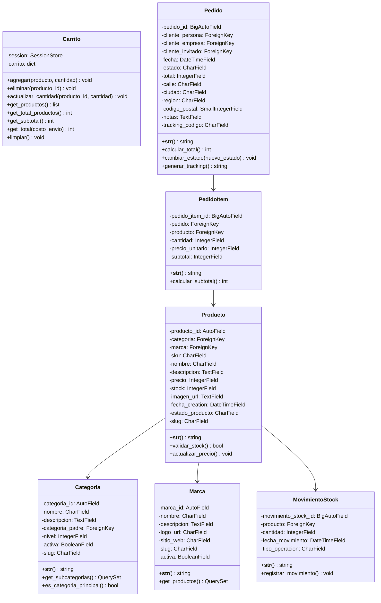

# Diagrama de Clases Principal

Diagrama detallado de las clases principales del sistema.

```mermaid
classDiagram
    class Producto {
        -producto_id: AutoField
        -categoria: ForeignKey
        -marca: ForeignKey
        -sku: CharField
        -nombre: CharField
        -descripcion: TextField
        -precio: IntegerField
        -stock: IntegerField
        -imagen_url: TextField
        -fecha_creation: DateTimeField
        -estado_producto: CharField
        -slug: CharField
        +__str__() string
        +validar_stock() bool
        +actualizar_precio() void
    }

    class Categoria {
        -categoria_id: AutoField
        -nombre: CharField
        -descripcion: TextField
        -categoria_padre: ForeignKey
        -nivel: IntegerField
        -activa: BooleanField
        -slug: CharField
        +__str__() string
        +get_subcategorias() QuerySet
        +es_categoria_principal() bool
    }

    class Marca {
        -marca_id: AutoField
        -nombre: CharField
        -descripcion: TextField
        -logo_url: CharField
        -sitio_web: CharField
        -slug: CharField
        -activa: BooleanField
        +__str__() string
        +get_productos() QuerySet
    }

    class Carrito {
        -session: SessionStore
        -carrito: dict
        +agregar(producto, cantidad) void
        +eliminar(producto_id) void
        +actualizar_cantidad(producto_id, cantidad) void
        +get_productos() list
        +get_total_productos() int
        +get_subtotal() int
        +get_total(costo_envio) int
        +limpiar() void
    }

    class Pedido {
        -pedido_id: BigAutoField
        -cliente_persona: ForeignKey
        -cliente_empresa: ForeignKey
        -cliente_invitado: ForeignKey
        -fecha: DateTimeField
        -estado: CharField
        -total: IntegerField
        -calle: CharField
        -ciudad: CharField
        -region: CharField
        -codigo_postal: SmallIntegerField
        -notas: TextField
        -tracking_codigo: CharField
        +__str__() string
        +calcular_total() int
        +cambiar_estado(nuevo_estado) void
        +generar_tracking() string
    }

    class PedidoItem {
        -pedido_item_id: BigAutoField
        -pedido: ForeignKey
        -producto: ForeignKey
        -cantidad: IntegerField
        -precio_unitario: IntegerField
        -subtotal: IntegerField
        +__str__() string
        +calcular_subtotal() int
    }

    class MovimientoStock {
        -movimiento_stock_id: BigAutoField
        -producto: ForeignKey
        -cantidad: IntegerField
        -fecha_movimiento: DateTimeField
        -tipo_operacion: CharField
        +__str__() string
        +registrar_movimiento() void
    }

    Producto --> Categoria
    Producto --> Marca
    Pedido --> PedidoItem
    PedidoItem --> Producto
    Producto --> MovimientoStock
```
