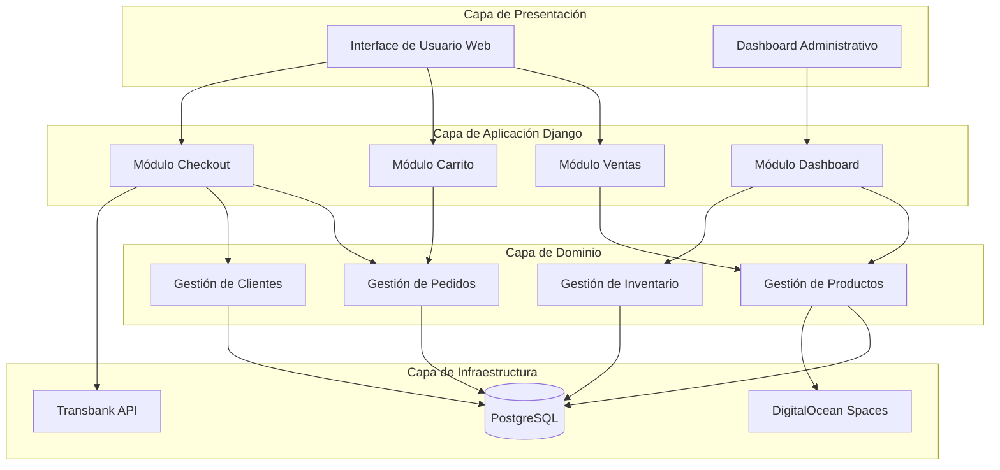

# Diagrama de Componentes Principales

Este diagrama muestra los componentes principales del sistema y cómo interactúan entre sí.

```mermaid
graph TB
    subgraph "Capa de Presentación"
        UI[Interface de Usuario Web]
        AdminUI[Dashboard Administrativo]
    end

    subgraph "Capa de Aplicación Django"
        Ventas[Módulo Ventas]
        Carrito[Módulo Carrito]
        Dashboard[Módulo Dashboard]
        Checkout[Módulo Checkout]
    end

    subgraph "Capa de Dominio"
        ProductosDomain[Gestión de Productos]
        ClientesDomain[Gestión de Clientes]
        PedidosDomain[Gestión de Pedidos]
        InventarioDomain[Gestión de Inventario]
    end

    subgraph "Capa de Infraestructura"
        DB[(PostgreSQL)]
        Storage[DigitalOcean Spaces]
        Payment[Transbank API]
    end

    UI --> Ventas
    UI --> Carrito
    UI --> Checkout
    AdminUI --> Dashboard

    Ventas --> ProductosDomain
    Carrito --> PedidosDomain
    Dashboard --> ProductosDomain
    Dashboard --> InventarioDomain
    Checkout --> PedidosDomain
    Checkout --> ClientesDomain

    ProductosDomain --> DB
    ClientesDomain --> DB
    PedidosDomain --> DB
    InventarioDomain --> DB

    ProductosDomain --> Storage
    Checkout --> Payment
```
