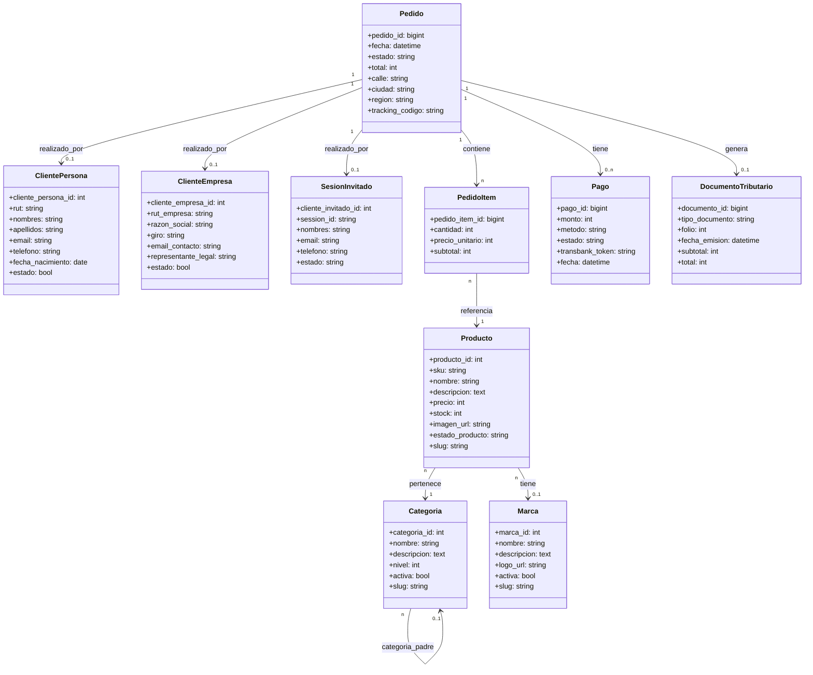

# Modelo de Dominio

El modelo de dominio representa las entidades principales del negocio y sus relaciones.

```mermaid
classDiagram
    class Producto {
        +producto_id: int
        +sku: string
        +nombre: string
        +descripcion: text
        +precio: int
        +stock: int
        +imagen_url: string
        +estado_producto: string
        +slug: string
    }

    class Categoria {
        +categoria_id: int
        +nombre: string
        +descripcion: text
        +nivel: int
        +activa: bool
        +slug: string
    }

    class Marca {
        +marca_id: int
        +nombre: string
        +descripcion: text
        +logo_url: string
        +activa: bool
        +slug: string
    }

    class ClientePersona {
        +cliente_persona_id: int
        +rut: string
        +nombres: string
        +apellidos: string
        +email: string
        +telefono: string
        +fecha_nacimiento: date
        +estado: bool
    }

    class ClienteEmpresa {
        +cliente_empresa_id: int
        +rut_empresa: string
        +razon_social: string
        +giro: string
        +email_contacto: string
        +representante_legal: string
        +estado: bool
    }

    class SesionInvitado {
        +cliente_invitado_id: int
        +session_id: string
        +nombres: string
        +email: string
        +telefono: string
        +estado: string
    }

    class Pedido {
        +pedido_id: bigint
        +fecha: datetime
        +estado: string
        +total: int
        +calle: string
        +ciudad: string
        +region: string
        +tracking_codigo: string
    }

    class PedidoItem {
        +pedido_item_id: bigint
        +cantidad: int
        +precio_unitario: int
        +subtotal: int
    }

    class Pago {
        +pago_id: bigint
        +monto: int
        +metodo: string
        +estado: string
        +transbank_token: string
        +fecha: datetime
    }

    class DocumentoTributario {
        +documento_id: bigint
        +tipo_documento: string
        +folio: int
        +fecha_emision: datetime
        +subtotal: int
        +total: int
    }

    Producto "n" --> "1" Categoria : pertenece
    Producto "n" --> "0..1" Marca : tiene
    Categoria "n" --> "0..1" Categoria : categoria_padre

    Pedido "1" --> "n" PedidoItem : contiene
    PedidoItem "n" --> "1" Producto : referencia

    Pedido "1" --> "0..1" ClientePersona : realizado_por
    Pedido "1" --> "0..1" ClienteEmpresa : realizado_por
    Pedido "1" --> "0..1" SesionInvitado : realizado_por

    Pedido "1" --> "0..n" Pago : tiene
    Pedido "1" --> "0..1" DocumentoTributario : genera
```
