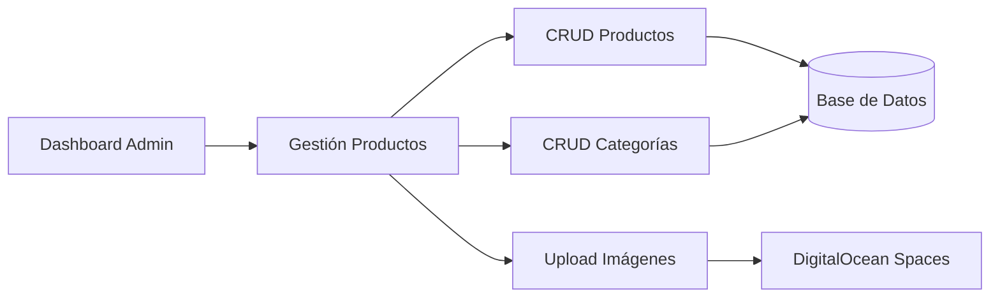
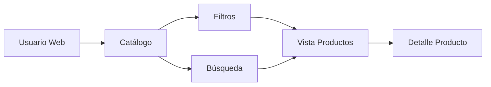
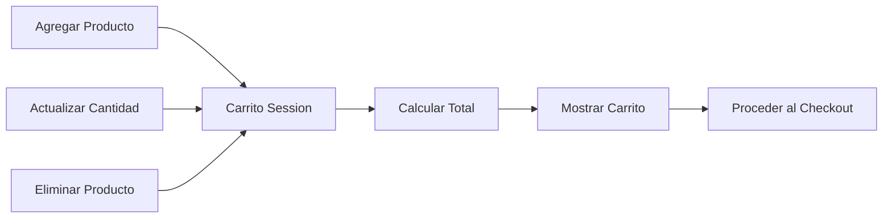
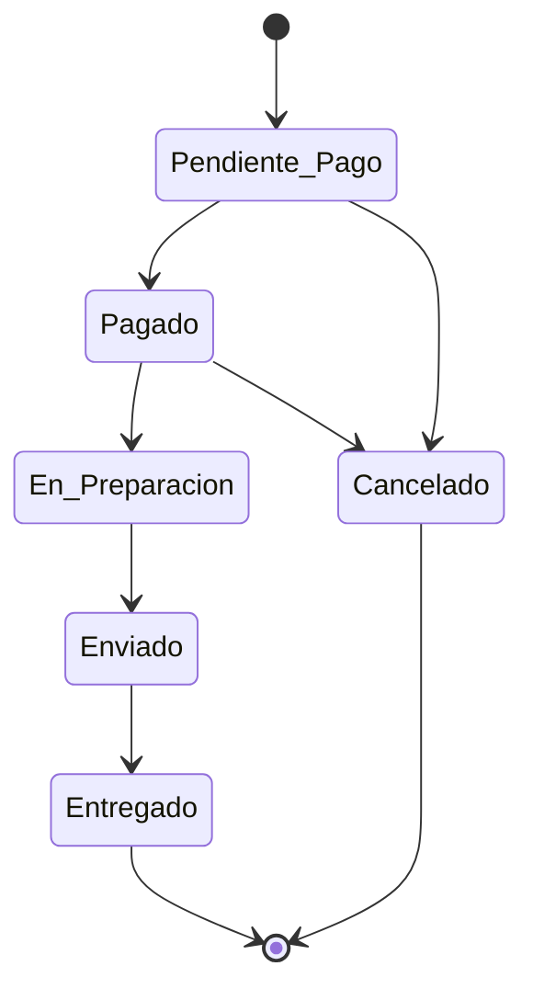
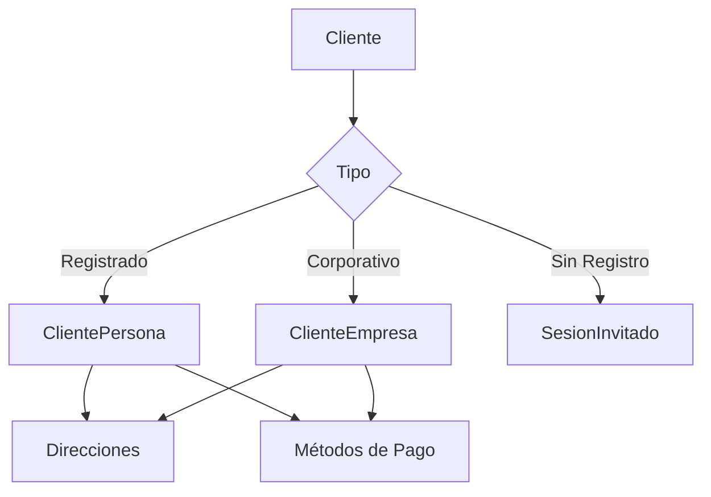

# Diagramas de Subsistemas Funcionales

## 1. Subsistema de Gestión de Productos

---

## 2. Subsistema de Ventas

---

## 3. Subsistema de Carrito

---

## 4. Subsistema de Pedidos - Estados

---

## 5. Subsistema de Clientes

