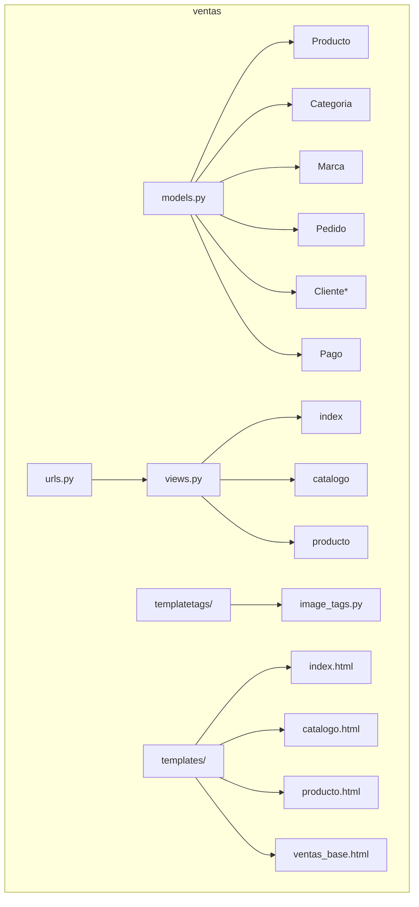
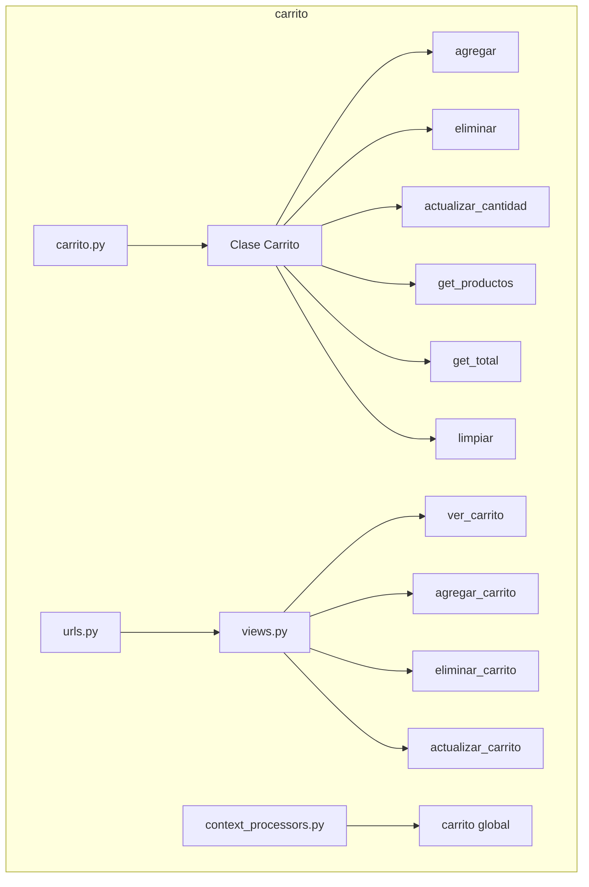
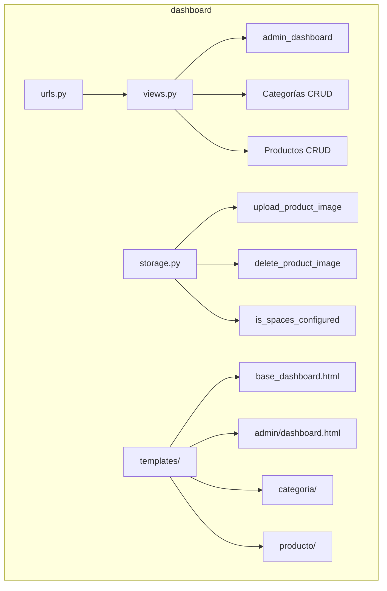
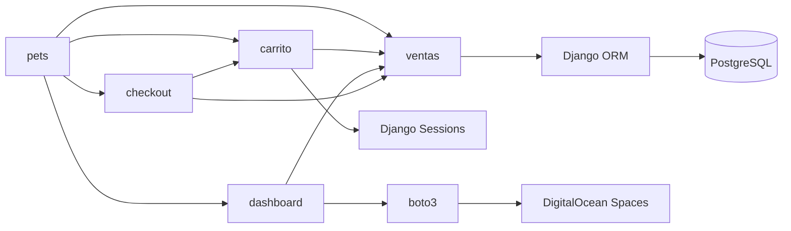

# Vista de Desarrollo

## Descripción General

La Vista de Desarrollo describe la organización del código fuente, los módulos, paquetes y capas del sistema. Esta vista es esencial para desarrolladores que necesitan entender la estructura del proyecto.

## Propósito

Esta vista permite entender:

- La organización de directorios y archivos
- Los módulos y paquetes del sistema
- Las dependencias entre componentes
- La arquitectura en capas
- Los patrones de código aplicados

## Contenido

1. [Estructura de Directorios](#estructura-de-directorios)
2. [Diagrama de Paquetes](#diagrama-de-paquetes)
3. [Arquitectura en Capas](#arquitectura-en-capas)
4. [Módulos Django](#módulos-django)
5. [Dependencias](#dependencias)

---

## Estructura de Directorios

### Árbol de Directorios Principal

```
Web/
├── manage.py                    # Script de gestión Django
├── pyproject.toml              # Configuración del proyecto y dependencias
├── .env                        # Variables de entorno (no versionado)
├── .pgpass                     # Credenciales PostgreSQL (no versionado)
│
├── pets/                       # Proyecto Django principal
│   ├── __init__.py
│   ├── settings.py            # Configuración global
│   ├── urls.py                # Enrutamiento principal
│   ├── wsgi.py                # WSGI para despliegue
│   └── asgi.py                # ASGI para despliegue
│
├── apps/                       # Aplicaciones Django
│   ├── __init__.py
│   │
│   ├── ventas/                # Módulo de catálogo público
│   │   ├── __init__.py
│   │   ├── models.py          # Modelos de dominio
│   │   ├── views.py           # Vistas de catálogo
│   │   ├── urls.py            # Rutas del módulo
│   │   ├── admin.py           # Configuración admin Django
│   │   ├── apps.py            # Configuración app
│   │   ├── templates/         # Templates del módulo
│   │   │   └── ventas/
│   │   │       ├── index.html
│   │   │       ├── catalogo.html
│   │   │       ├── producto.html
│   │   │       └── ventas_base.html
│   │   ├── static/            # Archivos estáticos
│   │   │   └── blog/
│   │   │       └── images/
│   │   └── templatetags/      # Filtros y tags personalizados
│   │       ├── __init__.py
│   │       └── image_tags.py
│   │
│   ├── carrito/               # Módulo de carrito de compras
│   │   ├── __init__.py
│   │   ├── carrito.py         # Lógica del carrito
│   │   ├── views.py           # Vistas del carrito
│   │   ├── urls.py            # Rutas del módulo
│   │   ├── context_processors.py  # Context processor global
│   │   └── templates/
│   │       └── carrito/
│   │           └── ver_carrito.html
│   │
│   ├── dashboard/             # Módulo administrativo
│   │   ├── __init__.py
│   │   ├── models.py
│   │   ├── views.py           # Vistas CRUD
│   │   ├── urls.py
│   │   ├── storage.py         # Integración DigitalOcean Spaces
│   │   └── templates/
│   │       └── dashboard/
│   │           ├── base_dashboard.html
│   │           ├── admin/
│   │           ├── categoria/
│   │           └── producto/
│   │
│   └── checkout/              # Módulo de checkout (en desarrollo)
│       └── templates/
│           └── checkout/
│
├── static/                    # Archivos estáticos globales
│   ├── css/
│   │   └── style.css
│   └── img/
│
└── Documentación/             # Documentación arquitectónica
    ├── README.md
    ├── 1-Vista-Lógica/
    ├── 2-Vista-Desarrollo/
    ├── 3-Vista-Proceso/
    ├── 4-Vista-Física/
    └── 5-Escenarios/
```

---

## Diagrama de Paquetes

📄 **[Ver diagrama completo](./diagrama-paquetes.md)**

Este diagrama muestra la estructura de paquetes del proyecto y las dependencias entre las aplicaciones Django.

**Paquetes principales:**

- Proyecto `pets`: Configuración global
- Aplicación `ventas`: Catálogo y modelos
- Aplicación `carrito`: Shopping cart
- Aplicación `dashboard`: Panel admin
- Aplicación `checkout`: Proceso de pago

---

## Arquitectura en Capas

📄 **[Ver diagrama completo](./diagrama-arquitectura-capas.md)**

El sistema implementa una arquitectura en capas clara de 5 niveles:

1. **Capa de Presentación**: Templates, archivos estáticos, context processors
2. **Capa de Aplicación**: Views, URLs, Forms, Template Tags
3. **Capa de Lógica de Negocio**: Models, Carrito, Business Logic
4. **Capa de Acceso a Datos**: Django ORM, QuerySets, Managers
5. **Capa de Infraestructura**: PostgreSQL, DigitalOcean Spaces, Session Storage

---

## Módulos Django

📄 **[Ver diagramas de todos los módulos](./diagrama-modulos-django.md)**

### 1. Módulo `pets` (Proyecto Principal)

**Responsabilidad**: Configuración global y enrutamiento principal

**Archivos clave:**

- `settings.py`: Configuración global (BD, apps, middleware, templates, DO Spaces)
- `urls.py`: Enrutamiento raíz que incluye apps
- `wsgi.py/asgi.py`: Entry points para servidores web

### 2. Módulo `ventas`

**Responsabilidad**: Catálogo público y gestión de productos

**Componentes principales:**

- **Models**: 15+ modelos de dominio (Producto, Categoria, Marca, Pedido, Cliente, etc.)
- **Views**: Vistas funcionales para catálogo
- **Template Tags**: Filtros personalizados para URLs de imágenes
- **Templates**: Estructura de presentación con herencia

### 3. Módulo `carrito`

**Responsabilidad**: Gestión del carrito de compras en sesión

**Características:**

- Almacenamiento en sesión de Django
- Context processor para acceso global
- Vistas AJAX para operaciones dinámicas
- Cálculo de totales con costo de envío

### 4. Módulo `dashboard`

**Responsabilidad**: Panel administrativo para gestión

**Funcionalidades:**

- CRUD completo de productos
- CRUD completo de categorías
- Integración con DigitalOcean Spaces
- Upload y eliminación de imágenes
- Paginación de listados
- Filtros y búsqueda

### 5. Módulo `checkout`

**Responsabilidad**: Proceso de pago (en desarrollo)

**Estado**: Estructura básica de templates creada

---

## Dependencias

📄 **[Ver diagrama de dependencias](./diagrama-paquetes.md#dependencias-entre-módulos)**

### Diagrama NO ENCONTRADO - CONTINUANDO```mermaid

graph TB
subgraph "Proyecto pets"
Settings[settings.py]
URLs[urls.py]
WSGI[wsgi.py/asgi.py]
end

    subgraph "Aplicación ventas"
        VentasModels[models.py]
        VentasViews[views.py]
        VentasURLs[urls.py]
        VentasTemplates[templates/]
        VentasStatic[static/]
        VentasTemplateTags[templatetags/]
    end

    subgraph "Aplicación carrito"
        CarritoClass[carrito.py]
        CarritoViews[views.py]
        CarritoURLs[urls.py]
        CarritoContext[context_processors.py]
        CarritoTemplates[templates/]
    end

    subgraph "Aplicación dashboard"
        DashboardViews[views.py]
        DashboardURLs[urls.py]
        DashboardStorage[storage.py]
        DashboardTemplates[templates/]
    end

    subgraph "Aplicación checkout"
        CheckoutTemplates[templates/]
    end

    URLs --> VentasURLs
    URLs --> CarritoURLs
    URLs --> DashboardURLs

    VentasViews --> VentasModels
    CarritoViews --> VentasModels
    CarritoViews --> CarritoClass
    DashboardViews --> VentasModels
    DashboardViews --> DashboardStorage

    Settings --> CarritoContext
    Settings --> DashboardStorage

    VentasViews --> VentasTemplates
    CarritoViews --> CarritoTemplates
    DashboardViews --> DashboardTemplates

````

---

## Arquitectura en Capas

El sistema implementa una arquitectura en capas clara:

```mermaid
graph TB
    subgraph "Capa de Presentación"
        Templates[Django Templates]
        StaticFiles[Archivos Estáticos CSS/JS/Images]
        ContextProcessors[Context Processors]
    end

    subgraph "Capa de Aplicación"
        Views[Views - Controladores]
        URLs[URL Routing]
        Forms[Forms - Validación]
        TemplateTags[Template Tags/Filters]
    end

    subgraph "Capa de Lógica de Negocio"
        Models[Models - Entidades]
        Carrito[Carrito - Lógica de Sesión]
        BusinessLogic[Lógica de Negocio]
    end

    subgraph "Capa de Acceso a Datos"
        ORM[Django ORM]
        QuerySets[QuerySets]
        Managers[Model Managers]
    end

    subgraph "Capa de Infraestructura"
        PostgreSQL[(PostgreSQL)]
        DOSpaces[DigitalOcean Spaces]
        Session[Session Storage]
    end

    Templates --> Views
    StaticFiles --> Templates
    ContextProcessors --> Templates

    Views --> URLs
    Views --> Models
    Views --> Carrito
    Views --> BusinessLogic

    Models --> ORM
    Carrito --> Session

    ORM --> PostgreSQL
    BusinessLogic --> DOSpaces
````

### Descripción de Capas

#### 1. Capa de Presentación

- **Templates Django**: Vistas HTML dinámicas
- **Archivos estáticos**: CSS, JavaScript, imágenes locales
- **Context Processors**: Datos globales disponibles en todos los templates

#### 2. Capa de Aplicación

- **Views**: Controladores que manejan requests HTTP
- **URLs**: Enrutamiento de peticiones
- **Forms**: Validación y procesamiento de formularios
- **Template Tags**: Filtros y tags personalizados

#### 3. Capa de Lógica de Negocio

- **Models**: Entidades del dominio con validaciones
- **Carrito**: Gestión del estado del carrito
- **Business Logic**: Reglas de negocio complejas

#### 4. Capa de Acceso a Datos

- **Django ORM**: Abstracción de base de datos
- **QuerySets**: Consultas optimizadas
- **Managers**: Lógica de consultas reutilizable

#### 5. Capa de Infraestructura

- **PostgreSQL**: Base de datos relacional
- **DigitalOcean Spaces**: Almacenamiento de objetos
- **Session Storage**: Almacenamiento de sesiones

---

## Módulos Django

### 1. Módulo `pets` (Proyecto Principal)

**Responsabilidad**: Configuración global y enrutamiento principal

```mermaid
graph LR
    A[pets/] --> B[settings.py]
    A --> C[urls.py]
    A --> D[wsgi.py]
    A --> E[asgi.py]

    B --> F[Configuración BD]
    B --> G[Apps Instaladas]
    B --> H[Middleware]
    B --> I[Templates]
    B --> J[Static Files]
    B --> K[DO Spaces Config]
```

**Archivos clave:**

- `settings.py`: Configuración global (BD, apps, middleware, templates, DO Spaces)
- `urls.py`: Enrutamiento raíz que incluye apps
- `wsgi.py/asgi.py`: Entry points para servidores web

---

### 2. Módulo `ventas`

**Responsabilidad**: Catálogo público y gestión de productos



**Componentes principales:**

- **Models**: 15+ modelos de dominio (Producto, Categoria, Marca, Pedido, Cliente, etc.)
- **Views**: Vistas funcionales para catálogo
- **Template Tags**: Filtros personalizados para URLs de imágenes
- **Templates**: Estructura de presentación con herencia

---

### 3. Módulo `carrito`

**Responsabilidad**: Gestión del carrito de compras en sesión



**Características:**

- Almacenamiento en sesión de Django
- Context processor para acceso global
- Vistas AJAX para operaciones dinámicas
- Cálculo de totales con costo de envío

---

### 4. Módulo `dashboard`

**Responsabilidad**: Panel administrativo para gestión



**Funcionalidades:**

- CRUD completo de productos
- CRUD completo de categorías
- Integración con DigitalOcean Spaces
- Upload y eliminación de imágenes
- Paginación de listados
- Filtros y búsqueda

---

### 5. Módulo `checkout`

**Responsabilidad**: Proceso de pago (en desarrollo)

**Estado**: Estructura básica de templates creada

---

## Dependencias

### Diagrama de Dependencias entre Módulos



### Dependencias Externas

Definidas en `pyproject.toml`:

```toml
dependencies = [
    "django (>=5.2,<5.3)",           # Framework web
    "pillow (>=11.3.0,<12.0.0)",     # Procesamiento de imágenes
    "psycopg[binary] (>=3.2.10,<4.0.0)",  # Driver PostgreSQL
    "django-bootstrap5 (>=25.2,<26.0)",   # Bootstrap integration
    "python-dotenv (>=1.0.0,<2.0.0)",     # Variables de entorno
    "boto3 (>=1.40.55,<2.0.0)",      # AWS SDK (DigitalOcean Spaces)
]

[dependency-groups]
dev = [
    "djhtml (>=3.0.10,<4.0.0)"       # Formateador de templates
]
```

---

## Patrones de Código

### 1. MTV Pattern (Model-Template-View)

```python
# Model (ventas/models.py)
class Producto(models.Model):
    nombre = models.CharField(max_length=50)
    precio = models.IntegerField()

# View (ventas/views.py)
def producto(request, producto_id):
    producto = get_object_or_404(Producto, producto_id=producto_id)
    return render(request, 'ventas/producto.html', {'producto': producto})

# Template (templates/ventas/producto.html)
<h1>{{ producto.nombre }}</h1>
<p>Precio: ${{ producto.precio }}</p>
```

### 2. Repository Pattern (mediante Django ORM)

```python
# Acceso a datos encapsulado en el modelo
productos = Producto.objects.filter(
    estado_producto='activo'
).select_related('categoria', 'marca')
```

### 3. Dependency Injection (mediante settings)

```python
# settings.py
DO_SPACES_URL = os.getenv('DO_SPACES_URL', '')

# storage.py
from django.conf import settings
spaces_url = settings.DO_SPACES_URL
```

### 4. Context Processor Pattern

```python
# carrito/context_processors.py
def carrito(request):
    from .carrito import Carrito
    return {'carrito': Carrito(request)}
```

### 5. Template Inheritance

```python
# Base template


# Child template


    <h1>Catálogo</h1>

```

---

## Convenciones de Código

### Nomenclatura

- **Clases**: PascalCase (`Producto`, `ClientePersona`)
- **Funciones/Métodos**: snake_case (`get_productos`, `calcular_total`)
- **Variables**: snake_case (`productos_activos`, `total_pedido`)
- **Constantes**: UPPER_SNAKE_CASE (`DO_SPACES_URL`)
- **Templates**: snake_case.html (`ver_carrito.html`)
- **URLs**: kebab-case (`/producto/detalle/`)

### Estructura de Views

```python
def mi_vista(request):
    """Docstring describiendo la vista"""
    # 1. Obtener datos
    objetos = Modelo.objects.filter(...)

    # 2. Procesar lógica
    resultado = procesar(objetos)

    # 3. Preparar contexto
    context = {
        'objetos': objetos,
        'resultado': resultado,
    }

    # 4. Renderizar template
    return render(request, 'app/template.html', context)
```

### Estructura de Models

```python
class MiModelo(models.Model):
    # Campos
    campo = models.CharField(max_length=100)

    class Meta:
        db_table = 'tabla_bd'
        managed = False  # No administrado por Django
        constraints = [...]
        indexes = [...]

    def __str__(self):
        return f"{self.campo}"
```

---

## Estrategia de Testing

### Estructura de Tests (Futura)

```
tests/
├── __init__.py
├── test_models.py        # Tests de modelos
├── test_views.py         # Tests de vistas
├── test_carrito.py       # Tests del carrito
├── test_storage.py       # Tests de almacenamiento
└── fixtures/             # Datos de prueba
    └── productos.json
```

---

## Build y Deployment

### Comandos de Gestión Django

```bash
# Iniciar servidor de desarrollo
python manage.py runserver

# Migraciones (nota: managed=False en modelos)
python manage.py makemigrations
python manage.py migrate

# Crear superusuario
python manage.py createsuperuser

# Colectar archivos estáticos
python manage.py collectstatic

# Shell interactivo
python manage.py shell
```

### Variables de Entorno (.env)

```bash
DO_SPACES_URL=https://...
DO_SPACES_CDN_URL=https://...
DO_SPACES_ACCESS_KEY=...
DO_SPACES_SECRET_KEY=...
DO_SPACES_BUCKET=...
DO_SPACES_REGION=nyc3
```

---

## Conclusión

La Vista de Desarrollo proporciona una comprensión completa de cómo está organizado el código del sistema, facilitando el mantenimiento, la extensión y la colaboración entre desarrolladores.

**Principios Aplicados:**

- Separación de responsabilidades
- Modularidad
- Reutilización de código
- Configuración externalizada
- Convenciones sobre configuración
