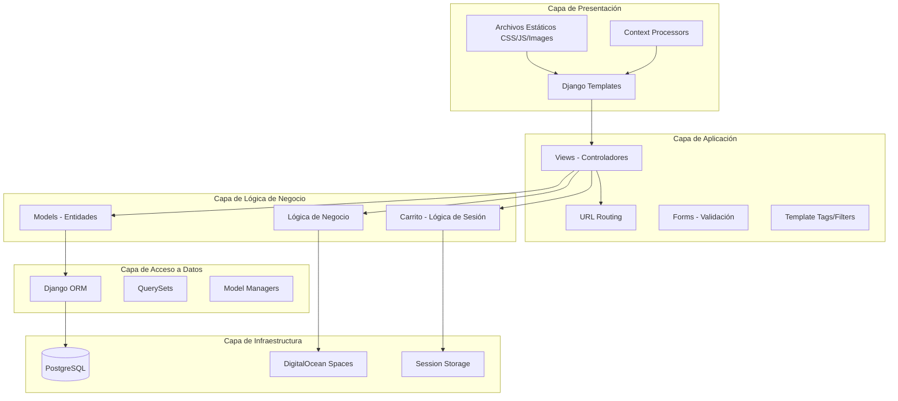

# Arquitectura en Capas

El sistema implementa una arquitectura en capas clara de 5 niveles.

## Descripción de Capas

### 1. Capa de Presentación

- **Templates Django**: Vistas HTML dinámicas
- **Archivos estáticos**: CSS, JavaScript, imágenes locales
- **Context Processors**: Datos globales disponibles en todos los templates

### 2. Capa de Aplicación

- **Views**: Controladores que manejan requests HTTP
- **URLs**: Enrutamiento de peticiones
- **Forms**: Validación y procesamiento de formularios
- **Template Tags**: Filtros y tags personalizados

### 3. Capa de Lógica de Negocio

- **Models**: Entidades del dominio con validaciones
- **Carrito**: Gestión del estado del carrito
- **Business Logic**: Reglas de negocio complejas

### 4. Capa de Acceso a Datos

- **Django ORM**: Abstracción de base de datos
- **QuerySets**: Consultas optimizadas
- **Managers**: Lógica de consultas reutilizable

### 5. Capa de Infraestructura

- **PostgreSQL**: Base de datos relacional
- **DigitalOcean Spaces**: Almacenamiento de objetos
- **Session Storage**: Almacenamiento de sesiones
