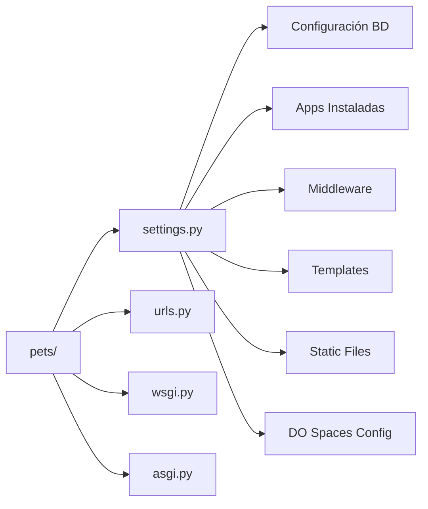
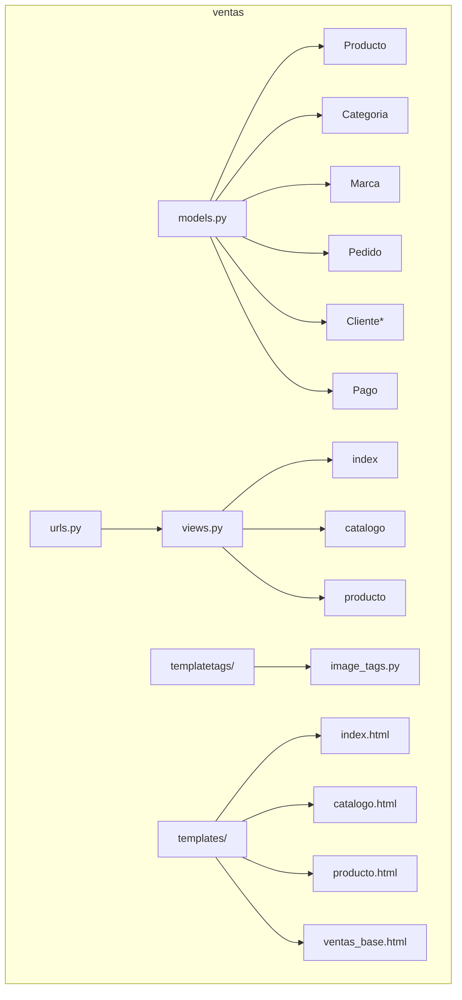
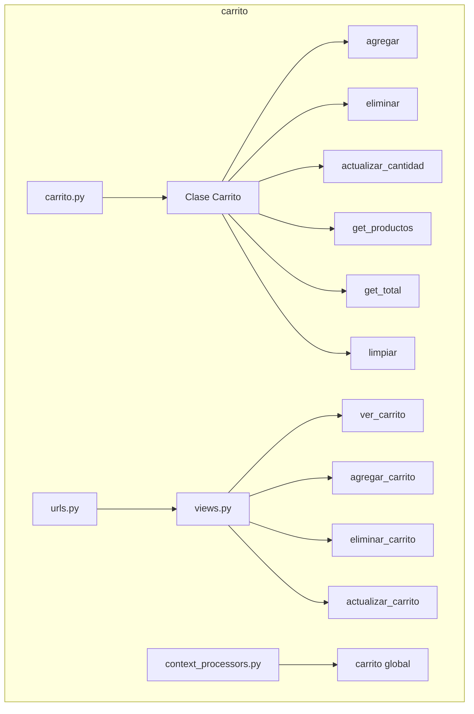
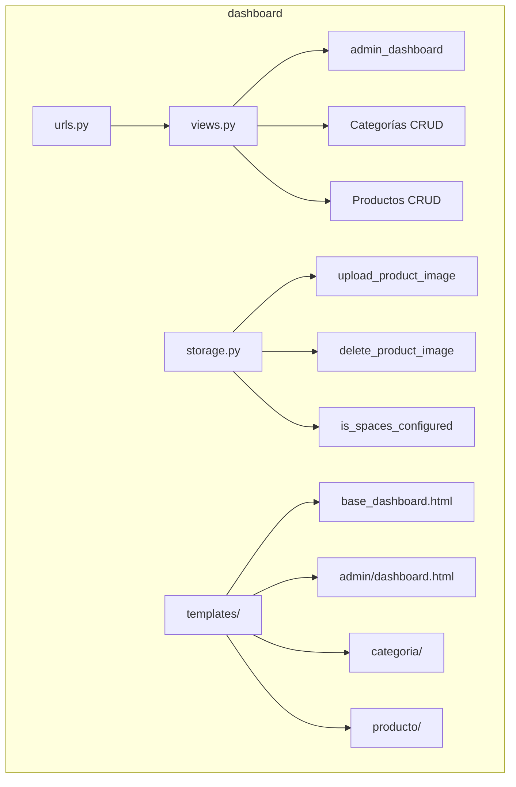

# Diagramas de Módulos Django

## 1. Módulo `pets` (Proyecto Principal)

Configuración global y enrutamiento principal.

---

## 2. Módulo `ventas`

Catálogo público y gestión de productos.

---

## 3. Módulo `carrito`

Gestión del carrito de compras en sesión.

---

## 4. Módulo `dashboard`

Panel administrativo para gestión.

**Funcionalidades:**

- CRUD completo de productos
- CRUD completo de categorías
- Integración con DigitalOcean Spaces
- Upload y eliminación de imágenes
- Paginación de listados
- Filtros y búsqueda
