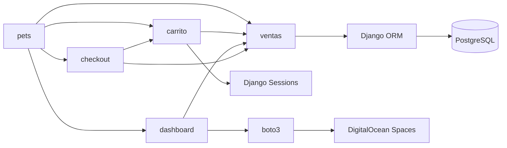

# Diagrama de Paquetes Django

Este diagrama muestra la estructura de paquetes del proyecto y las dependencias entre las aplicaciones Django.

```mermaid
graph TB
    subgraph "Proyecto pets"
        Settings[settings.py]
        URLs[urls.py]
        WSGI[wsgi.py/asgi.py]
    end

    subgraph "Aplicación ventas"
        VentasModels[models.py]
        VentasViews[views.py]
        VentasURLs[urls.py]
        VentasTemplates[templates/]
        VentasStatic[static/]
        VentasTemplateTags[templatetags/]
    end

    subgraph "Aplicación carrito"
        CarritoClass[carrito.py]
        CarritoViews[views.py]
        CarritoURLs[urls.py]
        CarritoContext[context_processors.py]
        CarritoTemplates[templates/]
    end

    subgraph "Aplicación dashboard"
        DashboardViews[views.py]
        DashboardURLs[urls.py]
        DashboardStorage[storage.py]
        DashboardTemplates[templates/]
    end

    subgraph "Aplicación checkout"
        CheckoutTemplates[templates/]
    end

    URLs --> VentasURLs
    URLs --> CarritoURLs
    URLs --> DashboardURLs

    VentasViews --> VentasModels
    CarritoViews --> VentasModels
    CarritoViews --> CarritoClass
    DashboardViews --> VentasModels
    DashboardViews --> DashboardStorage

    Settings --> CarritoContext
    Settings --> DashboardStorage

    VentasViews --> VentasTemplates
    CarritoViews --> CarritoTemplates
    DashboardViews --> DashboardTemplates
```

## Dependencias entre Módulos

```mermaid
graph LR
    A[pets] --> B[ventas]
    A --> C[carrito]
    A --> D[dashboard]
    A --> E[checkout]

    C --> B
    D --> B
    E --> B
    E --> C

    B --> F[Django ORM]
    C --> G[Django Sessions]
    D --> H[boto3]

    F --> I[(PostgreSQL)]
    H --> J[DigitalOcean Spaces]
```
