# Diagrama de Actividad: Autenticación y Registro de Usuarios

## Descripción

Este diagrama de actividad muestra los flujos de autenticación (inicio de sesión) y registro de nuevos usuarios en el sistema CordilleraPets, incluyendo las validaciones y procesos de seguridad implementados.

## Diagrama

```mermaid
flowchart TD
    Start([Inicio]) --> AccionUsuario{¿Qué desea hacer?}

    %% ========== FLUJO: INICIAR SESIÓN ==========
    AccionUsuario -->|Iniciar Sesión| FormLogin[Mostrar Formulario Login]
    FormLogin --> IngresarCredenciales[Usuario Ingresa Credenciales]
    IngresarCredenciales --> ValidarCamposLogin{¿Campos Completos?}

    ValidarCamposLogin -->|No| ErrorCamposLogin[Error: Campos Requeridos]
    ErrorCamposLogin --> FormLogin

    ValidarCamposLogin -->|Sí| ConsultarUsuario[Consultar Usuario en BD]
    ConsultarUsuario --> UsuarioExiste{¿Usuario Existe?}

    UsuarioExiste -->|No| ErrorUsuarioNoExiste[Error: Usuario No Encontrado]
    ErrorUsuarioNoExiste --> FormLogin

    UsuarioExiste -->|Sí| VerificarPassword[Verificar Contraseña]
    VerificarPassword --> PasswordCorrecta{¿Contraseña Correcta?}

    PasswordCorrecta -->|No| IncrementarIntentos[Incrementar Intentos Fallidos]
    IncrementarIntentos --> LimiteIntentos{¿Más de 5 Intentos?}

    LimiteIntentos -->|Sí| BloquearCuenta[Bloquear Cuenta Temporalmente]
    BloquearCuenta --> ErrorCuentaBloqueada[Error: Cuenta Bloqueada]
    ErrorCuentaBloqueada --> End1([Fin: Contactar Soporte])

    LimiteIntentos -->|No| ErrorPasswordIncorrecta[Error: Contraseña Incorrecta]
    ErrorPasswordIncorrecta --> FormLogin

    PasswordCorrecta -->|Sí| VerificarEstadoCuenta{¿Cuenta Activa?}

    VerificarEstadoCuenta -->|No| ErrorCuentaInactiva[Error: Cuenta Inactiva]
    ErrorCuentaInactiva --> End2([Fin: Cuenta Deshabilitada])

    VerificarEstadoCuenta -->|Sí| CrearSesion[Crear Sesión de Usuario]
    CrearSesion --> ReiniciarIntentos[Reiniciar Contador Intentos]
    ReiniciarIntentos --> RegistrarAcceso[Registrar Acceso en Log]
    RegistrarAcceso --> CargarCarrito{¿Tiene Carrito<br/>Guardado?}

    CargarCarrito -->|Sí| RestaurarCarrito[Restaurar Carrito]
    RestaurarCarrito --> RedirigirDashboardUser

    CargarCarrito -->|No| RedirigirDashboardUser[Redirigir a Home]
    RedirigirDashboardUser --> MostrarBienvenida[Mostrar Mensaje Bienvenida]
    MostrarBienvenida --> EndLoginExitoso([Fin: Sesión Iniciada])

    %% ========== FLUJO: REGISTRO ==========
    AccionUsuario -->|Registrarse| FormRegistro[Mostrar Formulario Registro]
    FormRegistro --> IngresarDatosRegistro[Usuario Ingresa Datos]
    IngresarDatosRegistro --> ValidarDatosRegistro{¿Todos los Campos<br/>Completos?}

    ValidarDatosRegistro -->|No| ErrorCamposRegistro[Error: Campos Requeridos]
    ErrorCamposRegistro --> FormRegistro

    ValidarDatosRegistro -->|Sí| ValidarFormatoRUT{¿RUT Válido?}

    ValidarFormatoRUT -->|No| ErrorRUTInvalido[Error: Formato RUT Inválido]
    ErrorRUTInvalido --> FormRegistro

    ValidarFormatoRUT -->|Sí| ValidarEmail{¿Email Válido?}

    ValidarEmail -->|No| ErrorEmailInvalido[Error: Email Inválido]
    ErrorEmailInvalido --> FormRegistro

    ValidarEmail -->|Sí| ValidarPassword{¿Contraseña Segura?}

    ValidarPassword -->|No| ErrorPasswordDebil[Error: Contraseña Débil]
    ErrorPasswordDebil --> FormRegistro

    ValidarPassword -->|Sí| VerificarRUTUnico{¿RUT ya<br/>Registrado?}

    VerificarRUTUnico -->|Sí| ErrorRUTDuplicado[Error: RUT ya Existe]
    ErrorRUTDuplicado --> FormRegistro

    VerificarRUTUnico -->|No| VerificarEmailUnico{¿Email ya<br/>Registrado?}

    VerificarEmailUnico -->|Sí| ErrorEmailDuplicado[Error: Email ya Existe]
    ErrorEmailDuplicado --> FormRegistro

    VerificarEmailUnico -->|No| HashearPassword[Hashear Contraseña<br/>SHA-256]
    HashearPassword --> IniciarTransaccionReg[Iniciar Transacción]
    IniciarTransaccionReg --> CrearCliente[INSERT ClientePersona]
    CrearCliente --> GenerarToken[Generar Token Verificación]
    GenerarToken --> CommitRegistro[COMMIT Transacción]
    CommitRegistro --> EnviarEmailVerificacion[Enviar Email Verificación]
    EnviarEmailVerificacion --> MostrarMensajeExito[Mensaje: Registro Exitoso]
    MostrarMensajeExito --> SugerirLogin[Sugerir Iniciar Sesión]
    SugerirLogin --> FormLogin

    %% ========== FLUJO: CERRAR SESIÓN ==========
    AccionUsuario -->|Cerrar Sesión| VerificarSesionActiva{¿Sesión Activa?}

    VerificarSesionActiva -->|No| ErrorNoSesion[Error: No hay sesión]
    ErrorNoSesion --> End3([Fin])

    VerificarSesionActiva -->|Sí| GuardarCarrito{¿Usuario Registrado?}

    GuardarCarrito -->|Sí| PersistirCarrito[Guardar Carrito en BD]
    PersistirCarrito --> DestruirSesion

    GuardarCarrito -->|No| DestruirSesion[Destruir Sesión]
    DestruirSesion --> LimpiarCookies[Limpiar Cookies]
    LimpiarCookies --> RegistrarCierre[Registrar Cierre en Log]
    RegistrarCierre --> RedirigirHome[Redirigir a Home]
    RedirigirHome --> MostrarDespedida[Mensaje: Sesión Cerrada]
    MostrarDespedida --> End4([Fin: Sesión Cerrada])

    %% ========== FLUJO: RECUPERAR CONTRASEÑA ==========
    AccionUsuario -->|Olvidé Contraseña| FormRecuperar[Formulario Recuperación]
    FormRecuperar --> IngresarEmailRecuperar[Ingresar Email]
    IngresarEmailRecuperar --> ValidarEmailRecuperar{¿Email Válido?}

    ValidarEmailRecuperar -->|No| ErrorEmailRecuperar[Error: Email Inválido]
    ErrorEmailRecuperar --> FormRecuperar

    ValidarEmailRecuperar -->|Sí| BuscarEmailBD[Buscar Email en BD]
    BuscarEmailBD --> EmailEnBD{¿Email Existe?}

    EmailEnBD -->|No| MensajeGenerico[Mensaje: Si el email existe,<br/>recibirás un enlace]
    MensajeGenerico --> End5([Fin: Protección contra<br/>enumeración de usuarios])

    EmailEnBD -->|Sí| GenerarTokenRecuperar[Generar Token Recuperación]
    GenerarTokenRecuperar --> GuardarTokenBD[Guardar Token en BD<br/>Expira en 1 hora]
    GuardarTokenBD --> EnviarEmailRecuperar[Enviar Email con Enlace]
    EnviarEmailRecuperar --> MensajeGenerico

    %% Estilos
    style Start fill:#90EE90
    style EndLoginExitoso fill:#90EE90
    style End1 fill:#FFB6C1
    style End2 fill:#FFB6C1
    style End3 fill:#FFB6C1
    style End4 fill:#90EE90
    style End5 fill:#FFD700
    style ErrorCamposLogin fill:#FFB6C1
    style ErrorUsuarioNoExiste fill:#FFB6C1
    style ErrorPasswordIncorrecta fill:#FFB6C1
    style ErrorCuentaBloqueada fill:#FF6B6B
    style ErrorCuentaInactiva fill:#FFB6C1
    style ErrorCamposRegistro fill:#FFB6C1
    style ErrorRUTInvalido fill:#FFB6C1
    style ErrorEmailInvalido fill:#FFB6C1
    style ErrorPasswordDebil fill:#FFB6C1
    style ErrorRUTDuplicado fill:#FFB6C1
    style ErrorEmailDuplicado fill:#FFB6C1
    style IniciarTransaccionReg fill:#87CEEB
    style CommitRegistro fill:#87CEEB
    style HashearPassword fill:#FFD700
```



## Descripción de Actividades

### Flujo 1: Iniciar Sesión

#### Fase 1: Validación de Credenciales

| Actividad                | Descripción                                 | Actor   |
| ------------------------ | ------------------------------------------- | ------- |
| Mostrar Formulario Login | Renderizar página de inicio de sesión       | Sistema |
| Ingresar Credenciales    | Usuario ingresa email/RUT y contraseña      | Usuario |
| Validar Campos Completos | Verificar que todos los campos estén llenos | Sistema |
| Consultar Usuario en BD  | Buscar usuario por email/RUT                | Sistema |

**Código de Autenticación:**

```python
from django.contrib.auth import authenticate, login

def login_view(request):
    if request.method == 'POST':
        username = request.POST.get('username')  # Email o RUT
        password = request.POST.get('password')

        # Django authentication
        user = authenticate(request, username=username, password=password)

        if user is not None:
            login(request, user)
            messages.success(request, f'¡Bienvenido, {user.first_name}!')
            return redirect('index')
        else:
            messages.error(request, 'Usuario o Contraseña Incorrecta')

    return render(request, 'ventas/iniciosesion.html')
```

#### Fase 2: Verificación de Seguridad

| Actividad               | Descripción                    | Actor   |
| ----------------------- | ------------------------------ | ------- |
| Verificar Contraseña    | Comparar hash de contraseña    | Sistema |
| Incrementar Intentos    | Contador de intentos fallidos  | Sistema |
| ¿Más de 5 Intentos?     | Protección contra fuerza bruta | Sistema |
| Bloquear Cuenta         | Bloqueo temporal (15 minutos)  | Sistema |
| Verificar Estado Cuenta | Validar que cuenta esté activa | Sistema |

**Implementación de Intentos Fallidos:**

```python
from django.core.cache import cache
from datetime import timedelta

def verificar_intentos_login(username):
    cache_key = f'login_attempts_{username}'
    attempts = cache.get(cache_key, 0)

    if attempts >= 5:
        # Cuenta bloqueada temporalmente
        return False, "Cuenta bloqueada por múltiples intentos. Intente en 15 minutos."

    return True, None

def incrementar_intentos_login(username):
    cache_key = f'login_attempts_{username}'
    attempts = cache.get(cache_key, 0)
    cache.set(cache_key, attempts + 1, timeout=900)  # 15 minutos

def reiniciar_intentos_login(username):
    cache_key = f'login_attempts_{username}'
    cache.delete(cache_key)
```

**Hash de Contraseña:**

```python
import hashlib

def hashear_password(password):
    """Hashea contraseña con SHA-256"""
    return hashlib.sha256(password.encode()).hexdigest()

def verificar_password(password_ingresada, password_hash):
    """Verifica contraseña contra hash almacenado"""
    return hashear_password(password_ingresada) == password_hash
```

#### Fase 3: Creación de Sesión

| Actividad                   | Descripción                                  | Actor   |
| --------------------------- | -------------------------------------------- | ------- |
| Crear Sesión de Usuario     | Inicializar sesión Django                    | Sistema |
| Reiniciar Contador Intentos | Limpiar intentos fallidos                    | Sistema |
| Registrar Acceso en Log     | Auditoría de inicio de sesión                | Sistema |
| Restaurar Carrito           | Si usuario registrado, cargar carrito previo | Sistema |
| Redirigir a Home            | Llevar al usuario a página principal         | Sistema |

**Gestión de Sesión:**

```python
def login_view(request):
    # ... autenticación exitosa ...

    # Crear sesión
    login(request, user)

    # Reiniciar intentos fallidos
    reiniciar_intentos_login(user.username)

    # Registrar en log
    logger.info(f"Login exitoso: {user.username} desde IP {request.META['REMOTE_ADDR']}")

    # Restaurar carrito si existe
    if hasattr(user, 'clientepersona'):
        # Cargar carrito guardado
        pass

    return redirect('index')
```

### Flujo 2: Registro de Usuario

#### Fase 1: Ingreso de Datos

| Actividad                   | Descripción                   | Actor   |
| --------------------------- | ----------------------------- | ------- |
| Mostrar Formulario Registro | Renderizar página de registro | Sistema |
| Ingresar Datos Registro     | Usuario completa formulario   | Usuario |
| Validar Campos Completos    | Verificar campos requeridos   | Sistema |

**Campos Requeridos:**

```python
campos_requeridos = [
    'rut',
    'nombres',
    'apellido_paterno',
    'apellido_materno',
    'email',
    'telefono',
    'fecha_nacimiento',
    'password',
    'password_confirmacion'
]
```

#### Fase 2: Validaciones Específicas

| Actividad                 | Descripción                            | Actor   |
| ------------------------- | -------------------------------------- | ------- |
| Validar Formato RUT       | Verificar formato y dígito verificador | Sistema |
| Validar Email             | Verificar formato de email             | Sistema |
| Validar Contraseña Segura | Requisitos mínimos de seguridad        | Sistema |
| Verificar RUT Único       | RUT no debe existir en BD              | Sistema |
| Verificar Email Único     | Email no debe existir en BD            | Sistema |

**Validación de RUT:**

```python
def validar_rut(rut):
    """Valida formato y dígito verificador de RUT chileno"""
    # Limpiar RUT
    rut = rut.replace('.', '').replace('-', '').upper()

    if len(rut) < 2:
        return False

    # Separar número y dígito verificador
    rut_num = rut[:-1]
    dv = rut[-1]

    # Calcular dígito verificador
    suma = 0
    multiplicador = 2

    for digito in reversed(rut_num):
        suma += int(digito) * multiplicador
        multiplicador += 1
        if multiplicador == 8:
            multiplicador = 2

    dv_calculado = 11 - (suma % 11)
    if dv_calculado == 11:
        dv_calculado = '0'
    elif dv_calculado == 10:
        dv_calculado = 'K'
    else:
        dv_calculado = str(dv_calculado)

    return dv == dv_calculado
```

**Validación de Email:**

```python
import re

def validar_email(email):
    """Valida formato de email"""
    pattern = r'^[a-zA-Z0-9._%+-]+@[a-zA-Z0-9.-]+\.[a-zA-Z]{2,}$'
    return re.match(pattern, email) is not None
```

**Validación de Contraseña:**

```python
def validar_password_segura(password):
    """Valida requisitos de contraseña segura"""
    errores = []

    if len(password) < 8:
        errores.append("Debe tener al menos 8 caracteres")

    if not re.search(r'[A-Z]', password):
        errores.append("Debe contener al menos una mayúscula")

    if not re.search(r'[a-z]', password):
        errores.append("Debe contener al menos una minúscula")

    if not re.search(r'[0-9]', password):
        errores.append("Debe contener al menos un número")

    if not re.search(r'[!@#$%^&*(),.?":{}|<>]', password):
        errores.append("Debe contener al menos un carácter especial")

    return len(errores) == 0, errores
```

#### Fase 3: Creación de Cuenta

| Actividad                  | Descripción                    | Actor   |
| -------------------------- | ------------------------------ | ------- |
| Hashear Contraseña         | SHA-256 de la contraseña       | Sistema |
| Iniciar Transacción        | BEGIN TRANSACTION              | Sistema |
| INSERT ClientePersona      | Crear registro de cliente      | Sistema |
| Generar Token Verificación | Token único para validar email | Sistema |
| COMMIT Transacción         | Confirmar creación             | Sistema |
| Enviar Email Verificación  | Email con enlace de activación | Sistema |

**Código de Registro:**

```python
from django.db import transaction

@transaction.atomic
def registro_view(request):
    if request.method == 'POST':
        # Obtener datos
        rut = request.POST.get('rut')
        nombres = request.POST.get('nombres')
        apellido_paterno = request.POST.get('apellido_paterno')
        apellido_materno = request.POST.get('apellido_materno')
        email = request.POST.get('email')
        telefono = request.POST.get('telefono')
        fecha_nacimiento = request.POST.get('fecha_nacimiento')
        password = request.POST.get('password')

        # Validaciones
        if not validar_rut(rut):
            messages.error(request, 'RUT inválido')
            return render(request, 'ventas/registro.html')

        if ClientePersona.objects.filter(rut=rut).exists():
            messages.error(request, 'Ya existe un cliente con este RUT.')
            return render(request, 'ventas/registro.html')

        if ClientePersona.objects.filter(email=email).exists():
            messages.error(request, 'Ya existe un cliente con este email.')
            return render(request, 'ventas/registro.html')

        # Hashear contraseña
        password_hash = hashlib.sha256(password.encode()).hexdigest()

        try:
            # Crear cliente
            cliente = ClientePersona.objects.create(
                rut=rut,
                nombres=nombres,
                apellido_paterno=apellido_paterno,
                apellido_materno=apellido_materno,
                email=email,
                telefono=telefono,
                fecha_nacimiento=fecha_nacimiento,
                estado=True,
                password=password_hash
            )

            # Enviar email de verificación
            # enviar_email_verificacion(cliente)

            messages.success(request, 'Cliente registrado exitosamente. Ya puede iniciar sesión.')
            return redirect('login')

        except Exception as e:
            messages.error(request, f'Error al registrar cliente: {str(e)}')
            return render(request, 'ventas/registro.html')

    return render(request, 'ventas/registro.html')
```

### Flujo 3: Cerrar Sesión

| Actividad                  | Descripción                             | Actor   |
| -------------------------- | --------------------------------------- | ------- |
| Verificar Sesión Activa    | Validar que haya sesión abierta         | Sistema |
| Guardar Carrito (opcional) | Persistir carrito si usuario registrado | Sistema |
| Destruir Sesión            | Cerrar sesión Django                    | Sistema |
| Limpiar Cookies            | Eliminar datos de sesión del navegador  | Sistema |
| Registrar Cierre en Log    | Auditoría de cierre de sesión           | Sistema |
| Redirigir a Home           | Volver a página principal               | Sistema |

**Código de Logout:**

```python
from django.contrib.auth import logout

def logout_view(request):
    """Vista para cerrar sesión"""
    # Registrar en log
    if request.user.is_authenticated:
        logger.info(f"Logout: {request.user.username}")

    # Cerrar sesión
    logout(request)

    messages.success(request, '¡Has cerrado sesión exitosamente!')
    return redirect('index')
```

### Flujo 4: Recuperar Contraseña

| Actividad               | Descripción                           | Actor   |
| ----------------------- | ------------------------------------- | ------- |
| Formulario Recuperación | Solicitar email                       | Sistema |
| Ingresar Email          | Usuario proporciona email             | Usuario |
| Validar Email           | Verificar formato                     | Sistema |
| Buscar Email en BD      | Verificar si existe                   | Sistema |
| Generar Token           | Token único de recuperación           | Sistema |
| Guardar Token en BD     | Expira en 1 hora                      | Sistema |
| Enviar Email            | Email con enlace de recuperación      | Sistema |
| Mensaje Genérico        | No revela si email existe (seguridad) | Sistema |

**Implementación:**

```python
import secrets
from datetime import datetime, timedelta

class TokenRecuperacion(models.Model):
    email = models.EmailField()
    token = models.CharField(max_length=64, unique=True)
    fecha_creacion = models.DateTimeField(auto_now_add=True)
    usado = models.BooleanField(default=False)

    def es_valido(self):
        """Token válido si no ha expirado (1 hora) y no ha sido usado"""
        expiracion = self.fecha_creacion + timedelta(hours=1)
        return datetime.now() < expiracion and not self.usado

def recuperar_password_view(request):
    if request.method == 'POST':
        email = request.POST.get('email')

        # Validar email
        if not validar_email(email):
            messages.error(request, 'Email inválido')
            return render(request, 'ventas/recuperar.html')

        # Buscar email (pero no revelar si existe)
        try:
            cliente = ClientePersona.objects.get(email=email)

            # Generar token
            token = secrets.token_urlsafe(32)

            # Guardar token
            TokenRecuperacion.objects.create(
                email=email,
                token=token
            )

            # Enviar email
            enviar_email_recuperacion(cliente, token)

        except ClientePersona.DoesNotExist:
            # No hacer nada (no revelar que el email no existe)
            pass

        # Mensaje genérico (protección contra enumeración de usuarios)
        messages.info(request, 'Si el email existe, recibirás un enlace de recuperación.')
        return redirect('login')

    return render(request, 'ventas/recuperar.html')
```

## Puntos de Decisión Clave

### 1. ¿Campos Completos?

**Criterio**: Todos los campos requeridos deben tener valores

- **Sí**: Continuar con validación
- **No**: Mostrar errores de campos vacíos

### 2. ¿Usuario Existe?

**Criterio**: `ClientePersona.objects.filter(email=email).exists()` o `filter(rut=rut).exists()`

- **Sí**: Verificar contraseña
- **No**: Error "Usuario no encontrado"

### 3. ¿Contraseña Correcta?

**Criterio**: `hashear_password(password_ingresada) == cliente.password`

- **Sí**: Crear sesión
- **No**: Incrementar intentos fallidos

### 4. ¿Más de 5 Intentos?

**Criterio**: Contador de intentos > 5

- **Sí**: Bloquear cuenta temporalmente (15 minutos)
- **No**: Permitir reintento

### 5. ¿Contraseña Segura?

**Criterios**:

- Mínimo 8 caracteres
- Al menos 1 mayúscula
- Al menos 1 minúscula
- Al menos 1 número
- Al menos 1 carácter especial

## Métricas de Seguridad

### Indicadores

| Métrica                          | Objetivo     | Actual |
| -------------------------------- | ------------ | ------ |
| **Tiempo Máximo de Sesión**      | 24 horas     | ✅     |
| **Intentos Fallidos Permitidos** | 5 intentos   | ✅     |
| **Duración Bloqueo**             | 15 minutos   | ✅     |
| **Longitud Mínima Password**     | 8 caracteres | ✅     |
| **Expiración Token Recuper.**    | 1 hora       | ✅     |
| **Hash de Contraseña**           | SHA-256      | ✅     |

### Logs de Auditoría

```python
# Login exitoso
logger.info(f"Login exitoso: {username} desde {ip}")

# Login fallido
logger.warning(f"Login fallido: {username} desde {ip}")

# Cuenta bloqueada
logger.warning(f"Cuenta bloqueada: {username} por múltiples intentos")

# Registro exitoso
logger.info(f"Nuevo registro: {email}, RUT: {rut}")

# Recuperación de contraseña solicitada
logger.info(f"Recuperación password solicitada: {email}")
```

## Conclusión

Este diagrama de actividad documenta los procesos de autenticación y registro, mostrando:

- **Múltiples validaciones** en cada paso
- **Protección contra fuerza bruta** con límite de intentos
- **Hashing seguro de contraseñas** con SHA-256
- **Validaciones específicas** (RUT chileno, email, contraseña segura)
- **Auditoría completa** de accesos y registros
- **Protección contra enumeración de usuarios** en recuperación de contraseña

**Aspectos clave del diseño:**

✅ Autenticación robusta con Django Auth  
✅ Protección contra ataques de fuerza bruta  
✅ Validaciones en múltiples niveles  
✅ Hashing seguro de contraseñas  
✅ Auditoría completa de accesos  
✅ Manejo seguro de recuperación de contraseña

---

**Actualizado**: Octubre 2025  
**Versión**: 1.0
