# Diagrama de Actividad: Proceso de Compra Completa

## Descripción

Este diagrama de actividad muestra el flujo completo de una compra desde que el cliente navega el catálogo hasta que recibe la confirmación del pedido, incluyendo todas las decisiones y validaciones del proceso.

## Diagrama

```mermaid
flowchart TD
    Start([Inicio]) --> NavCatalogo[Navegar Catálogo]
    NavCatalogo --> BuscarProducto{¿Buscar/Filtrar?}

    BuscarProducto -->|Sí| AplicarFiltros[Aplicar Filtros]
    AplicarFiltros --> MostrarResultados[Mostrar Resultados]
    MostrarResultados --> SeleccionarProducto

    BuscarProducto -->|No| SeleccionarProducto[Seleccionar Producto]

    SeleccionarProducto --> VerDetalle[Ver Detalle del Producto]
    VerDetalle --> VerificarStock{¿Stock Disponible?}

    VerificarStock -->|No| MostrarAgotado[Mostrar Mensaje Agotado]
    MostrarAgotado --> NavCatalogo

    VerificarStock -->|Sí| IngresarCantidad[Ingresar Cantidad]
    IngresarCantidad --> ValidarCantidad{¿Cantidad ≤ Stock?}

    ValidarCantidad -->|No| ErrorCantidad[Mensaje Error Cantidad]
    ErrorCantidad --> IngresarCantidad

    ValidarCantidad -->|Sí| AgregarCarrito[Agregar al Carrito]
    AgregarCarrito --> ActualizarContador[Actualizar Contador Carrito]
    ActualizarContador --> MasProductos{¿Seguir Comprando?}

    MasProductos -->|Sí| NavCatalogo
    MasProductos -->|No| VerCarrito[Ver Carrito]

    VerCarrito --> ModificarCarrito{¿Modificar Carrito?}

    ModificarCarrito -->|Cambiar Cantidad| ActualizarCantidad[Actualizar Cantidad]
    ActualizarCantidad --> RecalcularTotal[Recalcular Totales]
    RecalcularTotal --> VerCarrito

    ModificarCarrito -->|Eliminar Item| EliminarItem[Eliminar del Carrito]
    EliminarItem --> RecalcularTotal

    ModificarCarrito -->|No| IniciarCheckout{¿Usuario Registrado?}

    IniciarCheckout -->|No - Invitado| SolicitarDatos[Solicitar Datos de Envío]
    SolicitarDatos --> ValidarDatosEnvio{¿Datos Válidos?}

    ValidarDatosEnvio -->|No| ErrorDatos[Mostrar Errores]
    ErrorDatos --> SolicitarDatos

    IniciarCheckout -->|Sí - Registrado| CargarDatos[Cargar Datos Cliente]
    CargarDatos --> ConfirmarDatos{¿Confirmar Datos?}

    ConfirmarDatos -->|No| SolicitarDatos
    ConfirmarDatos -->|Sí| DatosValidados

    ValidarDatosEnvio -->|Sí| DatosValidados[Datos Validados]

    DatosValidados --> IniciarTransaccion[Iniciar Transacción DB]
    IniciarTransaccion --> BloquearStock[Bloquear Stock<br/>SELECT FOR UPDATE]
    BloquearStock --> VerificarStockFinal{¿Stock Disponible<br/>para Todos?}

    VerificarStockFinal -->|No| RollbackStock[Rollback Transacción]
    RollbackStock --> ErrorStockInsuficiente[Error: Stock Insuficiente]
    ErrorStockInsuficiente --> VerCarrito

    VerificarStockFinal -->|Sí| CrearPedido[Crear Pedido]
    CrearPedido --> CrearItems[Crear Items del Pedido]
    CrearItems --> ActualizarStock[Actualizar Stock]
    ActualizarStock --> RegistrarMovimientos[Registrar Movimientos Stock]
    RegistrarMovimientos --> CommitTransaccion[Commit Transacción]

    CommitTransaccion --> IniciarPago[Iniciar Pago Transbank]
    IniciarPago --> RedirectTransbank[Redirect a Pasarela]
    RedirectTransbank --> ClientePaga[Cliente Procesa Pago]

    ClientePaga --> CallbackTransbank{Resultado Pago}

    CallbackTransbank -->|Aprobado| ActualizarPedidoPagado[Actualizar Pedido: Pagado]
    ActualizarPedidoPagado --> GenerarDocumento[Generar Documento Tributario]
    GenerarDocumento --> LimpiarCarrito[Limpiar Carrito]
    LimpiarCarrito --> MostrarConfirmacion[Mostrar Confirmación]
    MostrarConfirmacion --> EnviarEmailConfirm[Enviar Email Confirmación]
    EnviarEmailConfirm --> End([Fin: Compra Exitosa])

    CallbackTransbank -->|Rechazado| ActualizarPedidoCancelado[Actualizar Pedido: Cancelado]
    ActualizarPedidoCancelado --> RevertirStock[Revertir Stock]
    RevertirStock --> MostrarErrorPago[Mostrar Error Pago]
    MostrarErrorPago --> VerCarrito

    CallbackTransbank -->|Timeout| PedidoPendiente[Pedido: Pendiente Verificación]
    PedidoPendiente --> MostrarMensajePendiente[Mensaje: Verificar Pago]
    MostrarMensajePendiente --> End2([Fin: Verificación Manual])

    style Start fill:#90EE90
    style End fill:#90EE90
    style End2 fill:#FFD700
    style ErrorCantidad fill:#FFB6C1
    style ErrorDatos fill:#FFB6C1
    style ErrorStockInsuficiente fill:#FFB6C1
    style MostrarErrorPago fill:#FFB6C1
    style RollbackStock fill:#FF6B6B
    style RevertirStock fill:#FF6B6B
    style IniciarTransaccion fill:#87CEEB
    style CommitTransaccion fill:#87CEEB
```



## Descripción de Actividades

### Fase 1: Navegación y Selección

| Actividad            | Descripción                                  | Actor   |
| -------------------- | -------------------------------------------- | ------- |
| Navegar Catálogo     | Cliente explora productos disponibles        | Cliente |
| Aplicar Filtros      | Filtrar por categoría, marca, búsqueda       | Cliente |
| Seleccionar Producto | Cliente hace clic en un producto específico  | Cliente |
| Ver Detalle          | Visualizar información completa del producto | Cliente |
| Verificar Stock      | Sistema valida disponibilidad                | Sistema |

### Fase 2: Gestión del Carrito

| Actividad           | Descripción                                  | Actor   |
| ------------------- | -------------------------------------------- | ------- |
| Ingresar Cantidad   | Cliente especifica cantidad deseada          | Cliente |
| Validar Cantidad    | Sistema verifica cantidad ≤ stock disponible | Sistema |
| Agregar al Carrito  | Añadir producto a sesión de carrito          | Sistema |
| Actualizar Contador | Mostrar total de items en carrito            | Sistema |
| Ver Carrito         | Cliente revisa resumen de compra             | Cliente |
| Modificar Carrito   | Actualizar cantidades o eliminar items       | Cliente |
| Recalcular Totales  | Sistema recalcula subtotal, envío y total    | Sistema |

### Fase 3: Checkout

| Actividad            | Descripción                            | Actor           |
| -------------------- | -------------------------------------- | --------------- |
| Usuario Registrado?  | Sistema verifica autenticación         | Sistema         |
| Cargar Datos Cliente | Recuperar información guardada         | Sistema         |
| Solicitar Datos      | Formulario para invitados              | Sistema/Cliente |
| Validar Datos Envío  | Verificar campos requeridos y formatos | Sistema         |

### Fase 4: Transacción y Stock

| Actividad             | Descripción                          | Actor   |
| --------------------- | ------------------------------------ | ------- |
| Iniciar Transacción   | BEGIN TRANSACTION ACID               | Sistema |
| Bloquear Stock        | SELECT ... FOR UPDATE (row locks)    | Sistema |
| Verificar Stock Final | Validación final antes de commit     | Sistema |
| Crear Pedido          | INSERT en tabla pedidos              | Sistema |
| Crear Items           | INSERT items del pedido              | Sistema |
| Actualizar Stock      | UPDATE productos (restar cantidades) | Sistema |
| Registrar Movimientos | INSERT en tabla movimiento_stock     | Sistema |
| Commit Transacción    | COMMIT (todo o nada)                 | Sistema |
| Rollback Transacción  | ROLLBACK si hay error                | Sistema |

### Fase 5: Procesamiento de Pago

| Actividad                 | Descripción                        | Actor     |
| ------------------------- | ---------------------------------- | --------- |
| Iniciar Pago Transbank    | Crear transacción en API Transbank | Sistema   |
| Redirect a Pasarela       | Cliente es redirigido a Transbank  | Sistema   |
| Cliente Procesa Pago      | Ingreso de datos bancarios         | Cliente   |
| Callback Transbank        | Transbank notifica resultado       | Transbank |
| Actualizar Pedido: Pagado | Cambiar estado a "Pagado"          | Sistema   |
| Generar Documento         | Crear boleta o factura             | Sistema   |
| Limpiar Carrito           | Vaciar sesión de carrito           | Sistema   |

### Fase 6: Confirmación o Reversión

| Actividad                    | Descripción                   | Actor   |
| ---------------------------- | ----------------------------- | ------- |
| Mostrar Confirmación         | Página con número de pedido   | Sistema |
| Enviar Email Confirmación    | Email con detalles del pedido | Sistema |
| Actualizar Pedido: Cancelado | Si pago rechazado             | Sistema |
| Revertir Stock               | Devolver cantidades al stock  | Sistema |
| Mostrar Error Pago           | Mensaje de pago rechazado     | Sistema |

## Puntos de Decisión Clave

### 1. ¿Stock Disponible?

**Criterio**: `producto.stock >= cantidad_solicitada`

- **Sí**: Permite agregar al carrito
- **No**: Muestra mensaje "Producto agotado" y vuelve al catálogo

### 2. ¿Usuario Registrado?

**Criterio**: `request.user.is_authenticated`

- **Sí**: Carga datos guardados (nombre, dirección, teléfono)
- **No**: Solicita datos de envío en formulario

### 3. ¿Stock Disponible para Todos? (Final)

**Criterio**: Dentro de transacción ACID, con row locks

```python
for item in carrito:
    producto = Producto.objects.select_for_update().get(id=item.id)
    if producto.stock < item.cantidad:
        raise ValueError("Stock insuficiente")
```

- **Sí**: Continúa con creación de pedido
- **No**: ROLLBACK y mensaje de error

### 4. Resultado Pago

**Estados posibles de Transbank:**

- **Aprobado (AUTHORIZED)**: Pedido confirmado, genera documento
- **Rechazado (FAILED)**: Revierte stock, cancela pedido
- **Timeout**: Marca como "Pendiente Verificación"

## Flujos Alternativos

### Alt-1: Carrito Vacío

Si el cliente intenta ir al checkout con carrito vacío:

```
VerCarrito --> CarritoVacio{¿Carrito Vacío?}
CarritoVacio -->|Sí| MensajeCarritoVacio[Mensaje: Agregar Productos]
MensajeCarritoVacio --> NavCatalogo
```

### Alt-2: Sesión Expirada

Si la sesión expira (24 horas):

```
VerCarrito --> SesionValida{¿Sesión Válida?}
SesionValida -->|No| CarritoVacio[Carrito Limpiado]
CarritoVacio --> MensajeSesionExpirada[Mensaje: Sesión Expirada]
```

### Alt-3: Error en Upload o Pago

Cualquier error en fases críticas activa:

```
Error --> RollbackTransaccion[ROLLBACK]
RollbackTransaccion --> LogError[Registrar en Logs]
LogError --> MostrarMensajeError[Mensaje de Error al Usuario]
```

## Tiempo Estimado por Fase

| Fase                   | Tiempo Estimado  | Notas                        |
| ---------------------- | ---------------- | ---------------------------- |
| Navegación y Selección | 2-5 minutos      | Variable según cliente       |
| Gestión del Carrito    | 1-2 minutos      | Modificaciones y revisión    |
| Checkout (datos)       | 1-3 minutos      | Más rápido si registrado     |
| Transacción y Stock    | 2-5 segundos     | Automático, crítico          |
| Procesamiento de Pago  | 30-60 segundos   | Depende de Transbank         |
| Confirmación           | 2-5 segundos     | Automático                   |
| **Total**              | **5-12 minutos** | Flujo completo sin problemas |

## Métricas de Éxito

### Indicadores de Performance

- **Tasa de Conversión**: Visitas → Compras completadas > 2%
- **Abandono de Carrito**: < 70%
- **Tiempo Promedio de Checkout**: < 3 minutos
- **Tasa de Éxito de Pago**: > 95%
- **Tasa de Error de Stock**: < 1%

### Indicadores Técnicos

- **Tiempo de Transacción DB**: < 500ms
- **Tiempo de Respuesta Transbank**: < 5 segundos
- **Rollbacks por Concurrencia**: < 0.5%
- **Errores de Sistema**: < 0.1%

## Validaciones Implementadas

### 1. Validación de Stock (3 niveles)

```python
# Nivel 1: Al agregar al carrito (soft check)
if producto.stock < cantidad:
    return error("Stock insuficiente")

# Nivel 2: Al iniciar checkout (soft check)
for item in carrito:
    if item.producto.stock < item.cantidad:
        return error("Stock actualizado")

# Nivel 3: Durante transacción (hard check con locks)
@transaction.atomic
def crear_pedido():
    for item in carrito:
        producto = Producto.objects.select_for_update().get(id=item.id)
        if producto.stock < item.cantidad:
            raise ValueError("Stock insuficiente")
```

### 2. Validación de Datos de Envío

```python
required_fields = ['nombre', 'apellidos', 'email', 'telefono',
                   'direccion', 'ciudad', 'region']

for field in required_fields:
    if not request.POST.get(field):
        errors.append(f"El campo {field} es requerido")
```

### 3. Validación de Transacción Transbank

```python
# Verificar firma digital
if not verificar_firma_transbank(token, firma):
    return error("Firma inválida")

# Verificar monto
if monto_transbank != pedido.total:
    return error("Monto no coincide")
```

## Manejo de Errores

### Errores Recuperables

| Error              | Acción                                   |
| ------------------ | ---------------------------------------- |
| Stock insuficiente | Mensaje al usuario, preservar carrito    |
| Datos inválidos    | Resaltar campos, preservar formulario    |
| Pago rechazado     | Revertir stock, ofrecer reintentar       |
| Timeout Transbank  | Marcar pendiente, notificar verificación |

### Errores Críticos

| Error                        | Acción                                 |
| ---------------------------- | -------------------------------------- |
| Fallo DB durante transacción | ROLLBACK automático, log crítico       |
| Error en API Transbank       | Rollback, notificar admin, log         |
| Inconsistencia de datos      | Rollback, alerta, investigación manual |

## Logs y Auditoría

```python
# Puntos de logging
logger.info(f"Pedido iniciado: {pedido_id}, Cliente: {cliente_id}")
logger.info(f"Stock bloqueado para pedido {pedido_id}")
logger.info(f"Pago iniciado: {transaccion_id}, Monto: {monto}")
logger.info(f"Pago aprobado: {transaccion_id}")
logger.error(f"Error en transacción: {str(e)}, Pedido: {pedido_id}")
```

## Conclusión

Este diagrama de actividad proporciona una vista completa del proceso de compra, mostrando:

- **Todas las decisiones** que afectan el flujo
- **Validaciones críticas** de stock y pago
- **Manejo de transacciones** ACID
- **Flujos alternativos** y de error
- **Integración con sistemas externos** (Transbank)

**Aspectos clave del diseño:**

✅ Transacciones ACID para integridad de datos  
✅ Control de concurrencia con row locks  
✅ Validación de stock en múltiples niveles  
✅ Manejo robusto de errores con rollback  
✅ Integración segura con pasarela de pagos

---

**Actualizado**: Octubre 2025  
**Versión**: 1.0
