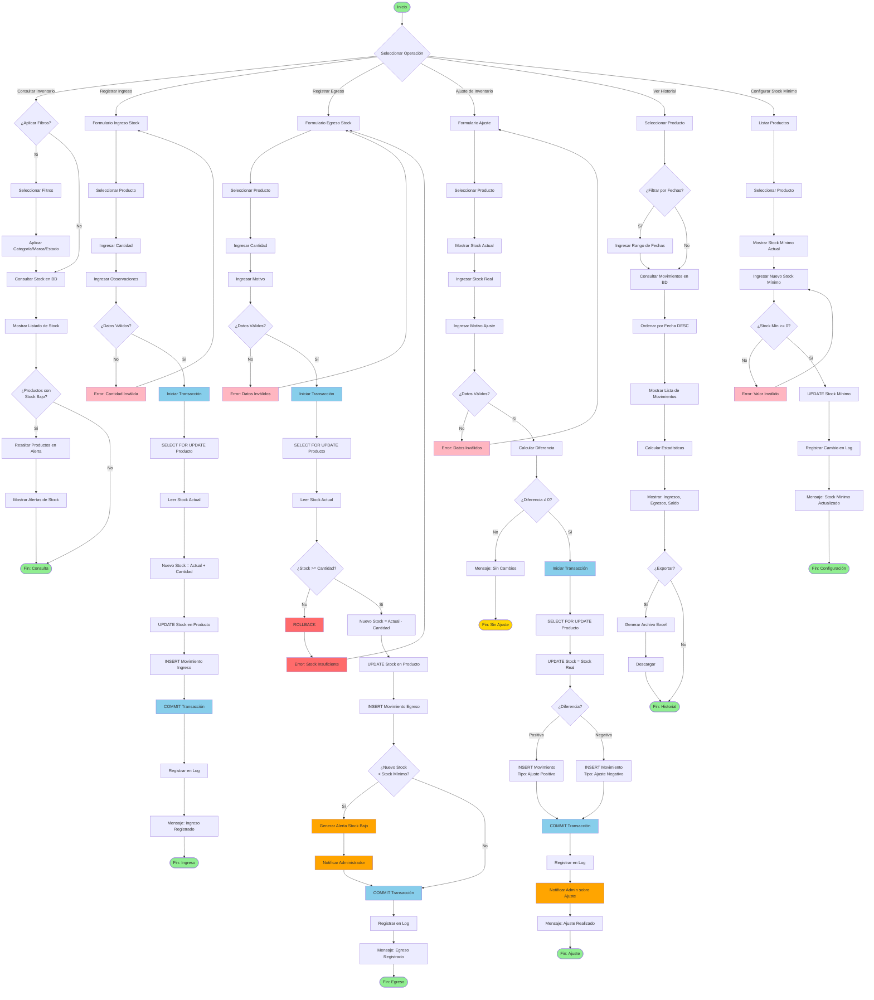

# Diagrama de Actividad: Gestión de Inventario y Stock

## Descripción

Este diagrama de actividad muestra el flujo completo de gestión de inventario, incluyendo movimientos de stock (ingresos, egresos, ajustes), control de stock mínimo, y auditoría de cambios.

## Diagrama



## Descripción de Actividades

### Flujo 1: Consultar Inventario

| Actividad             | Descripción                     | Actor   |
| --------------------- | ------------------------------- | ------- |
| Filtrar Consulta      | Decidir si aplicar filtros      | Admin   |
| Seleccionar Filtros   | Elegir categoría, marca, estado | Admin   |
| Consultar Stock en BD | Query a tabla productos         | Sistema |
| Mostrar Inventario    | Lista con stock actual          | Sistema |
| Verificar Stock Bajo  | Comparar con stock mínimo       | Sistema |
| Resaltar Alerta       | Destacar productos críticos     | Sistema |

**Query de Consulta:**

```python
def consultar_inventario(filtros=None):
    """Consulta inventario con stock actual"""
    productos = Producto.objects.select_related('categoria', 'marca').all()

    # Aplicar filtros
    if filtros:
        if 'categoria' in filtros:
            productos = productos.filter(categoria_id=filtros['categoria'])
        if 'marca' in filtros:
            productos = productos.filter(marca_id=filtros['marca'])
        if 'estado' in filtros:
            productos = productos.filter(estado_producto=filtros['estado'])

    # Ordenar por stock (los más bajos primero)
    productos = productos.order_by('stock')

    # Marcar productos con stock bajo
    for producto in productos:
        producto.alerta_stock = producto.stock <= producto.stock_minimo

    return productos
```

**Detección de Stock Bajo:**

```python
def obtener_productos_stock_bajo():
    """Productos con stock <= stock_mínimo"""
    return Producto.objects.filter(
        stock__lte=F('stock_minimo'),
        estado_producto='activo'
    ).select_related('categoria', 'marca')
```

### Flujo 2: Registrar Ingreso de Stock

| Actividad              | Descripción                             | Actor   |
| ---------------------- | --------------------------------------- | ------- |
| Formulario Ingreso     | Mostrar formulario                      | Sistema |
| Seleccionar Producto   | Admin elige producto                    | Admin   |
| Ingresar Cantidad      | Admin especifica cantidad a ingresar    | Admin   |
| Ingresar Observaciones | Admin añade notas (proveedor, OC, etc.) | Admin   |
| Validar Datos          | Sistema verifica cantidad > 0           | Sistema |
| Iniciar Transacción    | BEGIN TRANSACTION                       | Sistema |
| Bloquear Producto      | SELECT FOR UPDATE (row lock)            | Sistema |
| Calcular Nuevo Stock   | Stock nuevo = Stock actual + Cantidad   | Sistema |
| UPDATE Stock           | Actualizar cantidad en producto         | Sistema |
| INSERT Movimiento      | Registrar movimiento tipo "ingreso"     | Sistema |
| COMMIT                 | Confirmar cambios                       | Sistema |
| Registrar en Log       | Auditoría de operación                  | Sistema |

**Código de Ingreso:**

```python
from django.db import transaction
from django.db.models import F

@transaction.atomic
def registrar_ingreso_stock(producto_id, cantidad, observaciones, usuario):
    """Registra ingreso de stock"""
    # Bloquear producto
    producto = Producto.objects.select_for_update().get(producto_id=producto_id)

    # Validar cantidad
    if cantidad <= 0:
        raise ValueError("Cantidad debe ser mayor a 0")

    # Guardar stock anterior
    stock_anterior = producto.stock

    # Actualizar stock
    producto.stock = F('stock') + cantidad
    producto.save()
    producto.refresh_from_db()

    # Registrar movimiento
    movimiento = MovimientoStock.objects.create(
        producto=producto,
        tipo='ingreso',
        cantidad=cantidad,
        stock_anterior=stock_anterior,
        stock_nuevo=producto.stock,
        observaciones=observaciones,
        usuario=usuario
    )

    # Log
    logger.info(f"Ingreso stock: Producto {producto.nombre}, Cantidad {cantidad}, Usuario {usuario.username}")

    return movimiento
```

### Flujo 3: Registrar Egreso de Stock

| Actividad                  | Descripción                               | Actor   |
| -------------------------- | ----------------------------------------- | ------- |
| Formulario Egreso          | Mostrar formulario                        | Sistema |
| Seleccionar Producto       | Admin elige producto                      | Admin   |
| Ingresar Cantidad          | Admin especifica cantidad a egresar       | Admin   |
| Ingresar Motivo            | Razón del egreso (devolución, daño, etc.) | Admin   |
| Validar Datos              | Sistema verifica datos                    | Sistema |
| Iniciar Transacción        | BEGIN TRANSACTION                         | Sistema |
| Bloquear Producto          | SELECT FOR UPDATE                         | Sistema |
| Verificar Stock Suficiente | Stock actual >= Cantidad solicitada       | Sistema |
| Calcular Nuevo Stock       | Stock nuevo = Stock actual - Cantidad     | Sistema |
| UPDATE Stock               | Actualizar cantidad                       | Sistema |
| INSERT Movimiento          | Registrar movimiento tipo "egreso"        | Sistema |
| Verificar Stock Bajo       | ¿Nuevo stock < stock mínimo?              | Sistema |
| Generar Alerta             | Crear alerta si stock bajo                | Sistema |
| Notificar Admin            | Email/notificación de stock bajo          | Sistema |
| COMMIT                     | Confirmar cambios                         | Sistema |

**Código de Egreso:**

```python
@transaction.atomic
def registrar_egreso_stock(producto_id, cantidad, motivo, observaciones, usuario):
    """Registra egreso de stock"""
    # Bloquear producto
    producto = Producto.objects.select_for_update().get(producto_id=producto_id)

    # Validar cantidad
    if cantidad <= 0:
        raise ValueError("Cantidad debe ser mayor a 0")

    # Verificar stock suficiente
    if producto.stock < cantidad:
        raise ValueError(f"Stock insuficiente. Disponible: {producto.stock}, Solicitado: {cantidad}")

    # Guardar stock anterior
    stock_anterior = producto.stock

    # Actualizar stock
    producto.stock = F('stock') - cantidad
    producto.save()
    producto.refresh_from_db()

    # Registrar movimiento
    movimiento = MovimientoStock.objects.create(
        producto=producto,
        tipo='egreso',
        cantidad=cantidad,
        stock_anterior=stock_anterior,
        stock_nuevo=producto.stock,
        motivo=motivo,
        observaciones=observaciones,
        usuario=usuario
    )

    # Verificar stock bajo
    if producto.stock <= producto.stock_minimo:
        generar_alerta_stock_bajo(producto)
        notificar_admin_stock_bajo(producto)

    # Log
    logger.warning(f"Egreso stock: Producto {producto.nombre}, Cantidad {cantidad}, Motivo {motivo}")

    return movimiento
```

### Flujo 4: Ajuste de Inventario

| Actividad              | Descripción                                | Actor   |
| ---------------------- | ------------------------------------------ | ------- |
| Formulario Ajuste      | Mostrar formulario                         | Sistema |
| Seleccionar Producto   | Admin elige producto                       | Admin   |
| Mostrar Stock Actual   | Sistema muestra stock en sistema           | Sistema |
| Ingresar Stock Real    | Admin ingresa stock real (conteo físico)   | Admin   |
| Ingresar Motivo Ajuste | Razón del ajuste (inventario, error, etc.) | Admin   |
| Calcular Diferencia    | Diferencia = Stock Real - Stock Sistema    | Sistema |
| ¿Diferencia ≠ 0?       | Verificar si hay cambio                    | Sistema |
| Iniciar Transacción    | BEGIN TRANSACTION                          | Sistema |
| UPDATE Stock           | Actualizar a stock real                    | Sistema |
| INSERT Movimiento      | Tipo: ajuste_positivo o ajuste_negativo    | Sistema |
| COMMIT                 | Confirmar cambios                          | Sistema |
| Alertar Ajuste         | Notificar admin sobre discrepancia         | Sistema |

**Código de Ajuste:**

```python
@transaction.atomic
def ajustar_inventario(producto_id, stock_real, motivo, observaciones, usuario):
    """Ajusta inventario según conteo físico"""
    # Bloquear producto
    producto = Producto.objects.select_for_update().get(producto_id=producto_id)

    # Validar stock real
    if stock_real < 0:
        raise ValueError("Stock real no puede ser negativo")

    # Calcular diferencia
    stock_sistema = producto.stock
    diferencia = stock_real - stock_sistema

    # Sin cambios
    if diferencia == 0:
        return None

    # Determinar tipo de ajuste
    if diferencia > 0:
        tipo = 'ajuste_positivo'
        cantidad = diferencia
    else:
        tipo = 'ajuste_negativo'
        cantidad = abs(diferencia)

    # Actualizar stock
    producto.stock = stock_real
    producto.save()

    # Registrar movimiento
    movimiento = MovimientoStock.objects.create(
        producto=producto,
        tipo=tipo,
        cantidad=cantidad,
        stock_anterior=stock_sistema,
        stock_nuevo=stock_real,
        motivo=motivo,
        observaciones=observaciones,
        usuario=usuario
    )

    # Notificar admin sobre discrepancia
    if abs(diferencia) > 10:  # Discrepancia significativa
        notificar_admin_ajuste_inventario(producto, diferencia, motivo)

    # Log
    logger.warning(f"Ajuste inventario: Producto {producto.nombre}, "
                   f"Sistema: {stock_sistema}, Real: {stock_real}, "
                   f"Diferencia: {diferencia}, Motivo: {motivo}")

    return movimiento
```

### Flujo 5: Ver Historial de Movimientos

| Actividad             | Descripción                    | Actor   |
| --------------------- | ------------------------------ | ------- |
| Seleccionar Producto  | Admin elige producto           | Admin   |
| Filtrar por Fechas    | Opcional: rango de fechas      | Admin   |
| Consultar Movimientos | Query a tabla movimiento_stock | Sistema |
| Ordenar por Fecha     | Más recientes primero          | Sistema |
| Mostrar Historial     | Lista de movimientos           | Sistema |
| Calcular Estadísticas | Sumar ingresos, egresos, saldo | Sistema |
| Exportar              | Generar Excel (opcional)       | Sistema |

**Query de Historial:**

```python
def obtener_historial_movimientos(producto_id, fecha_desde=None, fecha_hasta=None):
    """Obtiene historial de movimientos de un producto"""
    movimientos = MovimientoStock.objects.filter(
        producto_id=producto_id
    ).select_related('usuario')

    # Filtrar por fechas
    if fecha_desde:
        movimientos = movimientos.filter(fecha__gte=fecha_desde)
    if fecha_hasta:
        movimientos = movimientos.filter(fecha__lte=fecha_hasta)

    # Ordenar por fecha descendente
    movimientos = movimientos.order_by('-fecha')

    # Calcular estadísticas
    from django.db.models import Sum, Q

    stats = movimientos.aggregate(
        total_ingresos=Sum('cantidad', filter=Q(tipo__in=['ingreso', 'ajuste_positivo'])),
        total_egresos=Sum('cantidad', filter=Q(tipo__in=['egreso', 'ajuste_negativo'])),
    )

    stats['saldo'] = (stats['total_ingresos'] or 0) - (stats['total_egresos'] or 0)

    return movimientos, stats
```

### Flujo 6: Configurar Stock Mínimo

| Actividad                | Descripción                  | Actor   |
| ------------------------ | ---------------------------- | ------- |
| Listar Productos         | Mostrar todos los productos  | Sistema |
| Seleccionar Producto     | Admin elige producto         | Admin   |
| Mostrar Stock Min Actual | Valor actual de stock mínimo | Sistema |
| Ingresar Nuevo Stock Min | Admin establece nuevo valor  | Admin   |
| Validar                  | Stock mínimo >= 0            | Sistema |
| UPDATE Stock Mínimo      | Actualizar campo             | Sistema |
| Registrar Cambio         | Log de auditoría             | Sistema |

**Código:**

```python
def configurar_stock_minimo(producto_id, stock_minimo, usuario):
    """Configura stock mínimo para alertas"""
    # Validar
    if stock_minimo < 0:
        raise ValueError("Stock mínimo no puede ser negativo")

    # Actualizar
    producto = Producto.objects.get(producto_id=producto_id)
    stock_min_anterior = producto.stock_minimo
    producto.stock_minimo = stock_minimo
    producto.save()

    # Log
    logger.info(f"Stock mínimo actualizado: Producto {producto.nombre}, "
                f"Anterior: {stock_min_anterior}, Nuevo: {stock_minimo}, "
                f"Usuario: {usuario.username}")

    return producto
```

## Modelo de Datos: MovimientoStock

```python
class MovimientoStock(models.Model):
    TIPOS_MOVIMIENTO = [
        ('ingreso', 'Ingreso'),
        ('egreso', 'Egreso'),
        ('ajuste_positivo', 'Ajuste Positivo'),
        ('ajuste_negativo', 'Ajuste Negativo'),
        ('venta', 'Venta'),
        ('devolucion', 'Devolución'),
    ]

    producto = models.ForeignKey(Producto, on_delete=models.CASCADE)
    tipo = models.CharField(max_length=20, choices=TIPOS_MOVIMIENTO)
    cantidad = models.IntegerField()
    stock_anterior = models.IntegerField()
    stock_nuevo = models.IntegerField()
    motivo = models.CharField(max_length=100, blank=True)
    observaciones = models.TextField(blank=True)
    usuario = models.ForeignKey(User, on_delete=models.SET_NULL, null=True)
    fecha = models.DateTimeField(auto_now_add=True)

    class Meta:
        db_table = 'movimiento_stock'
        ordering = ['-fecha']
```

## Sistema de Alertas

### Tipos de Alertas

| Tipo de Alerta            | Condición                   | Acción                        |
| ------------------------- | --------------------------- | ----------------------------- | -------------- | ---------------------------- |
| **Stock Bajo**            | `stock <= stock_minimo`     | Notificación a admin          |
| **Stock Crítico**         | `stock <= stock_minimo / 2` | Email urgente a admin         |
| **Stock Agotado**         | `stock == 0`                | Cambiar estado a "agotado"    |
| **Discrepancia Alta**     | `                           | ajuste                        | > 10 unidades` | Notificar para investigación |
| **Movimiento Sospechoso** | Egreso grande (> 50% stock) | Requiere aprobación adicional |

### Implementación de Alertas

```python
def generar_alerta_stock_bajo(producto):
    """Genera alerta cuando stock es bajo"""
    if producto.stock <= producto.stock_minimo:
        nivel = 'critico' if producto.stock <= producto.stock_minimo / 2 else 'bajo'

        Alerta.objects.create(
            tipo='stock_bajo',
            nivel=nivel,
            producto=producto,
            mensaje=f"Stock bajo para {producto.nombre}: {producto.stock} unidades"
        )

        # Notificar admins
        admins = User.objects.filter(is_staff=True)
        for admin in admins:
            notificar_usuario(admin, f"Alerta: Stock bajo en {producto.nombre}")
```

## Métricas de Inventario

### KPIs Principales

| Métrica                     | Fórmula                              | Objetivo      |
| --------------------------- | ------------------------------------ | ------------- |
| **Rotación de Inventario**  | Ventas / Stock Promedio              | > 4 veces/año |
| **Días de Inventario**      | 365 / Rotación                       | < 90 días     |
| **Tasa de Agotamiento**     | Productos Agotados / Total Productos | < 5%          |
| **Exactitud de Inventario** | 1 - (Ajustes / Stock Total)          | > 95%         |
| **Valor de Inventario**     | Σ(Stock × Precio)                    | Monitorear    |

### Consultas de Métricas

```python
from django.db.models import Sum, F, Count

def obtener_metricas_inventario():
    """Calcula métricas clave de inventario"""
    # Valor total del inventario
    valor_inventario = Producto.objects.aggregate(
        valor=Sum(F('stock') * F('precio'))
    )['valor']

    # Productos con stock bajo
    stock_bajo_count = Producto.objects.filter(
        stock__lte=F('stock_minimo')
    ).count()

    # Productos agotados
    agotados_count = Producto.objects.filter(stock=0).count()

    # Total de productos
    total_productos = Producto.objects.count()

    # Tasa de agotamiento
    tasa_agotamiento = (agotados_count / total_productos * 100) if total_productos > 0 else 0

    return {
        'valor_inventario': valor_inventario,
        'productos_stock_bajo': stock_bajo_count,
        'productos_agotados': agotados_count,
        'total_productos': total_productos,
        'tasa_agotamiento': tasa_agotamiento,
    }
```

## Conclusión

Este diagrama de actividad documenta la gestión completa de inventario y stock, mostrando:

- **Múltiples tipos de movimientos** (ingresos, egresos, ajustes)
- **Transacciones ACID** para integridad de datos
- **Control de concurrencia** con row locks
- **Sistema de alertas** para stock bajo
- **Auditoría completa** de todos los movimientos
- **Validaciones robustas** en cada operación

**Aspectos clave del diseño:**

✅ Transacciones ACID para operaciones críticas  
✅ Row-level locks para evitar race conditions  
✅ Registro completo de movimientos para auditoría  
✅ Sistema de alertas automatizado  
✅ Validaciones en múltiples niveles  
✅ Métricas y reportes de inventario

---

**Actualizado**: Octubre 2025  
**Versión**: 1.0
