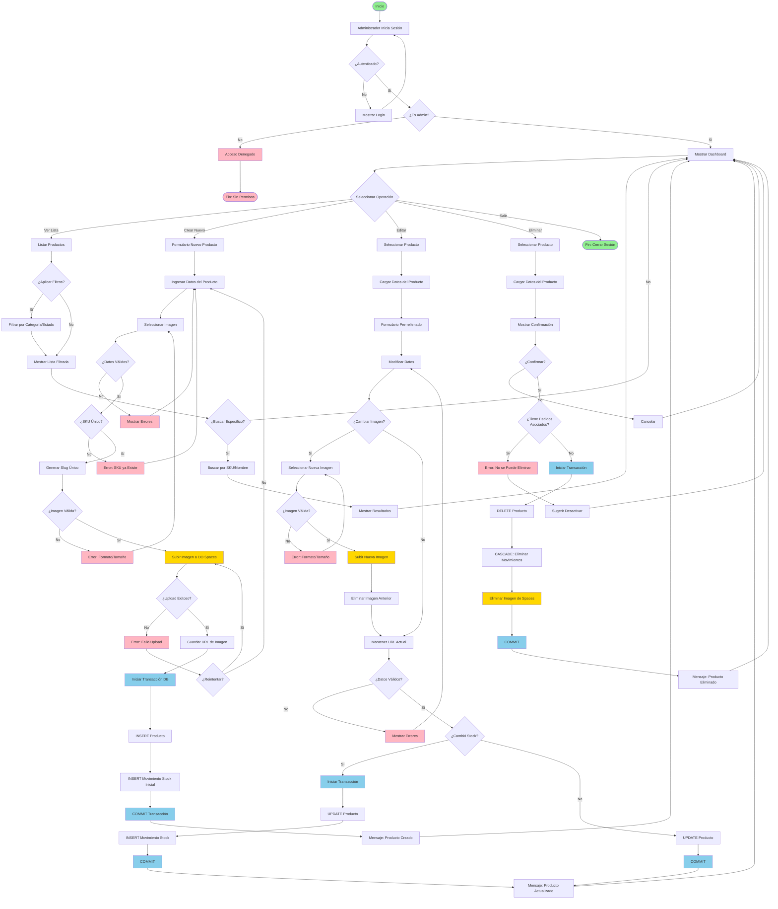

# Diagrama de Actividad: Gestión de Productos (Dashboard Administrativo)

## Descripción

Este diagrama de actividad muestra el flujo completo de gestión de productos desde el dashboard administrativo, incluyendo las operaciones CRUD (Crear, Leer, Actualizar, Eliminar) y la integración con DigitalOcean Spaces para el manejo de imágenes.

## Diagrama



## Descripción de Actividades

### Fase 1: Autenticación y Autorización

| Actividad         | Descripción                                | Actor   |
| ----------------- | ------------------------------------------ | ------- |
| Iniciar Sesión    | Administrador ingresa credenciales         | Admin   |
| Verificar Auth    | Sistema valida credenciales                | Sistema |
| Verificar Rol     | Sistema verifica permisos de administrador | Sistema |
| Mostrar Dashboard | Acceso al panel administrativo             | Sistema |

**Validaciones:**

```python
@login_required
@user_passes_test(lambda u: u.is_staff)
def dashboard_view(request):
    # Solo usuarios staff pueden acceder
    pass
```

### Fase 2: Operación - Listar Productos

| Actividad          | Descripción                          | Actor   |
| ------------------ | ------------------------------------ | ------- |
| Listar Productos   | Mostrar todos los productos          | Sistema |
| Aplicar Filtros    | Filtrar por categoría, marca, estado | Admin   |
| Buscar por SKU     | Búsqueda específica por SKU o nombre | Admin   |
| Mostrar Resultados | Lista filtrada/buscada               | Sistema |

**Query optimizado:**

```python
productos = Producto.objects.select_related(
    'categoria', 'marca'
).filter(
    estado_producto='activo'
).order_by('-fecha_creacion')
```

### Fase 3: Operación - Crear Producto

| Actividad               | Descripción                        | Actor   |
| ----------------------- | ---------------------------------- | ------- |
| Formulario Nuevo        | Mostrar formulario vacío           | Sistema |
| Ingresar Datos          | Admin completa campos              | Admin   |
| Seleccionar Imagen      | Admin carga archivo de imagen      | Admin   |
| Validar Formulario      | Sistema valida campos requeridos   | Sistema |
| Verificar SKU Único     | Sistema verifica que SKU no exista | Sistema |
| Generar Slug            | Sistema crea slug único (slugify)  | Sistema |
| Validar Imagen          | Sistema valida formato y tamaño    | Sistema |
| Subir Imagen a Spaces   | Upload mediante boto3 SDK          | Sistema |
| Guardar URL             | Almacenar URL pública de la imagen | Sistema |
| INSERT Producto         | Insertar registro en BD            | Sistema |
| INSERT Movimiento Stock | Registrar stock inicial            | Sistema |
| COMMIT Transacción      | Confirmar cambios                  | Sistema |

**Validaciones de Datos:**

```python
# Campos requeridos
required_fields = ['nombre', 'sku', 'precio', 'stock', 'categoria', 'marca']

# Validaciones
- SKU: Único, formato alfanumérico
- Precio: > 0
- Stock: >= 0
- Imagen: JPG/PNG/WebP, < 5MB
```

**Generación de Slug:**

```python
from django.utils.text import slugify

base_slug = slugify(nombre)
slug = base_slug
counter = 1

while Producto.objects.filter(slug=slug).exists():
    slug = f"{base_slug}-{counter}"
    counter += 1
```

**Upload a DigitalOcean Spaces:**

```python
import boto3
from django.conf import settings

s3 = boto3.client(
    's3',
    endpoint_url=settings.DO_SPACES_ENDPOINT,
    aws_access_key_id=settings.DO_SPACES_KEY,
    aws_secret_access_key=settings.DO_SPACES_SECRET
)

# Subir imagen
s3.upload_fileobj(
    imagen_file,
    settings.DO_SPACES_BUCKET,
    f'productos/{slug}.jpg',
    ExtraArgs={'ACL': 'public-read', 'ContentType': 'image/jpeg'}
)

# URL resultante
imagen_url = f"{settings.DO_SPACES_CDN}/productos/{slug}.jpg"
```

### Fase 4: Operación - Editar Producto

| Actividad                | Descripción                             | Actor   |
| ------------------------ | --------------------------------------- | ------- |
| Seleccionar Producto     | Admin elige producto a editar           | Admin   |
| Cargar Datos             | Sistema recupera información actual     | Sistema |
| Formulario Pre-rellenado | Mostrar datos existentes                | Sistema |
| Modificar Datos          | Admin actualiza campos                  | Admin   |
| ¿Cambiar Imagen?         | Decisión de actualizar imagen           | Admin   |
| Subir Nueva Imagen       | Upload si hay cambio                    | Sistema |
| Eliminar Imagen Anterior | Borrar imagen antigua de Spaces         | Sistema |
| Validar Datos            | Sistema valida cambios                  | Sistema |
| ¿Cambió Stock?           | Detectar cambio en cantidad             | Sistema |
| UPDATE Producto          | Actualizar registro en BD               | Sistema |
| INSERT Movimiento Stock  | Registrar ajuste (solo si cambió stock) | Sistema |
| COMMIT                   | Confirmar cambios                       | Sistema |

**Detección de cambio de stock:**

```python
producto_anterior = Producto.objects.get(id=producto_id)
stock_anterior = producto_anterior.stock
stock_nuevo = form.cleaned_data['stock']

if stock_nuevo != stock_anterior:
    diferencia = stock_nuevo - stock_anterior
    tipo = 'ingreso' if diferencia > 0 else 'egreso'

    MovimientoStock.objects.create(
        producto=producto,
        tipo=tipo,
        cantidad=abs(diferencia),
        observaciones='Ajuste manual desde dashboard'
    )
```

**Manejo de cambio de imagen:**

```python
if nueva_imagen:
    # Eliminar imagen anterior
    if producto.imagen_url:
        s3.delete_object(
            Bucket=settings.DO_SPACES_BUCKET,
            Key=extraer_key_de_url(producto.imagen_url)
        )

    # Subir nueva imagen
    nueva_url = upload_to_spaces(nueva_imagen, slug)
    producto.imagen_url = nueva_url
```

### Fase 5: Operación - Eliminar Producto

| Actividad              | Descripción                                | Actor   |
| ---------------------- | ------------------------------------------ | ------- |
| Seleccionar Producto   | Admin elige producto a eliminar            | Admin   |
| Cargar Datos           | Sistema muestra información                | Sistema |
| Mostrar Confirmación   | Diálogo de confirmación                    | Sistema |
| ¿Confirmar?            | Admin decide si continuar                  | Admin   |
| Verificar Dependencias | Sistema verifica pedidos asociados         | Sistema |
| DELETE Producto        | Eliminar registro (si no hay dependencias) | Sistema |
| CASCADE Movimientos    | Eliminar movimientos relacionados          | Sistema |
| Eliminar Imagen        | Borrar imagen de Spaces                    | Sistema |
| COMMIT                 | Confirmar eliminación                      | Sistema |

**Verificación de dependencias:**

```python
# Verificar si tiene pedidos asociados
pedidos_count = PedidoItem.objects.filter(producto_id=producto_id).count()

if pedidos_count > 0:
    return error("No se puede eliminar. Producto tiene pedidos asociados.")

# Sugerir alternativa
sugerencia = "Sugerencia: Desactivar el producto en lugar de eliminarlo."
```

**Eliminación segura:**

```python
@transaction.atomic
def eliminar_producto(producto_id):
    producto = Producto.objects.get(id=producto_id)

    # 1. Eliminar imagen de Spaces
    if producto.imagen_url:
        delete_from_spaces(producto.imagen_url)

    # 2. Eliminar producto (CASCADE elimina movimientos)
    producto.delete()

    # 3. COMMIT automático al final del bloque
```

## Puntos de Decisión Clave

### 1. ¿Es Administrador?

**Criterio**: `user.is_staff == True`

- **Sí**: Acceso completo al dashboard
- **No**: Acceso denegado, redirección

### 2. ¿SKU Único?

**Criterio**: `Producto.objects.filter(sku=sku).exists() == False`

- **Sí**: Continúa con creación
- **No**: Error, solicitar otro SKU

### 3. ¿Imagen Válida?

**Criterios múltiples:**

```python
# Formato permitido
extensiones_validas = ['jpg', 'jpeg', 'png', 'webp']
if extension not in extensiones_validas:
    return False

# Tamaño máximo
max_size = 5 * 1024 * 1024  # 5 MB
if imagen.size > max_size:
    return False

# Dimensiones mínimas (opcional)
from PIL import Image
img = Image.open(imagen)
if img.width < 300 or img.height < 300:
    return False
```

### 4. ¿Cambió Stock?

**Criterio**: Comparar stock anterior vs nuevo

- **Sí**: Registrar movimiento de stock (ajuste)
- **No**: Solo actualizar otros campos

### 5. ¿Tiene Pedidos Asociados?

**Criterio**: `PedidoItem.objects.filter(producto=producto).exists()`

- **Sí**: No permitir eliminación, sugerir desactivar
- **No**: Permitir eliminación física

## Validaciones y Reglas de Negocio

### Validaciones de Campos

```python
class ProductoForm(forms.ModelForm):
    def clean_sku(self):
        sku = self.cleaned_data['sku']

        # Verificar que sea único (excepto si es edición del mismo)
        if self.instance.pk:
            exists = Producto.objects.filter(sku=sku).exclude(pk=self.instance.pk).exists()
        else:
            exists = Producto.objects.filter(sku=sku).exists()

        if exists:
            raise ValidationError("Ya existe un producto con este SKU")

        return sku

    def clean_precio(self):
        precio = self.cleaned_data['precio']
        if precio <= 0:
            raise ValidationError("El precio debe ser mayor a 0")
        return precio

    def clean_stock(self):
        stock = self.cleaned_data['stock']
        if stock < 0:
            raise ValidationError("El stock no puede ser negativo")
        return stock
```

### Reglas de Negocio

| Regla                            | Descripción                                          |
| -------------------------------- | ---------------------------------------------------- |
| **SKU Único**                    | No puede haber dos productos con el mismo SKU        |
| **Slug Único**                   | Generado automáticamente, agregando sufijo si existe |
| **Precio Positivo**              | Precio > 0                                           |
| **Stock No Negativo**            | Stock >= 0                                           |
| **Categoría y Marca Requeridas** | Deben existir previamente                            |
| **Imagen Obligatoria**           | Al crear, debe subir imagen                          |
| **No Eliminar con Pedidos**      | Productos con historial de ventas no se eliminan     |
| **Registrar Movimientos**        | Todo cambio de stock debe quedar auditado            |

## Manejo de Transacciones

### Crear Producto

```python
@transaction.atomic
def crear_producto(form, imagen):
    # 1. Subir imagen (fuera de transacción)
    imagen_url = upload_to_spaces(imagen, slug)

    # 2. Iniciar transacción
    producto = form.save(commit=False)
    producto.imagen_url = imagen_url
    producto.save()

    # 3. Registrar movimiento de stock inicial
    MovimientoStock.objects.create(
        producto=producto,
        tipo='ingreso',
        cantidad=producto.stock,
        observaciones='Stock inicial'
    )

    # 4. COMMIT automático al finalizar
    return producto
```

### Editar Producto

```python
@transaction.atomic
def editar_producto(producto_id, form, nueva_imagen=None):
    producto = Producto.objects.get(id=producto_id)
    stock_anterior = producto.stock

    # Actualizar campos
    for field, value in form.cleaned_data.items():
        setattr(producto, field, value)

    # Cambiar imagen si existe
    if nueva_imagen:
        delete_from_spaces(producto.imagen_url)
        producto.imagen_url = upload_to_spaces(nueva_imagen, producto.slug)

    producto.save()

    # Registrar movimiento si cambió stock
    stock_nuevo = producto.stock
    if stock_nuevo != stock_anterior:
        diferencia = stock_nuevo - stock_anterior
        MovimientoStock.objects.create(
            producto=producto,
            tipo='ingreso' if diferencia > 0 else 'egreso',
            cantidad=abs(diferencia),
            observaciones='Ajuste manual'
        )

    return producto
```

### Eliminar Producto

```python
@transaction.atomic
def eliminar_producto(producto_id):
    producto = Producto.objects.select_for_update().get(id=producto_id)

    # Verificar dependencias
    if PedidoItem.objects.filter(producto=producto).exists():
        raise ValueError("No se puede eliminar producto con pedidos")

    # Guardar URL de imagen para eliminar
    imagen_url = producto.imagen_url

    # Eliminar producto (CASCADE elimina movimientos)
    producto.delete()

    # Eliminar imagen de Spaces (fuera de transacción)
    if imagen_url:
        delete_from_spaces(imagen_url)

    return True
```

## Integración con DigitalOcean Spaces

### Configuración

```python
# settings.py
DO_SPACES_ENDPOINT = 'https://nyc3.digitaloceanspaces.com'
DO_SPACES_BUCKET = 'cordillerapets'
DO_SPACES_CDN = 'https://cordillerapets.nyc3.cdn.digitaloceanspaces.com'
DO_SPACES_KEY = os.getenv('DO_SPACES_KEY')
DO_SPACES_SECRET = os.getenv('DO_SPACES_SECRET')
```

### Funciones Helper

```python
import boto3
from django.conf import settings

def get_spaces_client():
    return boto3.client(
        's3',
        endpoint_url=settings.DO_SPACES_ENDPOINT,
        aws_access_key_id=settings.DO_SPACES_KEY,
        aws_secret_access_key=settings.DO_SPACES_SECRET
    )

def upload_to_spaces(imagen, slug):
    """Sube imagen a Spaces y retorna URL pública"""
    s3 = get_spaces_client()
    key = f'productos/{slug}.jpg'

    s3.upload_fileobj(
        imagen,
        settings.DO_SPACES_BUCKET,
        key,
        ExtraArgs={
            'ACL': 'public-read',
            'ContentType': 'image/jpeg'
        }
    )

    return f"{settings.DO_SPACES_CDN}/{key}"

def delete_from_spaces(imagen_url):
    """Elimina imagen de Spaces dado su URL"""
    s3 = get_spaces_client()

    # Extraer key del URL
    key = imagen_url.split(settings.DO_SPACES_CDN + '/')[-1]

    s3.delete_object(
        Bucket=settings.DO_SPACES_BUCKET,
        Key=key
    )

    return True
```

## Métricas y Auditoría

### Logs del Sistema

```python
import logging
logger = logging.getLogger(__name__)

# Al crear producto
logger.info(f"Producto creado: {producto.nombre} (ID: {producto.id}), Admin: {request.user.username}")

# Al editar producto
logger.info(f"Producto editado: {producto.id}, Cambios: {cambios}, Admin: {request.user.username}")

# Al eliminar producto
logger.warning(f"Producto eliminado: {producto.id}, Admin: {request.user.username}")

# Errores
logger.error(f"Error al subir imagen: {str(e)}, Producto: {producto_id}")
```

### Tabla de Auditoría (Opcional)

```python
class AuditoriaProducto(models.Model):
    producto = models.ForeignKey(Producto, on_delete=models.SET_NULL, null=True)
    accion = models.CharField(max_length=20)  # crear, editar, eliminar
    usuario = models.ForeignKey(User, on_delete=models.SET_NULL, null=True)
    fecha = models.DateTimeField(auto_now_add=True)
    cambios = models.JSONField()  # Registro de qué cambió
```

## Tiempo Estimado por Operación

| Operación         | Tiempo Estimado | Notas                         |
| ----------------- | --------------- | ----------------------------- |
| Listar productos  | 2-3 segundos    | Con paginación (50 items)     |
| Crear producto    | 10-15 segundos  | Incluye upload de imagen      |
| Editar producto   | 5-10 segundos   | Más si cambia imagen          |
| Eliminar producto | 2-5 segundos    | Incluye eliminación de imagen |
| Buscar producto   | 1-2 segundos    | Búsqueda por SKU/nombre       |

## Conclusión

Este diagrama de actividad documenta completamente el flujo de gestión de productos en el dashboard administrativo, mostrando:

- **Autenticación y autorización** robusta
- **Operaciones CRUD completas** con validaciones
- **Integración con DigitalOcean Spaces** para manejo de imágenes
- **Transacciones ACID** para integridad de datos
- **Auditoría** de cambios mediante movimientos de stock
- **Manejo de errores** y validaciones en cada paso

**Aspectos clave del diseño:**

✅ Control de acceso basado en roles  
✅ Validaciones en múltiples niveles (cliente y servidor)  
✅ Manejo seguro de imágenes en cloud storage  
✅ Transacciones ACID para operaciones críticas  
✅ Auditoría completa de cambios de inventario  
✅ Prevención de eliminación de datos con dependencias

---

**Actualizado**: Octubre 2025  
**Versión**: 1.0
