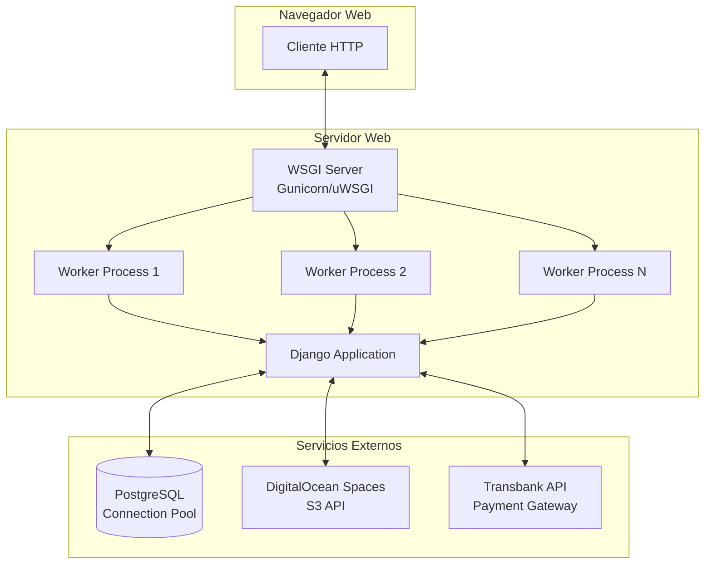

# Arquitectura de Procesos del Sistema

Este diagrama muestra la arquitectura de procesos del sistema Cordillera Pets eCommerce, incluyendo el flujo desde el cliente web hasta los servicios externos.

## Descripción de Procesos

### 1. Cliente Web (Browser)

- **Proceso**: Navegador del usuario
- **Responsabilidad**: Renderizar UI, ejecutar JavaScript, manejar eventos

### 2. WSGI Server

- **Proceso**: Servidor WSGI (Gunicorn/uWSGI en producción)
- **Responsabilidad**: Gestionar conexiones HTTP, load balancing
- **Workers**: Múltiples procesos para concurrencia

### 3. Django Application

- **Proceso**: Aplicación Django en cada worker
- **Responsabilidad**: Procesar requests, ejecutar lógica de negocio
- **Thread**: Un thread por request (modelo síncrono)

### 4. PostgreSQL

- **Proceso**: Servidor de base de datos
- **Connection Pool**: Pool de conexiones gestionado por PostgreSQL

### 5. DigitalOcean Spaces

- **Proceso**: Servicio externo S3-compatible
- **API**: REST API para upload/download de imágenes
