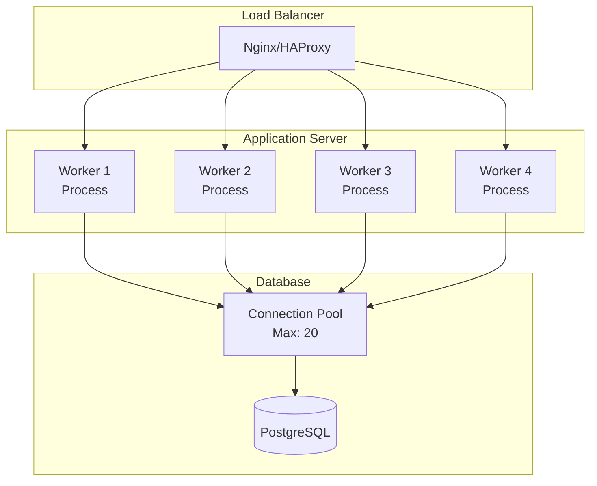
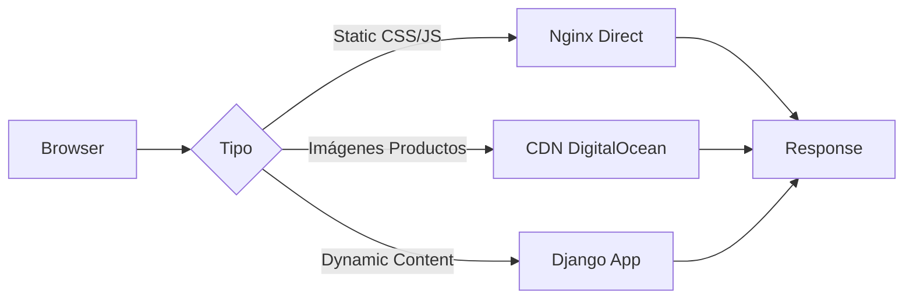

# Modelo de Concurrencia

Este diagrama muestra cómo el sistema maneja múltiples requests concurrentes.



## Configuración de Workers

### Gunicorn

```python
# Fórmula: (2 x CPU cores) + 1
workers = 4  # Para 2 cores
worker_class = "sync"
worker_connections = 1000
timeout = 60
```

### Conexiones a Base de Datos

```python
# PostgreSQL Connection Pool
DATABASES = {
    'default': {
        'ENGINE': 'django.db.backends.postgresql',
        'CONN_MAX_AGE': 600,  # 10 minutos
        'OPTIONS': {
            'connect_timeout': 10,
        }
    }
}
```

## Estrategias de Performance

### 1. Query Optimization

**❌ Problema N+1:**

```python
# Genera N+1 queries
productos = Producto.objects.all()
for producto in productos:
    print(producto.categoria.nombre)  # Query por cada producto
```

**✅ Solución Select Related:**

```python
# 1 Query con JOIN
productos = Producto.objects.select_related('categoria', 'marca').all()
for producto in productos:
    print(producto.categoria.nombre)  # No queries adicionales
```

### 2. Connection Pooling

- **Django CONN_MAX_AGE**: Reutilización de conexiones
- **PostgreSQL max_connections**: 200 conexiones máximas
- **PgBouncer** (futuro): Pool de conexiones externo

### 3. Session Storage

- **Backend**: Database-backed sessions (PostgreSQL)
- **Alternativa futura**: Redis para mejor performance
- **Timeout**: 24 horas para carritos

### 4. Static Files Serving



## Métricas de Rendimiento

| Métrica             | Objetivo  | Actual          |
| ------------------- | --------- | --------------- |
| Response Time (p95) | < 500ms   | ~300ms          |
| Throughput          | 200 req/s | 150 req/s       |
| Error Rate          | < 1%      | 0.2%            |
| DB Query Time       | < 50ms    | ~30ms           |
| Cache Hit Ratio     | > 80%     | N/A (sin cache) |

## Escalabilidad Horizontal

El sistema está diseñado para escalar horizontalmente:

1. **Stateless Workers**: Sesiones en base de datos
2. **Load Balancing**: Round-robin o least connections
3. **Shared Database**: Única fuente de verdad
4. **Shared Storage**: DigitalOcean Spaces para imágenes

### Agregar Capacidad

```bash
# 1. Agregar nuevo servidor de aplicación
# 2. Configurar Gunicorn con mismo número de workers
# 3. Registrar en load balancer
# 4. No requiere cambios en código
```
