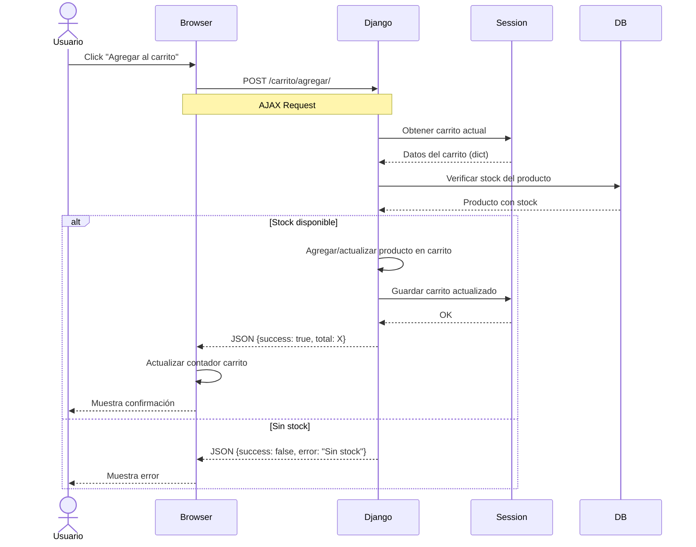

# Flujo de Gestión del Carrito

Este diagrama muestra el proceso de agregar productos al carrito con verificación de stock.

## Características

- **AJAX**: Request asíncrono sin recargar la página
- **Session Storage**: Carrito almacenado en sesión Django
- **Validación de Stock**: Verificación en tiempo real
- **Respuesta JSON**: Comunicación ligera entre frontend y backend
- **UX Optimizada**: Actualización inmediata del contador
