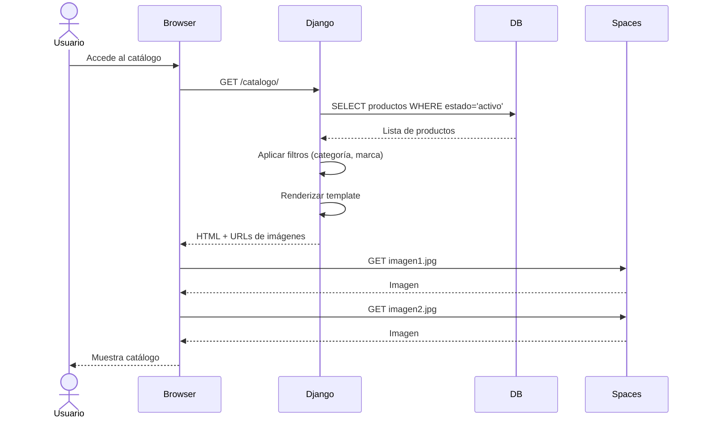

# Flujo de Navegación del Catálogo

Este diagrama de secuencia muestra el proceso completo cuando un usuario navega por el catálogo de productos.

## Puntos Clave

1. **Consulta a Base de Datos**: Se filtran solo productos activos
2. **Filtrado Dinámico**: Categoría y marca se aplican en el servidor
3. **Carga de Imágenes**: Las imágenes se cargan desde DigitalOcean Spaces
4. **Renderizado**: El template se renderiza en el servidor (SSR)
5. **Performance**: Las imágenes se cargan en paralelo desde el CDN
