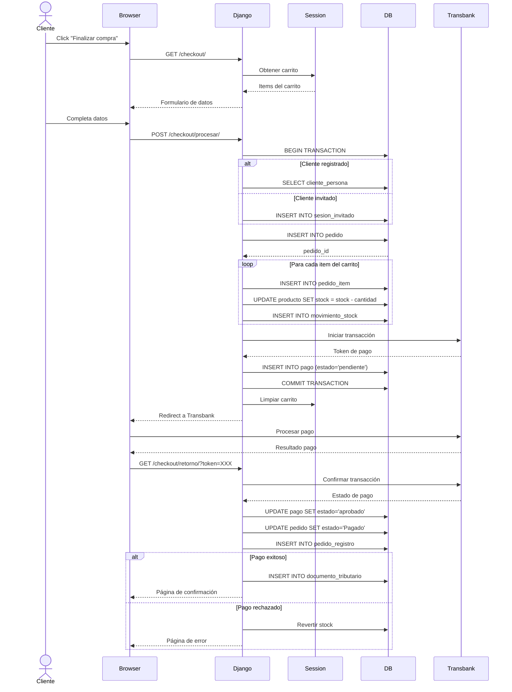

# Flujo de Checkout y Pago

Este diagrama muestra el proceso completo de checkout, incluyendo la creación del pedido y la integración con Transbank.

## Fases del Checkout

### Fase 1: Preparación

- Validación de carrito
- Formulario de datos de cliente

### Fase 2: Creación del Pedido

- **Transacción ACID**: Todo o nada
- Actualización de stock con locks
- Registro de movimientos

### Fase 3: Procesamiento de Pago

- Integración con Transbank API
- Redirect a pasarela de pago
- Manejo de callback

### Fase 4: Confirmación

- Actualización de estados
- Generación de documento tributario
- Limpieza de carrito

## Manejo de Errores

- **Stock insuficiente**: Rollback de transacción
- **Pago rechazado**: Reversión de stock
- **Timeout**: Pedido marcado como cancelado
