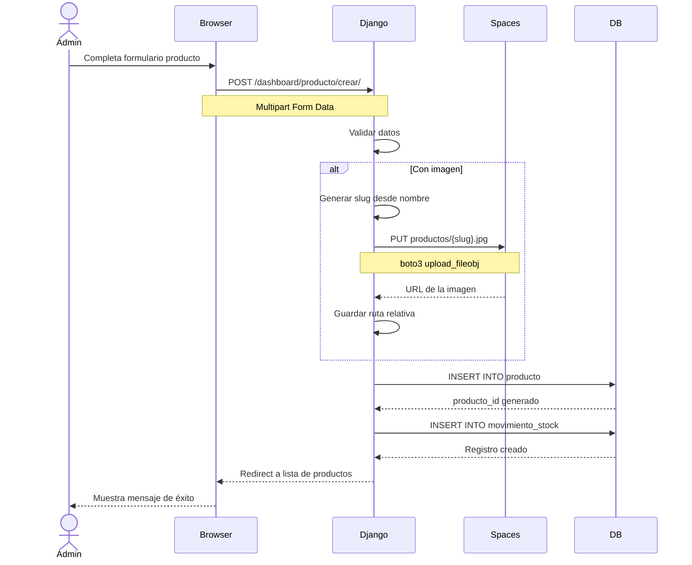

# Flujo de Creación de Producto (Dashboard)

Este diagrama muestra el proceso completo de creación de un producto por un administrador, incluyendo la subida de imágenes a DigitalOcean Spaces.

## Proceso de Upload

1. **Validación**: Datos del formulario son validados
2. **Generación de Slug**: Nombre único basado en el nombre del producto
3. **Upload a Spaces**: Imagen subida vía boto3 SDK (S3-compatible)
4. **Inserción en BD**: Producto creado con referencia a la imagen
5. **Movimiento de Stock**: Registro inicial del inventario
6. **Confirmación**: Redirect con mensaje de éxito
