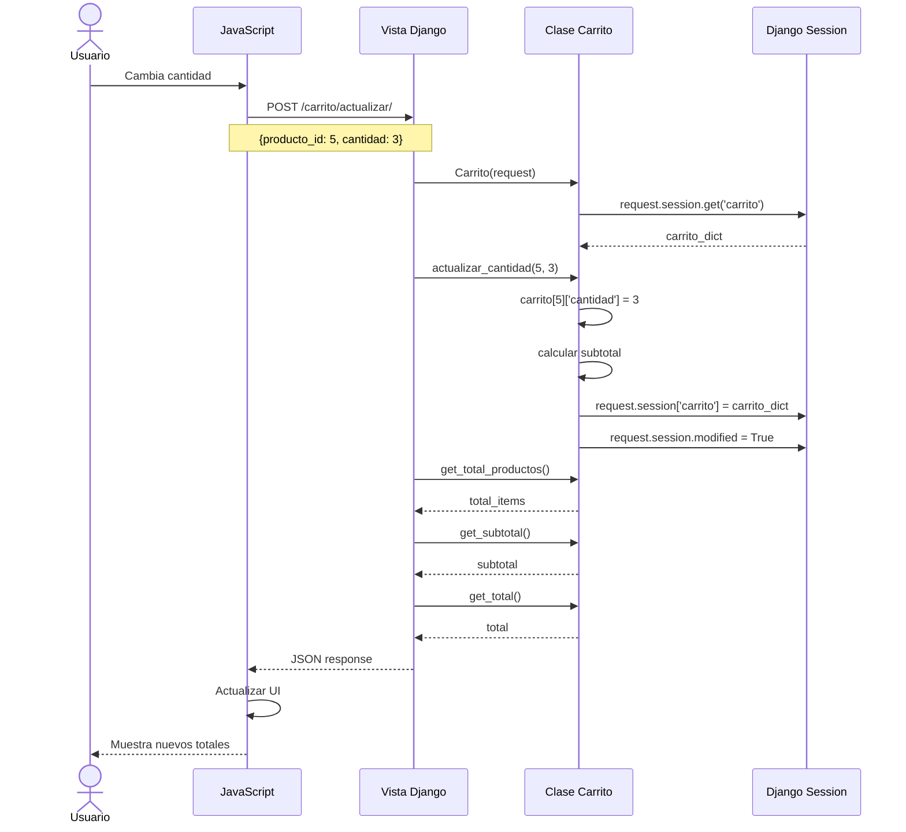

# Secuencia: Actualización de Cantidad en Carrito

Este diagrama muestra el flujo detallado de actualización de cantidad de un producto en el carrito.



## Clase Carrito

La clase `Carrito` encapsula toda la lógica de gestión del carrito:

- **Inicialización**: Lee carrito de sesión
- **Operaciones**: Agregar, actualizar, eliminar
- **Cálculos**: Subtotales, total, envío
- **Persistencia**: Guarda cambios en sesión

## Almacenamiento en Sesión

```python
# Estructura del carrito en sesión
carrito = {
    "5": {
        "producto_id": 5,
        "nombre": "Alimento Royal Canin",
        "precio": 45990,
        "cantidad": 3,
        "imagen": "productos/royal-canin.jpg"
    },
    "12": {
        "producto_id": 12,
        "nombre": "Arena Sanitaria",
        "precio": 8990,
        "cantidad": 2,
        "imagen": "productos/arena.jpg"
    }
}
```
