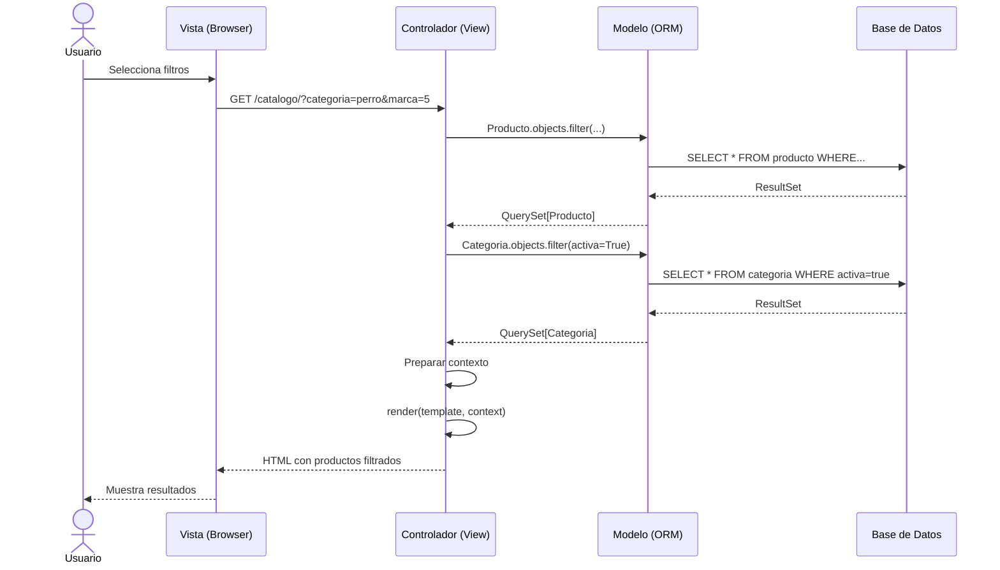

# Secuencia: Búsqueda y Filtrado de Productos

Este diagrama muestra la interacción entre las capas del sistema al buscar y filtrar productos.

## Patrón MVC en Django

- **Vista (Browser)**: Interfaz de usuario
- **Controlador (View)**: Lógica de negocio en Django
- **Modelo (ORM)**: Abstracción de base de datos

## Queries Ejecutados

1. **Productos filtrados**: Con JOIN a categoría y marca
2. **Categorías activas**: Para mostrar en sidebar
3. **Marcas activas**: Para filtros adicionales
