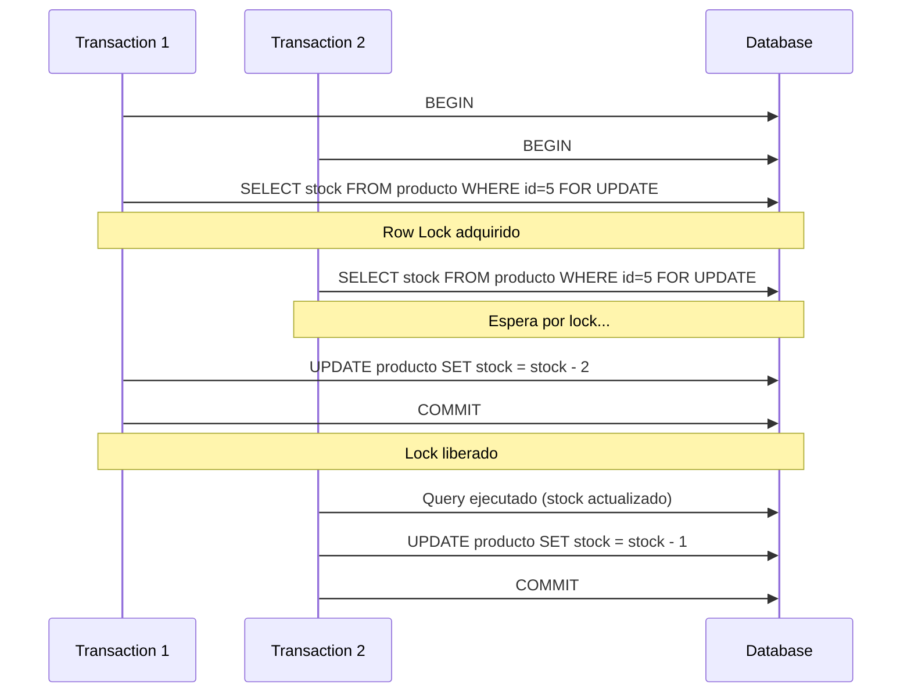

# Control de Concurrencia y Sincronización

Este diagrama muestra cómo el sistema maneja la concurrencia en operaciones críticas como la actualización de stock.



## Mecanismos de Sincronización

### 1. Row-Level Locks (FOR UPDATE)

Django ORM soporta `select_for_update()` para adquirir locks a nivel de fila:

```python
from django.db import transaction

@transaction.atomic
def crear_pedido(carrito, cliente):
    for item in carrito.items():
        # Adquirir lock exclusivo en la fila del producto
        producto = Producto.objects.select_for_update().get(id=item.id)

        if producto.stock >= item.cantidad:
            producto.stock -= item.cantidad
            producto.save()
            PedidoItem.objects.create(...)
        else:
            raise ValueError("Stock insuficiente")
```

### 2. Transacciones ACID

Django garantiza transacciones ACID con `@transaction.atomic`:

**Atomicidad**: Todo o nada

```python
@transaction.atomic
def procesar_checkout():
    pedido = Pedido.objects.create(...)
    for item in items:
        actualizar_stock(item)  # Si falla, todo se revierte
    crear_pago(...)
```

**Consistencia**: Constraints de BD

```python
# Constraint de stock no negativo en PostgreSQL
ALTER TABLE producto ADD CONSTRAINT stock_positivo CHECK (stock >= 0);
```

**Isolation**: Niveles de aislamiento

```python
# Django usa READ COMMITTED por defecto
# Evita dirty reads, permite non-repeatable reads
```

**Durability**: WAL de PostgreSQL

- Write-Ahead Logging garantiza persistencia
- Backups automáticos

### 3. Optimistic Locking (Futuro)

Para mejor concurrencia, se puede implementar optimistic locking:

```python
class Producto(models.Model):
    version = models.IntegerField(default=0)

    def save(self, *args, **kwargs):
        if self.pk:
            # UPDATE producto SET stock=X, version=version+1
            # WHERE id=Y AND version=Z
            updated = Producto.objects.filter(
                pk=self.pk,
                version=self.version
            ).update(
                stock=self.stock,
                version=self.version + 1
            )
            if not updated:
                raise ConcurrentModificationError()
        else:
            super().save(*args, **kwargs)
```

## Escenarios de Race Condition

### Escenario 1: Doble Venta (RESUELTO)

**Problema sin locks:**

```
Tiempo  | Cliente A          | Cliente B
--------|--------------------|-----------------
t0      | READ stock = 1     |
t1      |                    | READ stock = 1
t2      | UPDATE stock = 0   |
t3      |                    | UPDATE stock = -1 ❌
```

**Solución con FOR UPDATE:**

```
Tiempo  | Cliente A          | Cliente B
--------|--------------------|-----------------
t0      | LOCK + READ stock=1|
t1      |                    | WAIT...
t2      | UPDATE stock = 0   |
t3      | COMMIT + UNLOCK    |
t4      |                    | LOCK + READ stock=0
t5      |                    | ERROR: Sin stock ✓
```

### Escenario 2: Lost Update (RESUELTO)

**Problema:**

```python
# Sin transacción
producto = Producto.objects.get(id=5)  # stock = 10
producto.stock -= 2
# Otro proceso modifica aquí
producto.save()  # Sobrescribe cambios del otro proceso ❌
```

**Solución:**

```python
# Con transacción y lock
with transaction.atomic():
    producto = Producto.objects.select_for_update().get(id=5)
    producto.stock -= 2
    producto.save()  # Cambios protegidos ✓
```

## Niveles de Aislamiento

PostgreSQL soporta 4 niveles de aislamiento:

| Nivel                               | Dirty Read | Non-Repeatable Read | Phantom Read |
| ----------------------------------- | ---------- | ------------------- | ------------ |
| Read Uncommitted                    | Posible    | Posible             | Posible      |
| **Read Committed** (Django default) | Imposible  | Posible             | Posible      |
| Repeatable Read                     | Imposible  | Imposible           | Posible      |
| Serializable                        | Imposible  | Imposible           | Imposible    |

### Cambiar nivel de aislamiento

```python
from django.db import transaction

@transaction.atomic
def critical_operation():
    with transaction.get_connection().cursor() as cursor:
        cursor.execute("SET TRANSACTION ISOLATION LEVEL SERIALIZABLE")
    # Operación crítica
```

## Deadlock Detection

PostgreSQL detecta automáticamente deadlocks:

```python
from django.db import OperationalError

try:
    with transaction.atomic():
        # Operación que podría causar deadlock
        pass
except OperationalError as e:
    if 'deadlock detected' in str(e):
        # Reintentar operación
        pass
```

## Best Practices

1. **Minimizar tiempo de lock**: Operaciones rápidas dentro de transacciones
2. **Orden consistente**: Siempre adquirir locks en el mismo orden
3. **Timeout de transacciones**: Evitar locks infinitos
4. **Monitoreo**: Detectar bloqueos prolongados

```sql
-- Ver locks activos
SELECT * FROM pg_locks WHERE NOT granted;

-- Ver transacciones activas
SELECT * FROM pg_stat_activity WHERE state = 'active';
```
