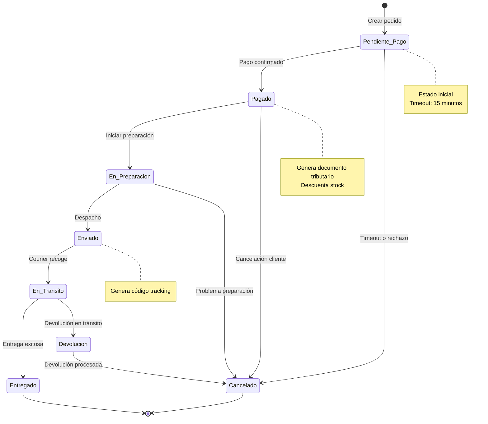
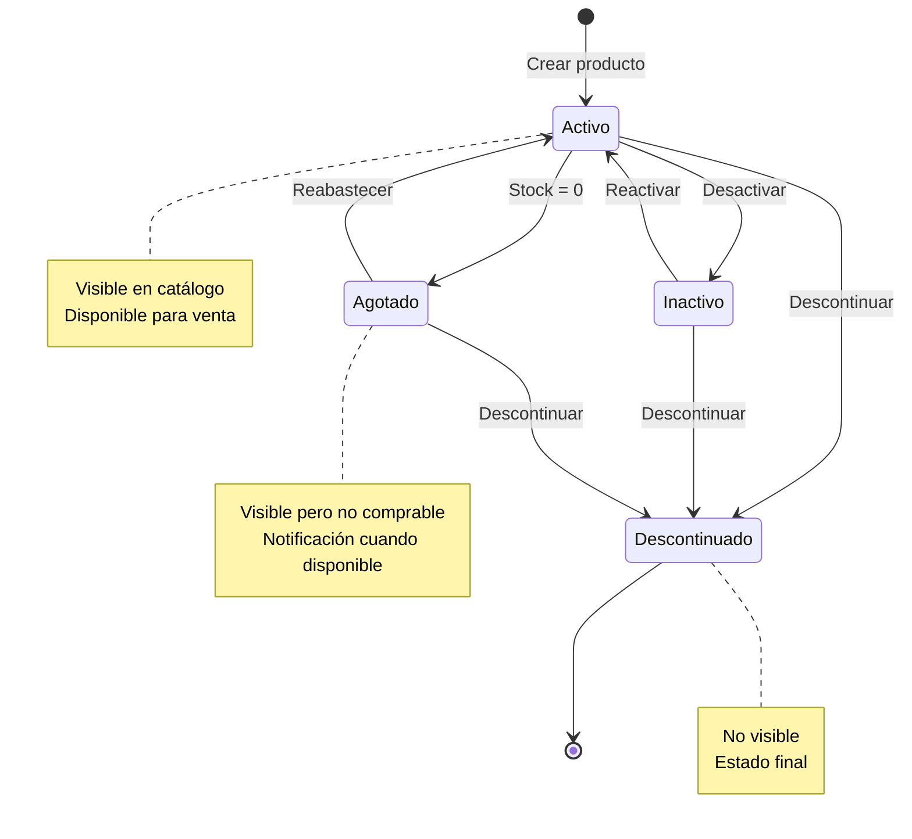
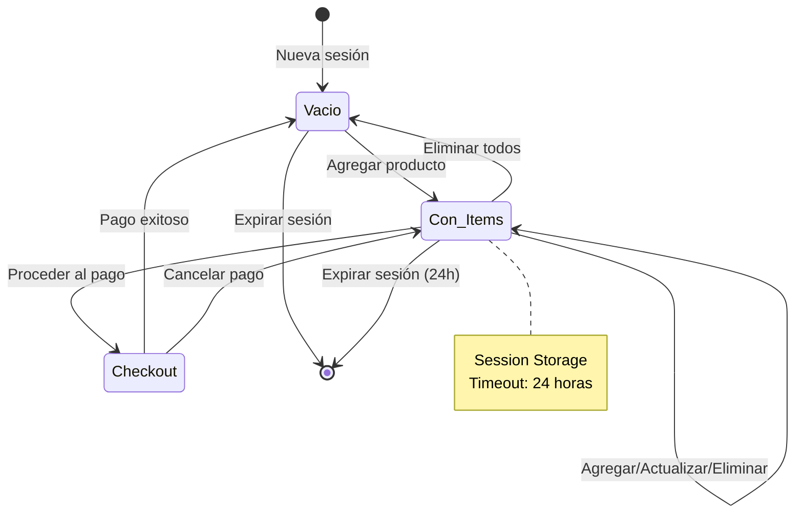

# Diagramas de Estados

Este archivo contiene los diagramas de máquinas de estados para las entidades principales del sistema.

## Estados del Pedido

### Transiciones del Pedido

| Estado Origen  | Evento              | Estado Destino |
| -------------- | ------------------- | -------------- |
| [Inicial]      | Crear pedido        | Pendiente_Pago |
| Pendiente_Pago | Pago confirmado     | Pagado         |
| Pendiente_Pago | Timeout/Rechazo     | Cancelado      |
| Pagado         | Iniciar preparación | En_Preparacion |
| Pagado         | Cancelación cliente | Cancelado      |
| En_Preparacion | Despacho            | Enviado        |
| En_Preparacion | Problema            | Cancelado      |
| Enviado        | Courier recoge      | En_Transito    |
| En_Transito    | Entrega exitosa     | Entregado      |
| En_Transito    | Devolución          | Devolucion     |
| Devolucion     | Procesada           | Cancelado      |

---

## Estados del Producto

### Transiciones del Producto

| Estado Origen | Evento         | Estado Destino |
| ------------- | -------------- | -------------- |
| [Inicial]     | Crear producto | Activo         |
| Activo        | Desactivar     | Inactivo       |
| Activo        | Stock = 0      | Agotado        |
| Activo        | Descontinuar   | Descontinuado  |
| Inactivo      | Reactivar      | Activo         |
| Inactivo      | Descontinuar   | Descontinuado  |
| Agotado       | Reabastecer    | Activo         |
| Agotado       | Descontinuar   | Descontinuado  |

---

## Estados de la Sesión del Carrito

### Ciclo de Vida del Carrito

1. **Vacio**: Carrito recién creado o vaciado
2. **Con_Items**: Uno o más productos agregados
3. **Checkout**: Usuario en proceso de pago
4. **Expiración**: Sesión caduca después de 24 horas

### Eventos del Carrito

- **Agregar producto**: Vacio → Con_Items
- **Actualizar cantidad**: Con_Items → Con_Items
- **Eliminar producto**: Con_Items → Con_Items o Vacio
- **Proceder al pago**: Con_Items → Checkout
- **Pago exitoso**: Checkout → Vacio (limpieza)
- **Cancelar pago**: Checkout → Con_Items
- **Timeout**: Cualquier estado → [Final]

## Implementación

Los estados se implementan como:

- **Pedido**: Campo `estado` con choices en modelo Django
- **Producto**: Campo `estado` con choices en modelo Django
- **Carrito**: Lógica en clase `Carrito` basada en sesión Django
