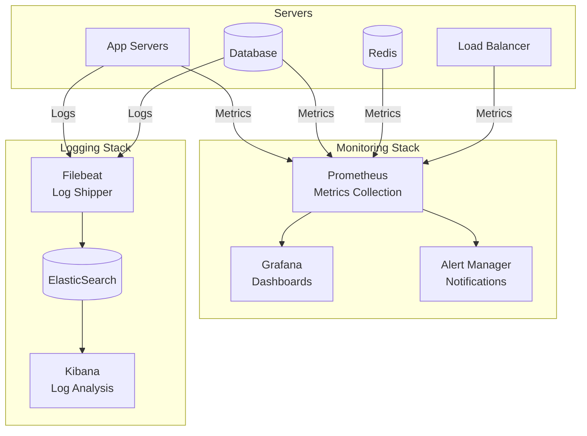

# Vista Física

## Descripción General

La Vista Física describe la topología del sistema en términos de hardware, la distribución del software en el hardware, y las conexiones físicas entre componentes. Esta vista es crucial para entender el despliegue y la infraestructura.

## Propósito

Esta vista permite entender:

- La arquitectura de infraestructura
- La distribución de componentes en servidores
- Las conexiones de red
- Los requisitos de hardware
- La estrategia de despliegue

## Contenido

1. [Arquitectura de Despliegue](#arquitectura-de-despliegue)
2. [Topología de Red](#topología-de-red)
3. [Componentes de Hardware](#componentes-de-hardware)
4. [Configuración de Servidores](#configuración-de-servidores)
5. [Estrategia de Escalabilidad](#estrategia-de-escalabilidad)

---

## Arquitectura de Despliegue

📄 **[Ver diagramas de despliegue completos](./diagramas-despliegue.md)**

El sistema tiene dos arquitecturas de despliegue: desarrollo (actual) y producción (propuesta).

### Despliegue Actual (Desarrollo)

**Componentes:**

- Django Development Server (puerto 8000)
- PostgreSQL Local (puerto 5432)
- Archivos estáticos locales
- DigitalOcean Spaces (cloud)

**Características:**

- Entorno simple para desarrollo
- Servidor único
- Sin SSL en local
- Imágenes en cloud compartido

### Despliegue Propuesto (Producción)

**Arquitectura multi-tier:**

- **CDN/Edge**: DigitalOcean Spaces CDN
- **DMZ**: Load Balancer (Nginx/HAProxy)
- **Application Tier**: 2 App Servers con Gunicorn
- **Data Tier**: PostgreSQL + Redis
- **External Services**: Transbank API

**Zonas de red:**

- DMZ: 10.0.1.0/24
- Application: 10.0.2.0/24
- Data: 10.0.3.0/24

---

## Topología de Red

📄 **[Ver diagrama de topología de red completo](./diagrama-topologia-red.md)**

Segmentación de red en tres capas con firewalls entre cada zona.

### Segmentación de Red (Producción)

**Subnets:**

- **DMZ**: 10.0.1.0/24 - Load Balancer
- **Application Tier**: 10.0.2.0/24 - App Servers
- **Data Tier**: 10.0.3.0/24 - PostgreSQL, Redis

### Puertos y Protocolos

| Servicio   | Puerto | Protocolo | Descripción                  |
| ---------- | ------ | --------- | ---------------------------- |
| HTTP       | 80     | TCP       | Redirige a HTTPS             |
| HTTPS      | 443    | TCP       | Tráfico web principal        |
| Gunicorn   | 8000   | TCP       | Aplicación Django            |
| PostgreSQL | 5432   | TCP       | Base de datos                |
| Redis      | 6379   | TCP       | Cache y sesiones             |
| SSH        | 22     | TCP       | Administración (restringido) |

---

## Componentes de Hardware

📄 **[Ver especificaciones de hardware completas](./diagramas-componentes-hardware.md)**

Requisitos de hardware para cada componente del sistema.

### Desarrollo

**Workstation:**

- CPU: 4 cores, 2.5 GHz
- RAM: 8 GB DDR4
- Disco: 256 GB SSD
- Red: 100 Mbps

### Producción

**Load Balancer:**

- CPU: 2 cores, 2.4 GHz
- RAM: 4 GB
- Disco: 50 GB SSD
- Red: 1 Gbps (2x NIC)

**Application Servers (x2):**

- CPU: 4 cores, 2.8 GHz
- RAM: 16 GB DDR4
- Disco: 100 GB SSD
- Workers: 4 por servidor
- Conexiones: ~400 concurrentes

**Database Server:**

- CPU: 8 cores, 3.0 GHz
- RAM: 32 GB DDR4
- Disco: 500 GB SSD NVMe RAID 1
- Backup: 1 TB HDD
- Red: 10 Gbps

**PostgreSQL Configuration:**

```conf
shared_buffers = 8GB
effective_cache_size = 24GB
max_connections = 200
```

**Cache Server (Redis):**

- CPU: 2 cores, 2.8 GHz
- RAM: 8 GB
- Disco: 50 GB SSD
- maxmemory: 6GB

**Costos Estimados:**

- Producción: ~$629/mes (DigitalOcean)

---

## Configuración de Servidores

### 1. Load Balancer (Nginx)

```nginx
upstream django_app {
    least_conn;  # Algoritmo de balanceo
    server 10.0.2.10:8000 max_fails=3 fail_timeout=30s;
    server 10.0.2.11:8000 max_fails=3 fail_timeout=30s;
}

server {
    listen 80;
    server_name cordillerapets.cl www.cordillerapets.cl;
    return 301 https://$server_name$request_uri;
}

server {
    listen 443 ssl http2;
    server_name cordillerapets.cl www.cordillerapets.cl;

    # SSL Configuration
    ssl_certificate /etc/ssl/certs/cordillerapets.crt;
    ssl_certificate_key /etc/ssl/private/cordillerapets.key;
    ssl_protocols TLSv1.2 TLSv1.3;
    ssl_ciphers HIGH:!aNULL:!MD5;

    # Headers de seguridad
    add_header Strict-Transport-Security "max-age=31536000" always;
    add_header X-Frame-Options "SAMEORIGIN" always;
    add_header X-Content-Type-Options "nosniff" always;

    location / {
        proxy_pass http://django_app;
        proxy_set_header Host $host;
        proxy_set_header X-Real-IP $remote_addr;
        proxy_set_header X-Forwarded-For $proxy_add_x_forwarded_for;
        proxy_set_header X-Forwarded-Proto $scheme;

        # Timeouts
        proxy_connect_timeout 60s;
        proxy_send_timeout 60s;
        proxy_read_timeout 60s;
    }

    location /static/ {
        alias /var/www/cordillerapets/static/;
        expires 30d;
        add_header Cache-Control "public, immutable";
    }
}
```

---

### 2. Application Server (Gunicorn + Systemd)

**Gunicorn Configuration** (`/etc/gunicorn/cordillerapets.py`):

```python
import multiprocessing

# Server socket
bind = "0.0.0.0:8000"
backlog = 2048

# Worker processes
workers = 4  # (2 x CPU cores) + 1
worker_class = "sync"
worker_connections = 1000
timeout = 60
keepalive = 5

# Logging
accesslog = "/var/log/gunicorn/access.log"
errorlog = "/var/log/gunicorn/error.log"
loglevel = "info"

# Process naming
proc_name = "cordillerapets"

# Server mechanics
daemon = False
pidfile = "/var/run/gunicorn/cordillerapets.pid"
user = "www-data"
group = "www-data"
tmp_upload_dir = None

# SSL (if terminated at app level)
# keyfile = None
# certfile = None
```

**Systemd Service** (`/etc/systemd/system/cordillerapets.service`):

```ini
[Unit]
Description=Cordillera Pets Django Application
After=network.target postgresql.service redis.service

[Service]
Type=notify
User=www-data
Group=www-data
WorkingDirectory=/opt/cordillerapets
Environment="PATH=/opt/cordillerapets/venv/bin"
Environment="DJANGO_SETTINGS_MODULE=pets.settings"
ExecStart=/opt/cordillerapets/venv/bin/gunicorn \
    --config /etc/gunicorn/cordillerapets.py \
    pets.wsgi:application
ExecReload=/bin/kill -s HUP $MAINPID
KillMode=mixed
TimeoutStopSec=5
PrivateTmp=true
Restart=on-failure
RestartSec=10

[Install]
WantedBy=multi-user.target
```

---

### 3. Database Server (PostgreSQL)

**PostgreSQL Configuration** (`/etc/postgresql/16/main/postgresql.conf`):

```conf
# Connection Settings
listen_addresses = '10.0.3.10'
port = 5432
max_connections = 200
superuser_reserved_connections = 3

# Memory Settings
shared_buffers = 8GB
effective_cache_size = 24GB
work_mem = 64MB
maintenance_work_mem = 2GB

# WAL Settings
wal_buffers = 16MB
checkpoint_completion_target = 0.9
max_wal_size = 4GB
min_wal_size = 1GB

# Query Tuning
random_page_cost = 1.1  # SSD
effective_io_concurrency = 200

# Logging
logging_collector = on
log_directory = '/var/log/postgresql'
log_filename = 'postgresql-%Y-%m-%d.log'
log_rotation_age = 1d
log_line_prefix = '%t [%p]: [%l-1] user=%u,db=%d,app=%a,client=%h '
log_min_duration_statement = 1000  # Log queries > 1s

# Autovacuum
autovacuum = on
autovacuum_max_workers = 4
autovacuum_naptime = 10s
```

**pg_hba.conf** (Control de acceso):

```conf
# TYPE  DATABASE        USER            ADDRESS                 METHOD
local   all            postgres                                peer
local   all            all                                     peer
host    cordillerapets cordillerapets   10.0.2.0/24            scram-sha-256
host    all            all              127.0.0.1/32           scram-sha-256
```

---

### 4. Cache Server (Redis)

**Redis Configuration** (`/etc/redis/redis.conf`):

```conf
# Network
bind 10.0.3.11 127.0.0.1
port 6379
protected-mode yes
tcp-backlog 511

# Security
requirepass "strong_password_here"

# Memory Management
maxmemory 6gb
maxmemory-policy allkeys-lru
maxmemory-samples 5

# Persistence
save 900 1
save 300 10
save 60 10000
stop-writes-on-bgsave-error yes
rdbcompression yes
rdbchecksum yes
dbfilename dump.rdb
dir /var/lib/redis

# Append Only File
appendonly yes
appendfilename "appendonly.aof"
appendfsync everysec
no-appendfsync-on-rewrite no

# Logging
loglevel notice
logfile /var/log/redis/redis-server.log

# Limits
maxclients 10000
```

---

## Estrategia de Escalabilidad

📄 **[Ver diagrama de escalabilidad completo](./diagrama-escalabilidad.md)**

Estrategia de crecimiento horizontal por fases.

### Fases de Crecimiento

**Fase 1 - Small (Actual):**

- 1 Load Balancer
- 1-2 App Servers
- 1 Database
- Capacidad: 200 req/s

**Fase 2 - Medium (10x tráfico):**

- 1 Load Balancer
- 4 App Servers
- 1 DB + 1 Read Replica
- Redis HA (2 servidores)
- Capacidad: 800 req/s

**Fase 3 - Large (50x tráfico):**

- 2 Load Balancers (HA)
- 8 App Servers
- 1 DB Master + 3 Read Replicas
- Redis Cluster (3+3)
- Capacidad: 2,000 req/s

### Puntos de Escalabilidad

**1. Application Layer:**

- Stateless workers
- Auto-scaling basado en CPU/memoria
- Load balancing round-robin

**Métricas de Escalado:**

- CPU > 70% → Agregar servidor
- Requests/s > 500 → Agregar servidor
- Response time > 500ms → Agregar servidor

**2. Database Layer:**

- Read replicas para lectura
- PgBouncer para connection pooling
- Partitioning por fecha

**3. Cache Layer:**

- Redis Cluster (sharding)
- Redis Sentinel (HA)
- Tiered caching (L1, L2, L3)

**4. Storage Layer:**

- DigitalOcean Spaces (ilimitado)
- CDN global
- Pay-as-you-go

---

## Distribución Geográfica (Futuro)

### Multi-Region Deployment

Propuesta de despliegue en múltiples regiones para mejor latencia.

**Regiones:**

- US East (principal)
- South America (secundaria)

**Componentes:**

- GeoDNS para routing basado en ubicación
- Replicación de base de datos entre regiones
- DigitalOcean Spaces multi-región

**Beneficios:**

- Menor latencia para usuarios locales
- Alta disponibilidad geográfica
- Cumplimiento de regulaciones

---

## Backup y Disaster Recovery

### Estrategia de Backup

**Políticas de Retención:**

- Daily Full Backup: 30 días
- Hourly Incremental: 7 días
- WAL Archives: 30 días
- Remote Backup: 90 días

**Ubicaciones:**

- Backup Local: En servidor de base de datos
- Backup Remoto: AWS S3 (región diferente)
- Replicación: DigitalOcean Spaces → S3

**Objetivos:**

- **RTO** (Recovery Time Objective): 1 hora
- **RPO** (Recovery Point Objective): 1 hora

---

## Monitoreo de Infraestructura

### Stack de Monitoreo



### Métricas Clave

**Application:**

- Requests per second
- Response time (p50, p95, p99)
- Error rate
- Active sessions

**Database:**

- Connections activas
- Query time
- Cache hit ratio
- Disk I/O

**Infrastructure:**

- CPU utilization
- Memory usage
- Disk usage
- Network bandwidth

---

## 📊 Índice de Diagramas

📄 **[Ver índice completo de diagramas de esta vista](./DIAGRAMAS.md)**

El índice contiene enlaces directos a todos los diagramas de infraestructura con especificaciones detalladas.

---

## Conclusión

La Vista Física proporciona una visión completa de la infraestructura necesaria para desplegar y operar el sistema Cordillera Pets eCommerce, desde el entorno de desarrollo hasta una arquitectura de producción escalable y resiliente.

**Aspectos Clave:**

- Arquitectura escalable horizontalmente
- Separación de capas de red (DMZ, App, Data)
- Alta disponibilidad mediante redundancia
- Backup y disaster recovery
- Monitoreo completo de infraestructura
- Costos estimados: ~$629/mes en producción
