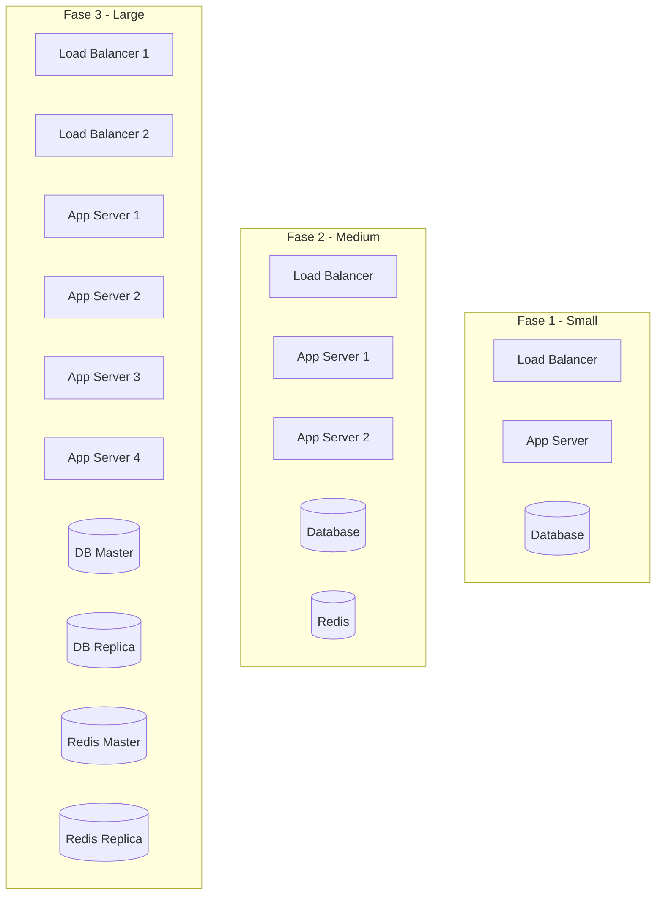
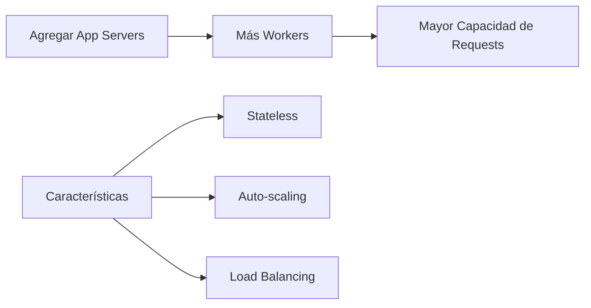
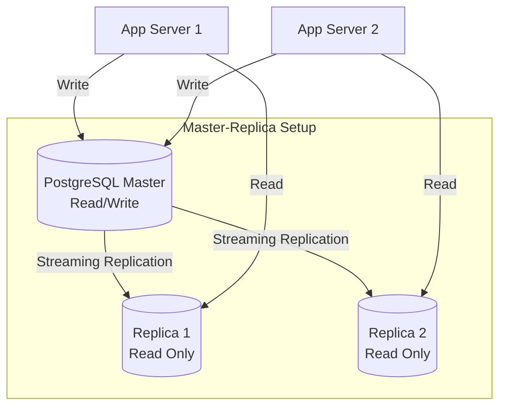
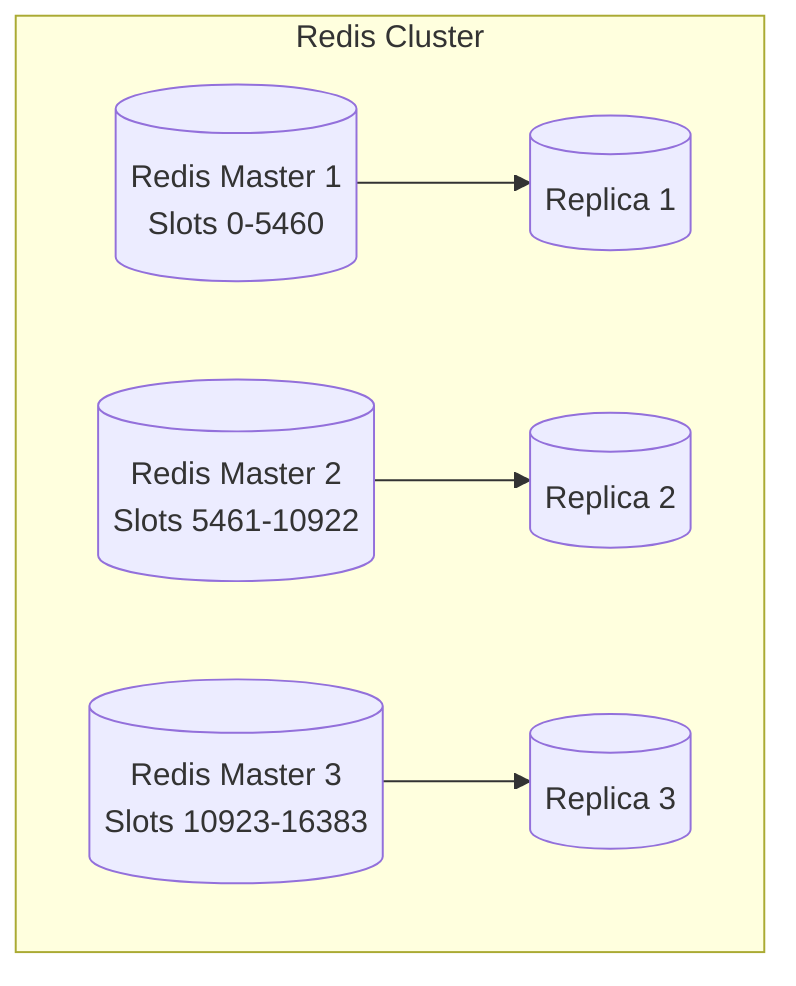
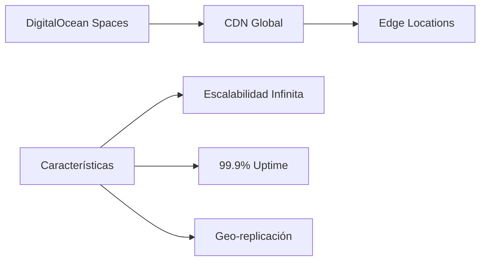
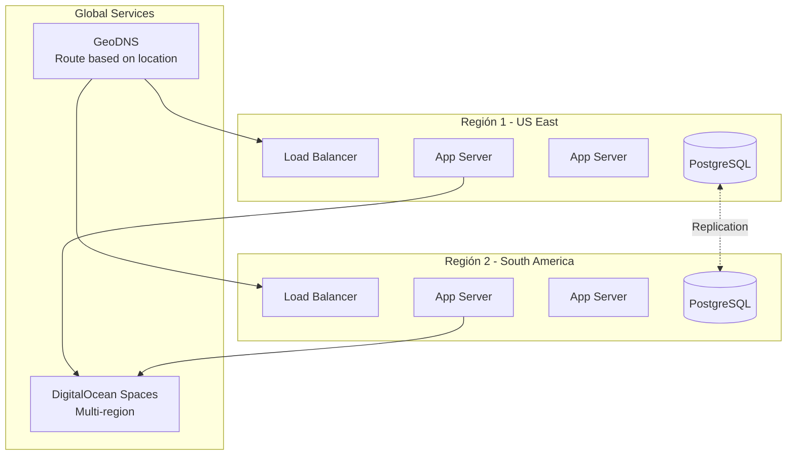

# Escalabilidad del Sistema

Este documento describe las estrategias de escalabilidad horizontal y vertical del sistema.

## Estrategia de Escalabilidad Horizontal (Scale Out)



## Puntos de Escalabilidad

### 1. Application Layer



**Ventajas:**

- Fácil de escalar horizontalmente
- Aplicaciones stateless (sesiones en Redis)
- Auto-scaling basado en métricas (CPU, memoria, requests/s)

**Métricas de Escalado:**

- CPU > 70% → Agregar servidor
- Requests/s > 500 → Agregar servidor
- Response time > 500ms → Agregar servidor

**Implementación:**

```yaml
# Auto-scaling policy (ejemplo con Kubernetes HPA)
apiVersion: autoscaling/v2
kind: HorizontalPodAutoscaler
metadata:
  name: django-app
spec:
  scaleTargetRef:
    apiVersion: apps/v1
    kind: Deployment
    name: django-app
  minReplicas: 2
  maxReplicas: 10
  metrics:
    - type: Resource
      resource:
        name: cpu
        target:
          type: Utilization
          averageUtilization: 70
    - type: Resource
      resource:
        name: memory
        target:
          type: Utilization
          averageUtilization: 80
```

---

### 2. Database Layer



**Estrategias:**

#### a) Read Replicas

Para queries de lectura (catálogo, búsquedas):

```python
# Django Database Router
class PrimaryReplicaRouter:
    def db_for_read(self, model, **hints):
        """
        Lecturas van a réplicas
        """
        return 'replica'

    def db_for_write(self, model, **hints):
        """
        Escrituras van al master
        """
        return 'default'

# settings.py
DATABASES = {
    'default': {  # Master
        'ENGINE': 'django.db.backends.postgresql',
        'HOST': '10.0.3.10',
        # ...
    },
    'replica': {  # Read Replica
        'ENGINE': 'django.db.backends.postgresql',
        'HOST': '10.0.3.20',
        # ...
    }
}
```

#### b) Connection Pooling

PgBouncer para gestión eficiente de conexiones:

```ini
[databases]
cordillerapets = host=10.0.3.10 port=5432 dbname=cordillerapets

[pgbouncer]
pool_mode = transaction
max_client_conn = 1000
default_pool_size = 25
```

#### c) Partitioning

Particionar tablas grandes por fecha:

```sql
-- Particionamiento de tabla pedidos
CREATE TABLE pedidos (
    id SERIAL,
    fecha_creacion TIMESTAMP,
    -- ...
) PARTITION BY RANGE (fecha_creacion);

CREATE TABLE pedidos_2025_01 PARTITION OF pedidos
    FOR VALUES FROM ('2025-01-01') TO ('2025-02-01');

CREATE TABLE pedidos_2025_02 PARTITION OF pedidos
    FOR VALUES FROM ('2025-02-01') TO ('2025-03-01');
```

---

### 3. Cache Layer



**Estrategias:**

#### a) Redis Cluster

Sharding automático para mayor capacidad:

```bash
# Crear cluster de 3 masters + 3 replicas
redis-cli --cluster create \
    10.0.3.11:6379 \
    10.0.3.12:6379 \
    10.0.3.13:6379 \
    10.0.3.14:6379 \
    10.0.3.15:6379 \
    10.0.3.16:6379 \
    --cluster-replicas 1
```

#### b) Redis Sentinel

High availability y failover automático:

```conf
# sentinel.conf
sentinel monitor mymaster 10.0.3.11 6379 2
sentinel down-after-milliseconds mymaster 5000
sentinel parallel-syncs mymaster 1
sentinel failover-timeout mymaster 10000
```

#### c) Tiered Caching

Múltiples niveles de cache:

```python
# L1: Local memory cache (por proceso)
from cachetools import TTLCache
local_cache = TTLCache(maxsize=100, ttl=60)

# L2: Redis (compartido entre procesos)
from django.core.cache import cache

# L3: Base de datos
def get_producto(producto_id):
    # Nivel 1: Cache local
    if producto_id in local_cache:
        return local_cache[producto_id]

    # Nivel 2: Redis
    cache_key = f'producto:{producto_id}'
    producto = cache.get(cache_key)
    if producto:
        local_cache[producto_id] = producto
        return producto

    # Nivel 3: Base de datos
    producto = Producto.objects.get(id=producto_id)
    cache.set(cache_key, producto, timeout=300)
    local_cache[producto_id] = producto
    return producto
```

---

### 4. Storage Layer



**Ventajas:**

- Escalabilidad automática (object storage)
- CDN integrado para distribución global
- No requiere gestión de capacidad
- Pay-as-you-go

**Optimizaciones:**

```python
# Lazy loading de imágenes


# Responsive images
<picture>
  <source srcset="producto-800w.jpg" media="(min-width: 800px)">
  <source srcset="producto-400w.jpg" media="(min-width: 400px)">
  
</picture>
```

---

## Distribución Geográfica (Futuro)

### Multi-Region Deployment



**Beneficios:**

- Menor latencia para usuarios locales
- Alta disponibilidad geográfica
- Cumplimiento de regulaciones locales

---

## Métricas de Capacidad

### Capacidad Actual (Fase 1)

| Métrica                 | Valor   |
| ----------------------- | ------- |
| Requests/segundo        | 150-200 |
| Usuarios concurrentes   | 500     |
| Queries/segundo         | 500     |
| Almacenamiento BD       | 20 GB   |
| Almacenamiento Imágenes | 50 GB   |

### Capacidad Objetivo (Fase 3)

| Métrica                 | Valor  | Incremento |
| ----------------------- | ------ | ---------- |
| Requests/segundo        | 2,000  | 10x        |
| Usuarios concurrentes   | 5,000  | 10x        |
| Queries/segundo         | 5,000  | 10x        |
| Almacenamiento BD       | 200 GB | 10x        |
| Almacenamiento Imágenes | 500 GB | 10x        |

---

## Plan de Escalamiento

### Triggers Automáticos

```python
# Ejemplo de lógica de auto-scaling
class AutoScaler:
    def evaluate(self):
        metrics = self.get_metrics()

        # CPU alto por 5 minutos → Scale out
        if metrics['cpu_avg_5m'] > 70:
            self.add_app_server()

        # Requests/s alto → Scale out
        if metrics['requests_per_sec'] > 500:
            self.add_app_server()

        # CPU bajo por 30 minutos → Scale in
        if metrics['cpu_avg_30m'] < 30 and self.server_count > 2:
            self.remove_app_server()
```

### Intervenciones Manuales

1. **Database Sharding**: Cuando una sola BD no es suficiente
2. **Microservicios**: Separar componentes monolíticos
3. **Message Queue**: Para procesamiento asíncrono (Celery + RabbitMQ)

---

## Costos vs Capacidad

| Fase   | Servidores | Costo/mes | Capacidad (req/s) | Costo por 1k req/s |
| ------ | ---------- | --------- | ----------------- | ------------------ |
| Fase 1 | 5          | $629      | 200               | $3.14              |
| Fase 2 | 8          | $1,100    | 800               | $1.37              |
| Fase 3 | 15         | $2,500    | 2,000             | $1.25              |

**Observación**: Economía de escala - El costo por request disminuye al escalar.
