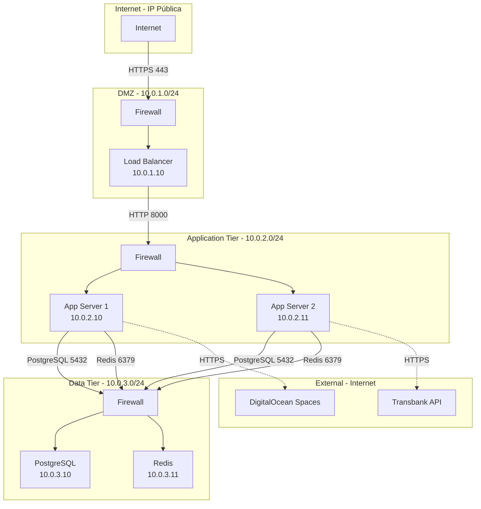

# Topología de Red

Este diagrama muestra la segmentación de red y las políticas de firewall en el entorno de producción.



## Segmentación de Red

### DMZ (Zona Desmilitarizada)

- **Subnet**: 10.0.1.0/24
- **Componentes**: Load Balancer
- **Acceso**: Desde Internet (puerto 80/443)

### Application Tier (Capa de Aplicación)

- **Subnet**: 10.0.2.0/24
- **Componentes**: Servidores de aplicación Django
- **Acceso**: Solo desde DMZ

### Data Tier (Capa de Datos)

- **Subnet**: 10.0.3.0/24
- **Componentes**: PostgreSQL, Redis
- **Acceso**: Solo desde Application Tier

## Puertos y Protocolos

| Servicio   | Puerto | Protocolo | Descripción                  |
| ---------- | ------ | --------- | ---------------------------- |
| HTTP       | 80     | TCP       | Redirige a HTTPS             |
| HTTPS      | 443    | TCP       | Tráfico web principal        |
| Gunicorn   | 8000   | TCP       | Aplicación Django            |
| PostgreSQL | 5432   | TCP       | Base de datos                |
| Redis      | 6379   | TCP       | Cache y sesiones             |
| SSH        | 22     | TCP       | Administración (restringido) |

## Reglas de Firewall

### Firewall 1 (DMZ)

```
# Permitir tráfico web desde Internet
ALLOW in from any to 10.0.1.10 port 80,443

# Permitir SSH solo desde IPs administrativas
ALLOW in from ADMIN_IP to 10.0.1.10 port 22

# Denegar todo lo demás
DENY in from any
```

### Firewall 2 (Application Tier)

```
# Permitir desde Load Balancer
ALLOW in from 10.0.1.10 to 10.0.2.0/24 port 8000

# Permitir SSH desde bastion host
ALLOW in from 10.0.1.10 to 10.0.2.0/24 port 22

# Denegar todo lo demás
DENY in from any
```

### Firewall 3 (Data Tier)

```
# Permitir PostgreSQL desde App Servers
ALLOW in from 10.0.2.0/24 to 10.0.3.10 port 5432

# Permitir Redis desde App Servers
ALLOW in from 10.0.2.0/24 to 10.0.3.11 port 6379

# Permitir SSH desde bastion host
ALLOW in from 10.0.1.10 to 10.0.3.0/24 port 22

# Denegar todo lo demás
DENY in from any
```

## Seguridad de Red

### 1. Principio de Mínimo Privilegio

- Cada tier solo accede a los puertos necesarios
- Sin acceso directo a Data Tier desde Internet

### 2. Defensa en Profundidad

- Múltiples capas de firewalls
- SSL/TLS en tránsito
- Encriptación de datos en reposo

### 3. Monitoreo

- Logs de firewall
- Detección de intrusiones (IDS)
- Alertas de tráfico anómalo

### 4. Bastion Host

- Único punto de entrada SSH
- Autenticación de dos factores
- Logging de todas las sesiones
