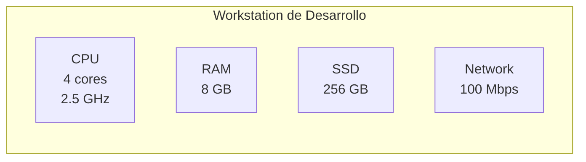
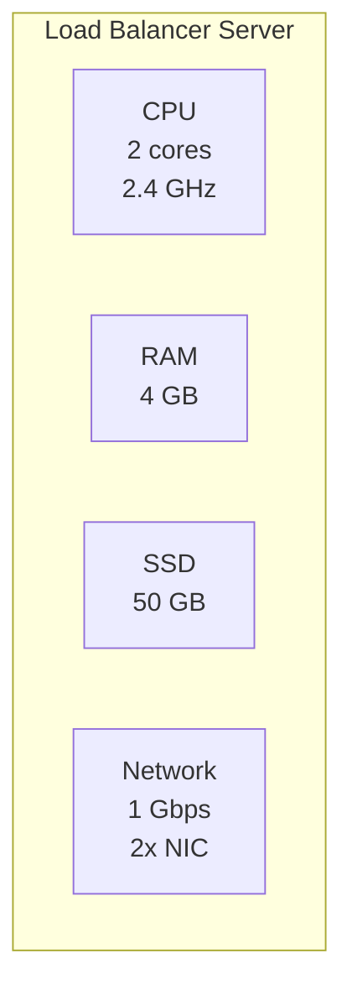
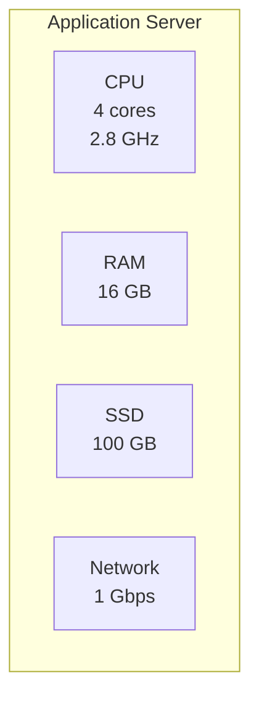
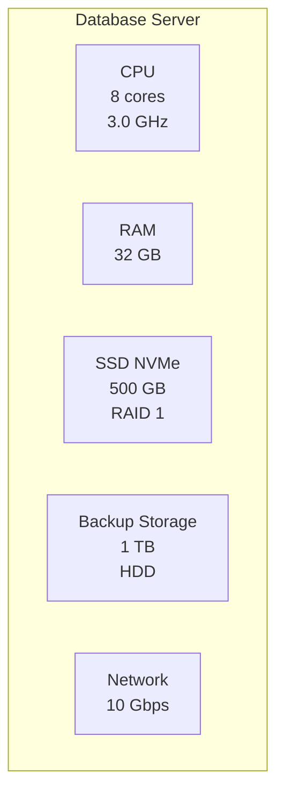
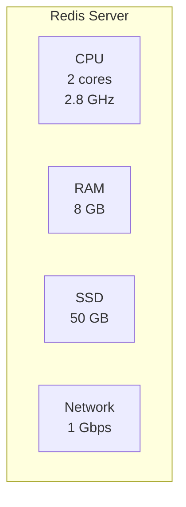

# Componentes de Hardware

Este archivo documenta los requisitos de hardware para cada componente del sistema.

## Entorno de Desarrollo



### Especificaciones Mínimas - Desarrollo

- **CPU**: 4 cores, 2.5 GHz (Intel i5 o AMD Ryzen 5)
- **RAM**: 8 GB DDR4
- **Disco**: 256 GB SSD
- **Sistema Operativo**: Linux (Ubuntu 22.04), Windows 11, macOS
- **Red**: 100 Mbps

### Uso de Recursos Estimado

| Componente        | Uso en Desarrollo |
| ----------------- | ----------------- |
| PostgreSQL        | ~500 MB RAM       |
| Django Dev Server | ~200 MB RAM       |
| IDE (VS Code)     | ~500 MB RAM       |
| Navegador         | ~1 GB RAM         |
| Sistema Operativo | ~2 GB RAM         |
| **Total**         | **~4-5 GB RAM**   |

---

## Entorno de Producción

### 1. Load Balancer



**Especificaciones:**

- **CPU**: 2 cores, 2.4 GHz
- **RAM**: 4 GB
- **Disco**: 50 GB SSD
- **Red**: 1 Gbps (2x NIC para redundancia)
- **SO**: Ubuntu Server 22.04 LTS

**Justificación:**

- Load balancing no requiere mucho CPU
- RAM moderada para buffer de conexiones
- 2 NICs para alta disponibilidad

---

### 2. Application Servers (x2)



**Especificaciones:**

- **CPU**: 4 cores, 2.8 GHz
- **RAM**: 16 GB DDR4
- **Disco**: 100 GB SSD
- **Red**: 1 Gbps
- **SO**: Ubuntu Server 22.04 LTS
- **Python**: 3.12+

**Configuración por servidor:**

- Gunicorn: 4 workers (1 por core)
- Memoria por worker: ~512 MB
- Conexiones concurrentes: ~400

**Cálculo de Workers:**

```
Workers = (2 x CPU cores) + 1
Workers = (2 x 4) + 1 = 9 workers

# En la práctica: 4-8 workers es suficiente
```

**Uso de Recursos:**

| Componente        | RAM por Instancia | Instancias | Total RAM |
| ----------------- | ----------------- | ---------- | --------- |
| Gunicorn Master   | 100 MB            | 1          | 100 MB    |
| Gunicorn Worker   | 512 MB            | 4          | 2 GB      |
| Sistema Operativo | -                 | 1          | 2 GB      |
| Buffer            | -                 | -          | 1 GB      |
| **Total**         | -                 | -          | **~5 GB** |

---

### 3. Database Server



**Especificaciones:**

- **CPU**: 8 cores, 3.0 GHz
- **RAM**: 32 GB DDR4
- **Disco Principal**: 500 GB SSD NVMe RAID 1
- **Disco Backup**: 1 TB HDD
- **Red**: 10 Gbps
- **SO**: Ubuntu Server 22.04 LTS
- **PostgreSQL**: 16.x

**Configuración PostgreSQL:**

```conf
# Memory Settings
shared_buffers = 8GB          # 25% de RAM total
effective_cache_size = 24GB   # 75% de RAM total
work_mem = 64MB               # Por operación de ordenamiento
maintenance_work_mem = 2GB    # Para VACUUM, CREATE INDEX

# Connection Settings
max_connections = 200

# WAL Settings
wal_buffers = 16MB
checkpoint_completion_target = 0.9
max_wal_size = 4GB
```

**Almacenamiento:**

| Tipo de Dato       | Tamaño Estimado | Crecimiento Anual   |
| ------------------ | --------------- | ------------------- |
| Tablas principales | 10 GB           | 5 GB/año            |
| Índices            | 5 GB            | 2 GB/año            |
| WAL Archives       | 50 GB           | Rotación semanal    |
| Backups            | 100 GB          | 7 días de retención |
| **Total**          | **165 GB**      | -                   |

**RAID 1 (Mirroring):**

- 2 discos de 500 GB → 500 GB utilizables
- Protección contra fallo de disco
- Sin mejora en rendimiento de lectura

---

### 4. Cache Server (Redis)



**Especificaciones:**

- **CPU**: 2 cores, 2.8 GHz
- **RAM**: 8 GB (Redis es in-memory)
- **Disco**: 50 GB SSD (para persistencia RDB)
- **Red**: 1 Gbps
- **SO**: Ubuntu Server 22.04 LTS
- **Redis**: 7.x

**Configuración Redis:**

```conf
# Memory Management
maxmemory 6gb
maxmemory-policy allkeys-lru

# Persistence
save 900 1        # Guardar si 1 cambio en 15min
save 300 10       # Guardar si 10 cambios en 5min
save 60 10000     # Guardar si 10k cambios en 1min

appendonly yes    # AOF para mayor durabilidad
appendfilename "appendonly.aof"
```

**Uso de RAM:**

| Tipo de Dato        | Tamaño Estimado |
| ------------------- | --------------- |
| Sesiones de usuario | 2 GB            |
| Cache de queries    | 3 GB            |
| Sistema operativo   | 1 GB            |
| Buffer              | 2 GB            |
| **Total**           | **8 GB**        |

---

## Comparación de Ambientes

| Componente      | Desarrollo | Producción | Ratio |
| --------------- | ---------- | ---------- | ----- |
| **CPU Total**   | 4 cores    | 18 cores   | 4.5x  |
| **RAM Total**   | 8 GB       | 60 GB      | 7.5x  |
| **Disco Total** | 256 GB     | 1.7 TB     | 6.6x  |
| **Servidores**  | 1          | 5          | 5x    |

---

## Crecimiento Futuro

### Año 1 (Actual)

- 2 App Servers
- 1 DB Server
- 1 Cache Server
- 1 Load Balancer

### Año 2 (10x tráfico)

- 4 App Servers → +2
- 1 DB Server + 1 Read Replica → +1
- 2 Cache Servers (HA) → +1
- 1 Load Balancer (sin cambio)

### Año 3 (50x tráfico)

- 8 App Servers → +4
- 1 DB Master + 3 Read Replicas → +2
- Redis Cluster (3 masters + 3 replicas) → +4
- 2 Load Balancers (HA) → +1

---

## Costos Estimados (Mensual)

### Desarrollo

- **Local**: $0 (workstation existente)

### Producción (DigitalOcean Droplets)

| Componente      | Tipo Droplet   | Precio/mes | Cantidad | Subtotal     |
| --------------- | -------------- | ---------- | -------- | ------------ |
| Load Balancer   | s-2vcpu-4gb    | $24        | 1        | $24          |
| App Servers     | s-4vcpu-16gb   | $96        | 2        | $192         |
| Database        | g-8vcpu-32gb   | $240       | 1        | $240         |
| Redis           | s-2vcpu-8gb    | $48        | 1        | $48          |
| Spaces (250 GB) | Object Storage | $5 + $20   | 1        | $25          |
| Backup (1 TB)   | Block Storage  | $100       | 1        | $100         |
| **Total**       | -              | -          | -        | **$629/mes** |

**Nota**: Precios aproximados basados en DigitalOcean pricing (octubre 2025).
