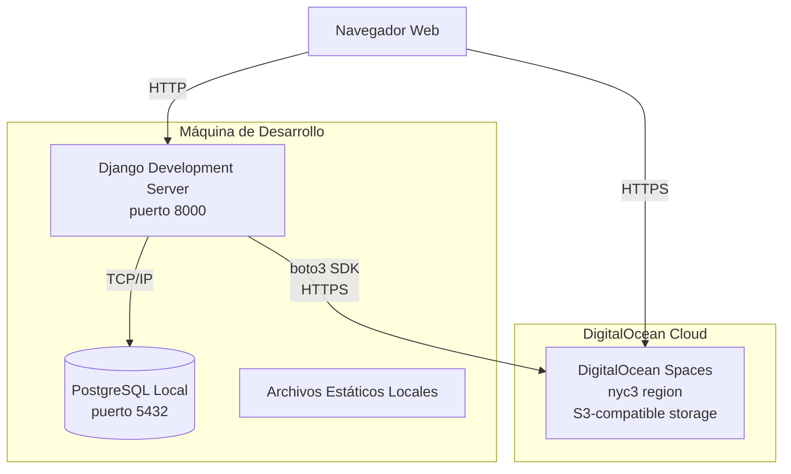
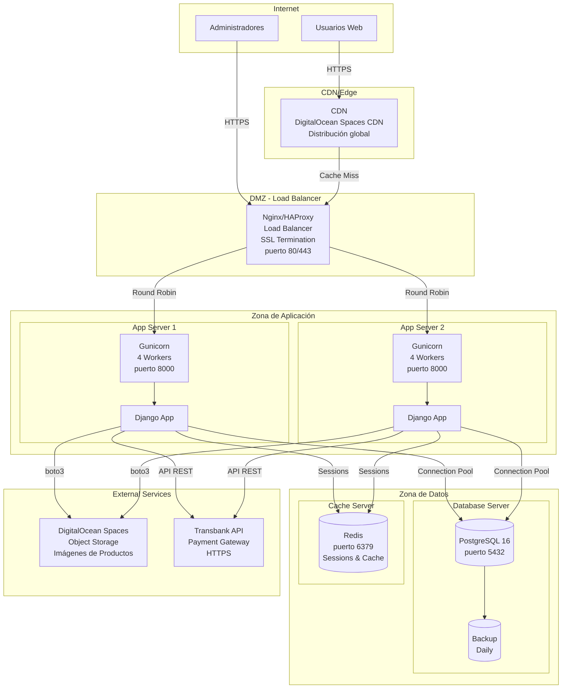

# Diagramas de Despliegue

Este archivo contiene los diagramas de arquitectura de despliegue tanto para desarrollo como para producción.

## Despliegue Actual (Desarrollo)

### Características del Entorno de Desarrollo

- **Servidor**: Django Development Server (manage.py runserver)
- **Base de Datos**: PostgreSQL local en puerto 5432
- **Archivos Estáticos**: Servidos directamente por Django
- **Imágenes**: DigitalOcean Spaces (compartido con producción)
- **Puerto**: 8000 (HTTP sin SSL)

---

## Despliegue Propuesto (Producción)

### Componentes de Producción

#### 1. Load Balancer

- **Software**: Nginx o HAProxy
- **Funciones**:
  - SSL/TLS termination
  - Load balancing (Round Robin)
  - Health checks
  - Rate limiting

#### 2. Application Servers (x2)

- **WSGI Server**: Gunicorn
- **Workers**: 4 por servidor
- **Alta Disponibilidad**: Redundancia activo-activo

#### 3. Database Server

- **DBMS**: PostgreSQL 16
- **Replicación**: Futura (Master-Replica)
- **Backup**: Diario automático

#### 4. Cache Server

- **Software**: Redis
- **Uso**: Sesiones y cache de aplicación
- **Persistencia**: RDB + AOF

#### 5. CDN

- **Proveedor**: DigitalOcean Spaces CDN
- **Contenido**: Imágenes de productos
- **Distribución**: Global edge locations
