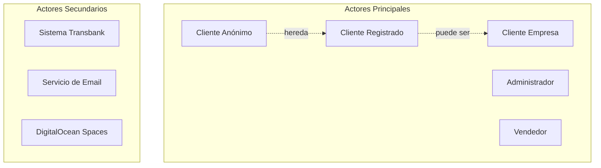

# Actores del Sistema

Este diagrama muestra todos los actores que interactúan con el sistema Cordillera Pets.



## Descripción de Actores

### Actores Principales

| Actor                  | Descripción                        | Privilegios                                                    |
| ---------------------- | ---------------------------------- | -------------------------------------------------------------- |
| **Cliente Anónimo**    | Usuario que navega sin registrarse | Ver catálogo, agregar al carrito, comprar como invitado        |
| **Cliente Registrado** | Usuario con cuenta personal        | Todo lo anterior + historial de compras, direcciones guardadas |
| **Cliente Empresa**    | Cliente corporativo registrado     | Todo lo anterior + facturación empresarial                     |
| **Administrador**      | Gestor del sistema                 | CRUD productos, categorías, marcas, ver pedidos                |
| **Vendedor**           | Personal de sucursal               | Consultar inventario, crear pedidos presenciales               |

### Actores Secundarios

| Actor                   | Descripción                           | Interacción                              |
| ----------------------- | ------------------------------------- | ---------------------------------------- |
| **Sistema Transbank**   | Plataforma de pagos externa           | Procesar pagos, notificar resultados     |
| **Servicio de Email**   | Sistema de notificaciones (futuro)    | Enviar confirmaciones, notificaciones    |
| **DigitalOcean Spaces** | Servicio de almacenamiento en la nube | Almacenar y servir imágenes de productos |

## Jerarquía de Actores

### Herencia de Privilegios

```
Cliente Anónimo (base)
    ├─ Ver catálogo
    ├─ Buscar productos
    ├─ Ver detalle de producto
    ├─ Gestionar carrito
    └─ Comprar como invitado

Cliente Registrado (hereda de Cliente Anónimo)
    ├─ Todo lo anterior +
    ├─ Historial de compras
    ├─ Direcciones guardadas
    └─ Perfil de usuario

Cliente Empresa (hereda de Cliente Registrado)
    ├─ Todo lo anterior +
    ├─ Facturación empresarial
    └─ Múltiples direcciones de despacho
```

## Roles y Responsabilidades

### Cliente Anónimo

- **Objetivo**: Navegar y comprar sin crear cuenta
- **Casos de Uso**: UC-01, UC-02, UC-03, UC-04, UC-05
- **Limitaciones**: Sin historial, sin direcciones guardadas

### Cliente Registrado

- **Objetivo**: Comprar con beneficios de cuenta
- **Casos de Uso**: Todos los del cliente anónimo + UC-06
- **Beneficios**: Proceso de compra más rápido, tracking de pedidos

### Administrador

- **Objetivo**: Gestionar el catálogo de productos
- **Casos de Uso**: UC-07, UC-08, UC-09, UC-10
- **Acceso**: Dashboard administrativo (/dashboard/)

### Sistema Transbank

- **Objetivo**: Procesar pagos seguros
- **Integración**: API REST
- **Flujo**: Webpay Plus (redirect)

### DigitalOcean Spaces

- **Objetivo**: Almacenamiento escalable de imágenes
- **Integración**: boto3 SDK (S3-compatible)
- **CDN**: Distribución global de contenido
