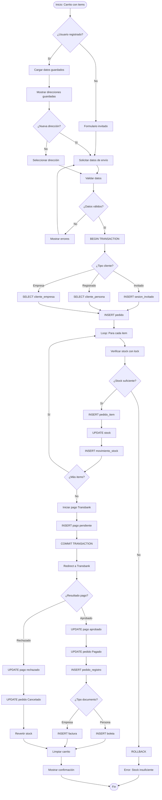
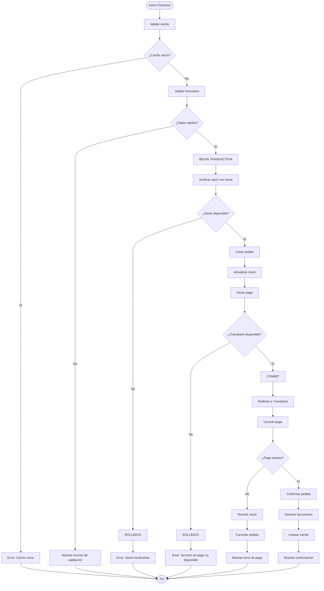

# Flujos de Trabajo Principales

Este archivo contiene diagramas de flujo para los principales procesos del sistema.

## Flujo: Navegar Catálogo

```mermaid
flowchart TD
    Start([Inicio]) --> A[Usuario accede al sitio]
    A --> B{¿Categoría específica?}
    B -->|Sí| C[Filtrar por categoría]
    B -->|No| D[Mostrar todos los productos]
    C --> E[Cargar productos filtrados]
    D --> E
    E --> F{¿Aplicar más filtros?}
    F -->|Marca| G[Filtrar por marca]
    F -->|Búsqueda| H[Buscar por texto]
    F -->|No| I[Mostrar resultados]
    G --> I
    H --> I
    I --> J{¿Productos encontrados?}
    J -->|Sí| K[Renderizar catálogo]
    J -->|No| L[Mostrar mensaje "Sin resultados"]
    K --> M[Cargar imágenes desde Spaces]
    L --> End([Fin])
    M --> N{¿Ver detalle?}
    N -->|Sí| O[Ir a página de producto]
    N -->|No| End
    O --> End
```

---

## Flujo: Realizar Compra



---

## Flujo: Gestión de Producto (Dashboard)

```mermaid
flowchart TD
    Start([Admin en Dashboard]) --> A{¿Acción?}

    A -->|Crear| B[Click "Nuevo Producto"]
    A -->|Editar| C[Click "Editar"]
    A -->|Eliminar| D[Click "Eliminar"]
    A -->|Listar| E[Ver lista de productos]

    B --> F[Formulario vacío]
    C --> G[Formulario con datos]

    F --> H[Admin completa datos]
    G --> H

    H --> I{¿Tiene imagen?}
    I -->|Sí| J[Upload a Spaces]
    I -->|No| K[Validar datos]
    J --> K

    K --> L{¿Válido?}
    L -->|No| M[Mostrar errores]
    M --> H

    L -->|Sí| N[Guardar en BD]
    N --> O[Registrar movimiento stock]
    O --> P[Redirect a lista]

    D --> Q[Confirmar eliminación]
    Q --> R{¿Confirma?}
    R -->|No| E
    R -->|Sí| S{¿Tiene pedidos?}
    S -->|Sí| T[Error: No se puede eliminar]
    S -->|No| U[Eliminar imagen de Spaces]
    U --> V[DELETE de BD]
    V --> P
    T --> E

    E --> End([Fin])
    P --> End
```

---

## Flujo: Manejo de Errores en Checkout



## Puntos de Decision Críticos

### 1. Validación de Stock

- **Momento**: Antes de confirmar pedido
- **Método**: SELECT FOR UPDATE (row lock)
- **Fallback**: Mostrar error, preservar carrito

### 2. Procesamiento de Pago

- **Timeout**: 15 minutos
- **Retry**: No automático (requiere acción del usuario)
- **Rollback**: Reversión completa de transacción

### 3. Upload de Imágenes

- **Validación**: Tipo MIME, tamaño máximo
- **Fallback**: Producto sin imagen (placeholder)
- **Rollback**: Si falla INSERT en BD, eliminar de Spaces

## Tiempos Estimados

| Flujo            | Tiempo Promedio | Tiempo Máximo |
| ---------------- | --------------- | ------------- |
| Navegar catálogo | 30 segundos     | 2 minutos     |
| Realizar compra  | 5 minutos       | 15 minutos    |
| Gestión producto | 2 minutos       | 5 minutos     |
