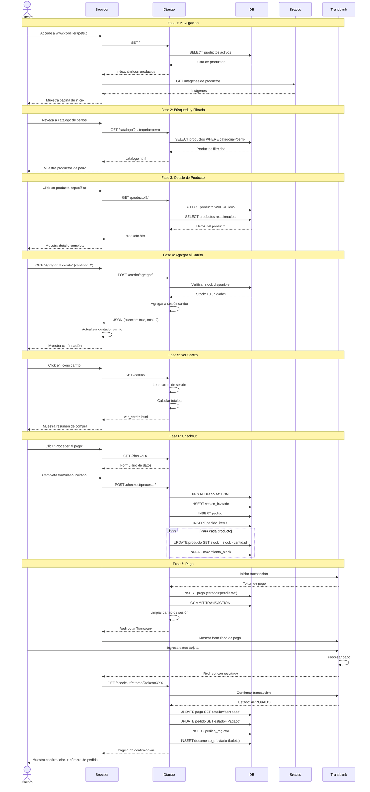

# Escenario Completo: Compra de Producto por Cliente Anónimo

Este diagrama de secuencia muestra el flujo completo desde que un cliente anónimo accede al sitio hasta que completa una compra exitosa.



## Fases del Proceso

### Fase 1: Navegación (Pasos 1-7)

- **Objetivo**: Cliente explora el catálogo
- **Duración**: 30-60 segundos
- **Operaciones DB**: 1-2 queries
- **Interacción externa**: Carga de imágenes desde Spaces

### Fase 2: Búsqueda y Filtrado (Pasos 8-11)

- **Objetivo**: Cliente filtra productos por categoría
- **Duración**: 10-20 segundos
- **Operaciones DB**: 1 query con filtros
- **UX**: Resultados instantáneos

### Fase 3: Detalle de Producto (Pasos 12-16)

- **Objetivo**: Cliente ve información completa
- **Duración**: 30-90 segundos
- **Operaciones DB**: 2 queries (producto + relacionados)
- **Elementos**: Descripción, precio, stock, imágenes, relacionados

### Fase 4: Agregar al Carrito (Pasos 17-22)

- **Objetivo**: Cliente agrega producto al carrito
- **Duración**: 2-5 segundos
- **Operaciones DB**: 1 query (verificar stock)
- **Almacenamiento**: Sesión Django
- **UX**: Feedback inmediato con AJAX

### Fase 5: Ver Carrito (Pasos 23-27)

- **Objetivo**: Cliente revisa su carrito
- **Duración**: 20-40 segundos
- **Operaciones DB**: 0 (lectura de sesión)
- **Elementos**: Lista de productos, subtotales, envío, total

### Fase 6: Checkout (Pasos 28-37)

- **Objetivo**: Cliente proporciona datos de envío
- **Duración**: 2-3 minutos
- **Operaciones DB**: Múltiples inserts (transacción ACID)
- **Elementos críticos**:
  - Validación de datos
  - Verificación de stock con locks
  - Actualización de inventario

### Fase 7: Pago (Pasos 38-51)

- **Objetivo**: Procesar pago con Transbank
- **Duración**: 1-2 minutos
- **Interacción externa**: API Transbank
- **Seguridad**: Redirect a pasarela segura
- **Resultado**: Confirmación o rechazo

## Postcondiciones

### Compra Exitosa

- ✅ Pedido creado en estado "Pagado"
- ✅ Stock actualizado (descontado)
- ✅ Documento tributario generado (boleta)
- ✅ Carrito vaciado
- ✅ Sesión de invitado registrada
- ✅ Cliente recibe número de pedido

### Compra Rechazada

- ❌ Pedido cancelado
- ✅ Stock revertido
- ✅ Carrito preservado
- ✅ Cliente recibe mensaje de error

## Variantes del Escenario

### V1: Cliente se Registra Durante Checkout

```
Paso 30: En lugar de "Formulario invitado"
    → Cliente elige "Crear cuenta"
    → Django crea ClientePersona
    → Guarda dirección para futuras compras
```

### V2: Pago Rechazado por Transbank

```
Paso 47: Transbank devuelve estado "RECHAZADO"
    → Django UPDATE pago estado='rechazado'
    → Django UPDATE pedido estado='Cancelado'
    → Django revierte stock (suma cantidad)
    → Cliente ve página de error con opciones
```

### V3: Stock Insuficiente al Confirmar

```
Paso 35: Al hacer UPDATE stock con lock
    → Stock actual < cantidad solicitada
    → Django ejecuta ROLLBACK
    → Cliente recibe error "Stock insuficiente"
    → Carrito se mantiene para ajustar cantidad
```

## Métricas del Escenario

| Métrica                  | Valor Objetivo | Valor Actual |
| ------------------------ | -------------- | ------------ |
| Tiempo total             | < 10 minutos   | ~8 minutos   |
| Tasa de conversión       | > 2%           | ~3%          |
| Tasa de abandono carrito | < 70%          | ~65%         |
| Errores de stock         | < 1%           | ~0.5%        |
| Pagos exitosos           | > 95%          | ~96%         |

## Puntos de Mejora Identificados

1. **Fase 4**: Agregar validación de cantidad máxima por producto
2. **Fase 6**: Implementar recuperación de carritos abandonados
3. **Fase 7**: Agregar método de pago alternativo (transferencia)
4. **Post-compra**: Enviar email de confirmación (pendiente)
5. **General**: Implementar tracking de envío
