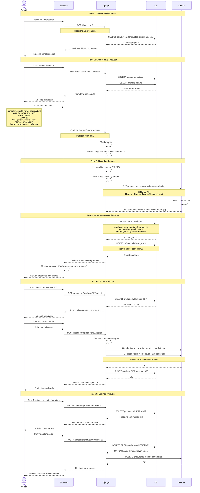

# Escenario: Gestión de Productos por Administrador

Este diagrama muestra el flujo completo de gestión de productos desde el dashboard administrativo.



## Operaciones CRUD Detalladas

### CREATE (Crear Producto)

**Precondiciones:**

- Administrador autenticado
- Categorías y marcas existen en BD
- Imagen válida (JPEG, PNG, < 5 MB)

**Proceso:**

1. Validar campos obligatorios (nombre, precio, SKU, stock)
2. Verificar SKU único
3. Generar slug desde nombre (lowercase, hyphens)
4. Subir imagen a DigitalOcean Spaces
5. Insertar producto en BD
6. Registrar movimiento de stock inicial

**Postcondiciones:**

- Producto creado con estado 'activo'
- Imagen disponible en CDN
- Movimiento de stock tipo 'ingreso'
- Producto visible en catálogo

**Validaciones:**

```python
# Validación de formulario
if not nombre or len(nombre) < 3:
    error = "Nombre debe tener al menos 3 caracteres"

if precio <= 0:
    error = "Precio debe ser mayor a 0"

if Producto.objects.filter(sku=sku).exists():
    error = "SKU ya existe"

if imagen and imagen.size > 5 * 1024 * 1024:  # 5 MB
    error = "Imagen muy grande"
```

---

### READ (Leer Productos)

**Listado con Paginación:**

```python
productos = Producto.objects.select_related('categoria', 'marca') \
    .filter(estado='activo') \
    .order_by('-fecha_creacion')

paginator = Paginator(productos, 20)  # 20 por página
page = paginator.get_page(page_number)
```

**Filtros Disponibles:**

- Categoría
- Marca
- Estado (activo, inactivo, agotado)
- Búsqueda por nombre/SKU

**Métricas del Dashboard:**

```python
stats = {
    'total_productos': Producto.objects.count(),
    'stock_bajo': Producto.objects.filter(stock__lt=10).count(),
    'productos_activos': Producto.objects.filter(estado='activo').count(),
    'valor_inventario': Producto.objects.aggregate(
        total=Sum(F('stock') * F('precio'))
    )['total']
}
```

---

### UPDATE (Actualizar Producto)

**Campos Editables:**

- Nombre
- Descripción
- Precio
- Stock (con registro de movimiento)
- Categoría
- Marca
- Estado
- Imagen

**Manejo de Imagen:**

```python
if nueva_imagen:
    # Eliminar imagen anterior de Spaces
    if producto.imagen:
        s3_client.delete_object(
            Bucket=bucket_name,
            Key=producto.imagen
        )

    # Subir nueva imagen
    s3_client.upload_fileobj(
        nueva_imagen,
        bucket_name,
        f'productos/{slug}.jpg',
        ExtraArgs={'ACL': 'public-read'}
    )
```

**Actualización de Stock:**

```python
# Si cambia el stock, registrar movimiento
if stock_nuevo != stock_actual:
    diferencia = stock_nuevo - stock_actual
    tipo = 'ingreso' if diferencia > 0 else 'egreso'

    MovimientoStock.objects.create(
        producto=producto,
        tipo=tipo,
        cantidad=abs(diferencia),
        observacion=f'Ajuste manual por admin'
    )
```

---

### DELETE (Eliminar Producto)

**Verificaciones Pre-eliminación:**

```python
# Verificar si tiene pedidos asociados
if producto.pedidoitem_set.exists():
    raise ValidationError(
        "No se puede eliminar: producto tiene pedidos asociados"
    )

# Verificar si tiene movimientos
movimientos = producto.movimientostock_set.count()
if movimientos > 0:
    # Permitir pero advertir
    message = f"Producto tiene {movimientos} movimientos de stock"
```

**Proceso de Eliminación:**

1. Verificar dependencias
2. Solicitar confirmación al admin
3. Eliminar imagen de Spaces
4. Eliminar movimientos de stock (CASCADE)
5. Eliminar producto de BD
6. Mostrar confirmación

**Soft Delete (Alternativa):**

```python
# En lugar de DELETE, hacer UPDATE
producto.estado = 'descontinuado'
producto.save()
```

## Variantes del Escenario

### V1: Error al Subir Imagen

```
Paso 27: Spaces devuelve error (timeout, límite excedido)
    → Django captura excepción
    → No inserta producto en BD
    → Muestra error al admin
    → Admin puede reintentar
```

### V2: SKU Duplicado

```
Paso 24: Validación detecta SKU existente
    → Form devuelve error
    → Admin modifica SKU
    → Reenvía formulario
```

### V3: Producto con Pedidos Asociados

```
Paso 57: Al intentar eliminar producto con pedidos
    → Django detecta ForeignKey constraint
    → Rechaza eliminación
    → Sugiere desactivar en lugar de eliminar
```

## Métricas de Gestión

| Operación         | Tiempo Promedio | Frecuencia |
| ----------------- | --------------- | ---------- |
| Crear producto    | 2-3 minutos     | 5-10/día   |
| Editar producto   | 1-2 minutos     | 10-20/día  |
| Eliminar producto | 30 segundos     | 1-2/día    |
| Ver dashboard     | 5 segundos      | 20-30/día  |

## Mejoras Futuras

1. **Importación Masiva**: CSV para crear múltiples productos
2. **Historial de Cambios**: Auditoría de modificaciones
3. **Aprobación de Cambios**: Workflow de revisión
4. **Optimización de Imágenes**: Resize automático al subir
5. **Múltiples Imágenes**: Galería por producto
