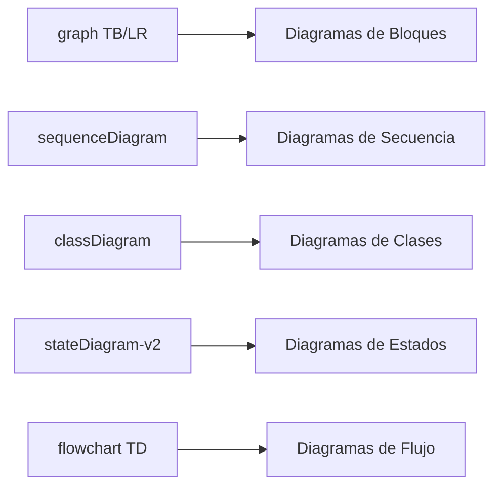

# Índice de Documentación - Modelo Arquitectónico 4+1

## 📚 Cordillera Pets eCommerce Platform

---

## 🗂️ Estructura de la Documentación

### [📖 README Principal](./README.md)

Introducción general al proyecto y al modelo arquitectónico 4+1.

---

## 🎯 Las 5 Vistas Arquitectónicas

### 1️⃣ [Vista Lógica](./1-Vista-Lógica/README.md)

**Funcionalidad del Sistema**

Contenido:

- Diagrama de Componentes Principales
- Modelo de Dominio
- Diagrama de Clases Principal
- Subsistemas Funcionales
  - Gestión de Productos
  - Ventas
  - Carrito
  - Pedidos
  - Clientes
- Patrones de Diseño
- Reglas de Negocio

**Diagramas Mermaid incluidos:**

- Componentes del sistema
- Modelo de dominio (15+ entidades)
- Clases principales
- Estados de pedidos y productos

---

### 2️⃣ [Vista de Desarrollo](./2-Vista-Desarrollo/README.md)

**Organización del Código**

Contenido:

- Estructura de Directorios Completa
- Diagrama de Paquetes
- Arquitectura en Capas (5 capas)
- Módulos Django Detallados
  - `pets` (proyecto)
  - `ventas` (catálogo)
  - `carrito` (shopping cart)
  - `dashboard` (admin)
  - `checkout` (payment)
- Dependencias y Tecnologías
- Patrones de Código
- Convenciones de Nomenclatura

**Diagramas Mermaid incluidos:**

- Paquetes y dependencias
- Arquitectura en capas
- Estructura de módulos

---

### 3️⃣ [Vista de Proceso](./3-Vista-Proceso/README.md)

**Comportamiento Dinámico**

Contenido:

- Arquitectura de Procesos
- Flujos de Trabajo Completos
  - Navegación de catálogo
  - Gestión de carrito
  - Creación de productos
  - Checkout y pago
- Diagramas de Secuencia Detallados
- Diagramas de Estados
  - Estados de pedidos
  - Estados de productos
  - Estados de sesión
- Concurrencia y Performance
- Sincronización y Transacciones
- Monitoreo y Logging

**Diagramas Mermaid incluidos:**

- 4 secuencias completas de procesos críticos
- 3 diagramas de estados
- Modelo de concurrencia
- Control de transacciones

---

### 4️⃣ [Vista Física](./4-Vista-Física/README.md)

**Infraestructura y Despliegue**

Contenido:

- Arquitectura de Despliegue
  - Desarrollo
  - Producción
- Topología de Red
  - Segmentación (DMZ, App, Data)
  - Puertos y protocolos
- Componentes de Hardware
  - Requisitos desarrollo
  - Requisitos producción (5 tipos de servidores)
- Configuración Detallada
  - Nginx (Load Balancer)
  - Gunicorn (App Server)
  - PostgreSQL (Database)
  - Redis (Cache)
- Estrategia de Escalabilidad
  - Horizontal scaling
  - Multi-region (futuro)
- Backup y Disaster Recovery
- Monitoreo de Infraestructura

**Diagramas Mermaid incluidos:**

- Arquitectura de despliegue completa
- Topología de red con segmentación
- Componentes de hardware
- Estrategia de escalabilidad
- Stack de monitoreo

---

### 5️⃣ [Escenarios (Vista +1)](./5-Escenarios/README.md)

**Casos de Uso y Validación**

Contenido:

- Actores del Sistema
- 10 Casos de Uso Principales
- 3 Escenarios Detallados:
  1. **Compra completa de cliente anónimo**
     - 50+ pasos documentados
     - Integración con Transbank
  2. **Gestión de productos por admin**
     - CRUD completo
     - Upload a DigitalOcean Spaces
  3. **Actualización de stock concurrente**
     - Control de race conditions
- Diagramas de Flujo
- Matriz de Trazabilidad
- Escenarios de Rendimiento
- Escenarios de Seguridad

**Diagramas Mermaid incluidos:**

- Actores del sistema
- Casos de uso general
- 2 secuencias detalladas (100+ interacciones)
- Diagramas de flujo
- Estados y procesos

---

## 📊 Resumen de Diagramas

### Por Vista

| Vista          | Cantidad de Diagramas | Tipos                                               |
| -------------- | --------------------- | --------------------------------------------------- |
| **Lógica**     | 6                     | Componentes, Dominio, Clases, Estados               |
| **Desarrollo** | 4                     | Paquetes, Capas, Módulos, Dependencias              |
| **Proceso**    | 10                    | Secuencias, Estados, Concurrencia, Transacciones    |
| **Física**     | 8                     | Despliegue, Red, Hardware, Escalabilidad, Monitoreo |
| **Escenarios** | 12                    | Casos de uso, Flujos, Secuencias, Actores           |
| **TOTAL**      | **40**                | Diagramas Mermaid                                   |

---

## 🔍 Navegación Rápida por Tema

### Por Subsistema

- **Productos y Catálogo**:

  - [Lógica - Subsistema Productos](./1-Vista-Lógica/README.md#subsistema-de-gestión-de-productos)
  - [Desarrollo - Módulo ventas](./2-Vista-Desarrollo/README.md#2-módulo-ventas)
  - [Escenarios - UC-01](./5-Escenarios/README.md#uc-01-navegar-catálogo)

- **Carrito de Compras**:

  - [Lógica - Subsistema Carrito](./1-Vista-Lógica/README.md#3-subsistema-de-carrito)
  - [Desarrollo - Módulo carrito](./2-Vista-Desarrollo/README.md#3-módulo-carrito)
  - [Proceso - Flujo de Carrito](./3-Vista-Proceso/README.md#2-flujo-de-gestión-del-carrito)
  - [Escenarios - UC-02](./5-Escenarios/README.md#uc-02-gestionar-carrito-de-compras)

- **Pedidos y Pagos**:

  - [Lógica - Subsistema Pedidos](./1-Vista-Lógica/README.md#4-subsistema-de-pedidos)
  - [Proceso - Flujo Checkout](./3-Vista-Proceso/README.md#4-flujo-de-checkout-y-pago)
  - [Escenarios - Compra Completa](./5-Escenarios/README.md#escenario-1-compra-de-producto-por-cliente-anónimo)

- **Dashboard Admin**:
  - [Desarrollo - Módulo dashboard](./2-Vista-Desarrollo/README.md#4-módulo-dashboard)
  - [Proceso - Creación de Productos](./3-Vista-Proceso/README.md#3-flujo-de-creación-de-producto-dashboard)
  - [Escenarios - Gestión Admin](./5-Escenarios/README.md#escenario-2-gestión-de-productos-por-administrador)

### Por Aspecto Técnico

- **Base de Datos**:

  - [Lógica - Modelo de Dominio](./1-Vista-Lógica/README.md#modelo-de-dominio)
  - [Física - PostgreSQL Config](./4-Vista-Física/README.md#3-database-server-postgresql)
  - [Proceso - Transacciones](./3-Vista-Proceso/README.md#procesos-de-sincronización)

- **Almacenamiento (DigitalOcean Spaces)**:

  - [Desarrollo - storage.py](./2-Vista-Desarrollo/README.md#4-módulo-dashboard)
  - [Proceso - Upload de Imágenes](./3-Vista-Proceso/README.md#3-flujo-de-creación-de-producto-dashboard)
  - [Física - Storage Layer](./4-Vista-Física/README.md#4-storage-layer)

- **Escalabilidad**:

  - [Física - Estrategia Completa](./4-Vista-Física/README.md#estrategia-de-escalabilidad)
  - [Proceso - Concurrencia](./3-Vista-Proceso/README.md#concurrencia-y-performance)

- **Seguridad**:
  - [Física - Segmentación de Red](./4-Vista-Física/README.md#topología-de-red)
  - [Escenarios - Casos de Seguridad](./5-Escenarios/README.md#escenarios-de-seguridad)

---

## 📈 Métricas de Documentación

- **Páginas de documentación**: 5 vistas + README
- **Diagramas Mermaid**: 40+
- **Líneas de documentación**: ~3,000
- **Casos de uso documentados**: 10+
- **Escenarios detallados**: 3 completos
- **Configuraciones incluidas**: 5 (Nginx, Gunicorn, PostgreSQL, Redis, Systemd)

---

## 🎨 Leyenda de Diagramas Mermaid

### Tipos de Diagramas Utilizados

### Convenciones

- **Rectángulos**: Componentes/Procesos
- **Cilindros**: Bases de datos
- **Actores**: Usuarios/Sistemas externos
- **Flechas sólidas**: Flujo de datos/control
- **Flechas punteadas**: Relaciones de dependencia
- **Subgraphs**: Agrupación lógica

---

## 🚀 Guía de Lectura Recomendada

### Para Desarrolladores Nuevos

1. [README Principal](./README.md) - Contexto general
2. [Vista de Desarrollo](./2-Vista-Desarrollo/README.md) - Estructura de código
3. [Vista Lógica](./1-Vista-Lógica/README.md) - Entender el dominio
4. [Escenarios](./5-Escenarios/README.md) - Casos de uso

### Para Arquitectos

1. [README Principal](./README.md) - Contexto
2. [Vista Lógica](./1-Vista-Lógica/README.md) - Diseño conceptual
3. [Vista Física](./4-Vista-Física/README.md) - Infraestructura
4. [Vista de Proceso](./3-Vista-Proceso/README.md) - Comportamiento dinámico

### Para DevOps/SRE

1. [Vista Física](./4-Vista-Física/README.md) - Configuración completa
2. [Vista de Proceso](./3-Vista-Proceso/README.md) - Procesos y concurrencia
3. [Escenarios](./5-Escenarios/README.md) - Casos de rendimiento

### Para Product Owners

1. [README Principal](./README.md) - Visión general
2. [Escenarios](./5-Escenarios/README.md) - Funcionalidades
3. [Vista Lógica](./1-Vista-Lógica/README.md) - Componentes funcionales

---

## 📝 Notas de Versión

- **Versión del Proyecto**: 0.0.1
- **Fecha de Documentación**: Octubre 2025
- **Modelo Arquitectónico**: 4+1 (Philippe Kruchten)
- **Herramienta de Diagramas**: Mermaid
- **Formato**: Markdown

---

## 👥 Equipo

- **Janiz Carreño** - jan.carreno@duocuc.cl
- **Carolina Sanchez** - caro.sanchez@duocuc.cl
- **Nicolás Rocha** - nico.rocha@duocuc.cl

---

## 📚 Referencias

- [Modelo 4+1 - Philippe Kruchten](https://www.cs.ubc.ca/~gregor/teaching/papers/4+1view-architecture.pdf)
- [Django Documentation](https://docs.djangoproject.com/)
- [PostgreSQL Documentation](https://www.postgresql.org/docs/)
- [Mermaid Documentation](https://mermaid.js.org/)
- [DigitalOcean Spaces](https://www.digitalocean.com/products/spaces)

---

**Última actualización**: Octubre 2025
